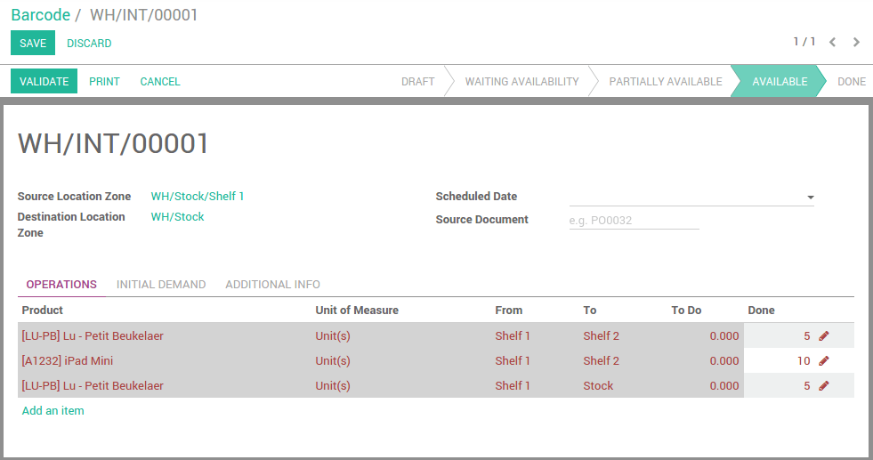

===============================
How to do an internal transfer?
===============================

In Odoo, there are two types of internal transfers:

-   Those initiated automatically by the system (for example, a quality
    control)

-   Those created by a worker (for example, through the internal transfer
    area of the dashboard).

To make an Internal Transfer:

1. From the home of the barcode application, scan the **source location**

2. Pick up and **scan the products**

3. Scan the **destination location**

4. **Validate** the transfer to finish it

