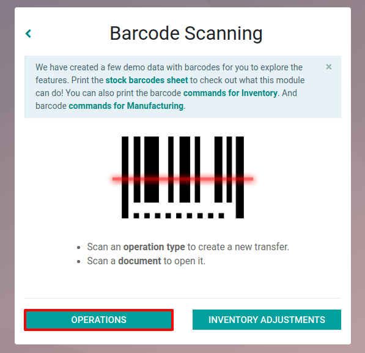
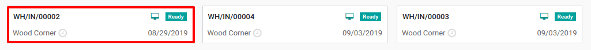

====================
Process to Transfers
====================

Simple Transfers
================

To process a transfer from the *Barcode* app, the first step is to go
to *Operations*.

Then, you have the choice to either enter an existing transfer, by going
to the corresponding operation type and manually selecting the one you
want to enter, or by scanning the barcode of the transfer.

.. image:: internal/internal_02.png
    :align: center

From there, you will be able to scan the products that are part of the
existing transfer and/or add new products to this transfer. Once all the
products have been scanned, you can validate the transfer to proceed
with the stock moves.

.. image:: internal/internal_04.png
    :align: center

.. note::
        If you have different storage locations in your warehouse, you can add
        additional steps for the different operation types.

Receipts
========

When receiving a product in stock, you need to scan its barcode in order
to identify it in the system. Once done, you can either make it enter
the main location of the transfer, for example WH/Stock, or scan a
location barcode to make it enter a sub-location of the main location.

.. image:: internal/internal_05.png
    :align: center

.. note::
        If you want the product to enter WH/Stock in our example, you can simply
        scan the next product.

Delivery Orders
===============

When delivering a product, you have to scan the source location if it is
different than the one initially set on the transfer. Then, you can
start scanning the products that are delivered from this specific
location.

.. image:: internal/internal_06.png
    :align: center

Once the different products have been scanned, you have the possibility
to scan another location, such as WH/Stock, and another page will be
added to your delivery order. You can move from one to the other thanks
to the *Previous* and *Next* buttons.

.. image:: internal/internal_07.png
    :align: center

Now, you can validate your transfer. To do so, click on *Next* until
you reach the last page of the transfer. There, you will be able to
validate it.

.. image:: internal/internal_08.png
    :align: center

Internal Transfers
==================

When realizing an internal transfer with multi-location, you first have
to scan the source location of the product. Then, you can scan the
product in itself, before having to scan the barcode of the destination
location.

If the source and destination of the internal transfers are already
correct, you don’t need to scan them.

Transfers with Tracked Products
-------------------------------

If you work with products tracked by lot/serial numbers, you have two
ways of working:

-  If you work with serial/lot numbers taking all products into consideration, you can scan the barcode of the lot/serial number and Odoo will increase the quantity of the product, setting its lot/serial number.

.. image:: internal/internal_09.png
    :align: center

-  If you have the same lot/serial number for different products, you can work by scanning the product barcode first, and then the barcode of the lot/serial number.

.. image:: internal/internal_10.png
    :align: center