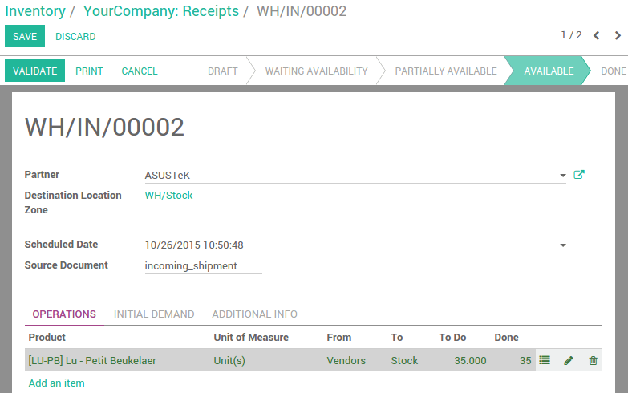

====================================================
How to handle lots and serial numbers with barcodes?
====================================================

Lots Numbers can be encoded from incoming shipments, internal moves and
outgoing deliveries:

-   In the barcode interface, **scan** the products you want create a lot from

-   If this product should be manage by lots, a window opens to help you
    scan the lots/serial numbers

-   **Scan** a lot barcode, **type** one manually or **leave empty** to generate one
    automatically

-   Click or scan **Validate** once you are done

What is the difference between **Lots** and **Serial Numbers**?

-   **Lot** numbers are attributed to several identical products, so each
    time you scan a lot number, Odoo will add one on the product
    count.

-   On the opposite, a **serial number** is unique, and represented by only
    one barcode, sticked on only one item. This means that Odoo won't
    accept scanning the same serial number more than once per
    operation.

.. image:: media/lots_serial_numbers01.png
    :align: center

Here, we configured **Lu - Petit Beukelaer** tracking by lots.

.. image:: media/lots_serial_numbers04.png
    :align: center

Scan a product from this incoming shipment, then scan the lot number of
each product (you can also use the keyboard).

.. image:: media/lots_serial_numbers02.png
    :align: center

Click save/scan **Validate** and you are done.

