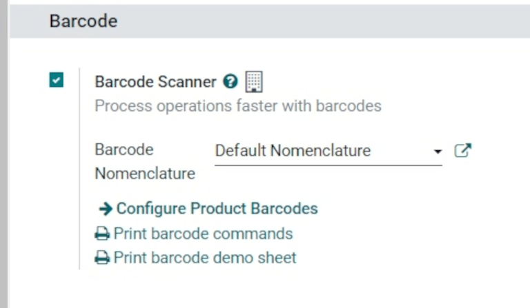
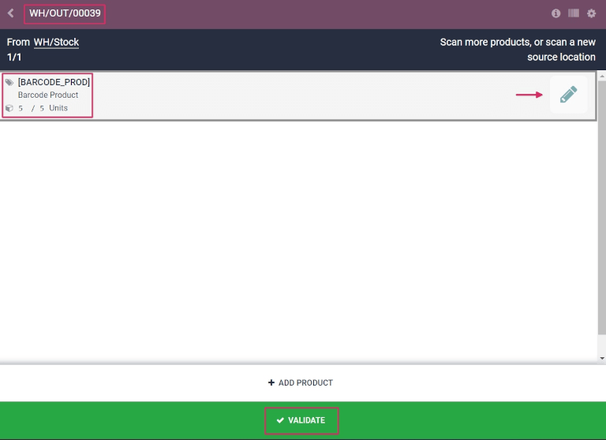

=============================================
Process receipts and deliveries with barcodes
=============================================

.. _barcode/operations/intro:

The *Barcode* app can be used to process receipts, deliveries, and other types of operations in real
time using a barcode scanner or the Odoo mobile app.

This makes it possible to process operations on the warehouse floor when they happen, instead of
having to wait to validate transfers from a computer. Processing operations this way can help to
properly attribute barcodes to the appropriate products, pickings, locations, and more.

Enable Barcode app
==================

To use the *Barcode* app to process transfers, it must be installed by enabling the feature from the
settings of the *Inventory* app.

To do so, go to the :menuselection:`Inventory app --> Configuration --> Settings`. Then, scroll down
to the :guilabel:`Barcode` section, and click the checkbox next to the :guilabel:`Barcode Scanner`
feature.

Once the checkbox is ticked, click :guilabel:`Save` at the top of the page to save changes.

Once the page has refreshed, new options will be displayed under the :guilabel:`Barcode Scanner`
feature: :guilabel:`Barcode Nomenclature` (with a corresponding drop-down menu), where either
:guilabel:`Default Nomenclature` or :guilabel:`Default GS1 Nomenclature` can be selected.

There is also a :guilabel:`Configure Product Barcodes` internal link arrow, and a set of
:guilabel:`Print` buttons for printing barcode commands and a barcode demo sheet.

For more on setting up and configuring the :guilabel:`Barcode` app, refer to the :doc:`Set up your
barcode scanner <../setup/hardware>` and :doc:`Activate the Barcodes in Odoo <../setup/software>`
documentation pages.

.. _barcode/operations/scan-received-products:

Scan barcodes for receipts
==========================

To process warehouse receipts for incoming products, there first needs to be a purchase order (PO)
created, and a receipt operation to process.

To create a :abbr:`PO (purchase order)`, navigate to the :menuselection:`Purchase app --> Create` to
create a new request for quotation (RFQ).

From the blank :abbr:`RFQ (request for quotation)` form, click the drop-down menu next to the
:guilabel:`Vendor` field to add a vendor. Then, on the :guilabel:`Product` line under the
:guilabel:`Products` tab, click :guilabel:`Add a product`, and select the desired product(s) to add
to the quotation.

Once ready, click :guilabel:`Save` at the top of the form, then click :guilabel:`Confirm Order` to
confirm the :abbr:`RFQ (request for quotation)` to a :abbr:`PO (purchase order)`.

.. image:: receipts_deliveries/receipts-deliveries-purchase-order.png
   :align: center
   :alt: Completed purchase order for barcode product.

To process and scan barcodes for warehouse receipts, navigate to the :menuselection:`Barcode app`.

Once inside the :guilabel:`Barcode app`, a :guilabel:`Barcode Scanning` screen displaying different
options is presented. To process receipts, click on the :guilabel:`Operations` button at the bottom
of the screen. This navigates to an :menuselection:`Operations` overview page.

.. image:: receipts_deliveries/receipts-deliveries-barcode-scanner.png
   :align: center
   :alt: Barcode app start screen with scanner.

From this page, locate the :guilabel:`Receipts` card, and click the :guilabel:`# To Process` button
to view all outstanding receipts. Then, select the desired receipt operation to process. This
navigates to the barcode transfer screen.

.. note::
   If *only* using a barcode scanner or the Odoo mobile app, the barcodes for each transfer of a
   corresponding operation type can be scanned to be processed easily. Once scanned, the products
   that are part of an existing transfer can be scanned, and new products can be added to the
   transfer, as well. Once all products have been scanned, validate the transfer to proceed with the
   stock moves.

From this screen, an overview of all receipts to process within that transfer (**WH/IN/000XX**) is
shown. At the bottom of the screen, there are options to :guilabel:`Add Product` or
:guilabel:`Validate`, depending on if products need to be added to the operation, or if the whole
operation should be validated at once.

.. image:: receipts_deliveries/receipts-deliveries-scanner-overview.png
   :align: center
   :alt: Overview of receipts in transfer to scan.

To process and scan each product individually, choose a specific product line. The :guilabel:`+#`
button (in this case, :guilabel:`+10`) can be clicked to indicate receipt of that product, or the
:guilabel:`pencil` icon can be clicked to open a new screen to edit that product line.

From this screen, the product that's being received is listed. Under the product name, the
:guilabel:`Quantity` line can be edited. Either change the `0` in the line to the desired quantity,
or click the :guilabel:`/# Units` button (in this case, :guilabel:`/10 Units`) to automatically fill
the quantity ordered from the :abbr:`PO (purchase order)`.

.. example::
   In the reception operation `WH/IN/00019`, `10 Units` of the `Barcode Product` is expected to be
   received. `[BARCODE_PROD]` is the :guilabel:`Internal Reference` set on the product form. Scan
   the barcode of the `Barcode Product` to receive one unit. Afterwards, click the
   :guilabel:`pencil` icon to manually enter the received quantities.

   .. image:: receipts_deliveries/receipts-deliveries-product-line-editor.png
      :align: center
      :alt: Product line editor for individual transfer in Barcode app.

Additionally, the :guilabel:`+1` and :guilabel:`-1` buttons can be clicked to add or subtract
quantity of the product, and the :guilabel:`number keys` can be used to add quantity, as well.

Below the :guilabel:`number keys` is the :guilabel:`location` line, which reads `WH/Stock` by
default, unless another *location* is listed on the product itself. Click this line to reveal a
drop-down menu of additional locations to choose from.

Once ready, click :guilabel:`Confirm` to confirm the changes made to the product line.

Then, from the overview page with all receipts to process within that transfer (**WH/IN/000XX**),
click the :guilabel:`+#` button on the product line for the products being received, and click
:guilabel:`Validate`. The receipt has now been processed, and the :guilabel:`Barcode app` can be
closed out.

.. image:: receipts_deliveries/receipts-deliveries-validate-transfer.png
   :align: center
   :alt: Overview of receipts in transfer to validate.

Scan barcodes for delivery orders
=================================

To process warehouse deliveries for outgoing products, there first needs to be a sales order (SO)
created, and a delivery operation to process.

To create a :abbr:`SO (sales order)`, navigate to the :menuselection:`Sales app --> Create` to
create a new quotation.

From the blank quotation form, click the drop-down menu next to the :guilabel:`Customer` field to
add a customer. Then, on the :guilabel:`Product` line under the :guilabel:`Order Lines` tab, click
:guilabel:`Add a product`, and select the desired product(s) to add to the quotation.

Once ready, click :guilabel:`Save` at the top of the form, and click :guilabel:`Confirm Order` to
confirm the quotation to a :abbr:`SO (sales order)`.

.. image:: receipts_deliveries/receipts-deliveries-sales-order.png
   :align: center
   :alt: Completed sales order for barcode product.

To process and scan barcodes for warehouse deliveries, navigate to the :menuselection:`Barcode app`.

Once inside the :guilabel:`Barcode app`, a :guilabel:`Barcode Scanning` screen displaying different
options is presented. To process deliveries, click on the :guilabel:`Operations` button at the
bottom of the screen. This navigates to an :guilabel:`Operations` overview page.

From this page, locate the :guilabel:`Delivery Orders` card, and click the :guilabel:`# To Process`
button to view all outstanding deliveries. Then, select the desired delivery order to process. This
navigates to the barcode transfer screen.

.. image:: receipts_deliveries/receipts-deliveries-operations-page.png
   :align: center
   :alt: Operations overview page in Barcode app dashboard.

From this screen, an overview of all deliveries to process within that transfer (**WH/OUT/000XX**)
is shown. At the bottom of the screen, there are options to :guilabel:`Add Product` or
:guilabel:`Validate`, depending on if products need to be added to the operation, or if the whole
operation should be validated at once.

To process and scan each product individually, choose a specific product line. The :guilabel:`+1`
button can be clicked to indicate delivery of that product, or the :guilabel:`pencil icon` can be
clicked to open a new screen to edit that product line.

From this screen, the product that's being delivered is listed. Under the product name, the
:guilabel:`Quantity` line can be edited. Either change the `0` in the line to the desired quantity,
or click the :guilabel:`/# Units` button (in this case, :guilabel:`/10 Units`) to automatically fill
the quantity ordered from the :abbr:`SO (sales order)`.

Additionally, the :guilabel:`+1` and :guilabel:`-1` buttons can be clicked to add or subtract
quantity of the product, and the :guilabel:`number keys` can be used to add quantity, as well.

Below the :guilabel:`number keys` is the :guilabel:`location` line, which reads `WH/Stock` by
default, unless another location is listed on the product itself.

This is the location that the product is being pulled from for delivery. Click this line to reveal a
drop-down menu of additional locations to choose from (if this product is stored in multiple
locations in the warehouse).

.. tip::
   For warehouses that have multiple different storage locations, putaway rules, and removal
   strategies, additional steps can be added for various operation types, while using the *Barcode*
   app.

Once ready, click :guilabel:`Confirm` to confirm the changes made to the product line.

Then, from the overview page with all receipts to process within that transfer (**WH/OUT/000XX**),
click the :guilabel:`+#` button on the product line for the products being received, and click
:guilabel:`Validate`. The delivery has now been processed, and the *Barcode* app can be closed out.

