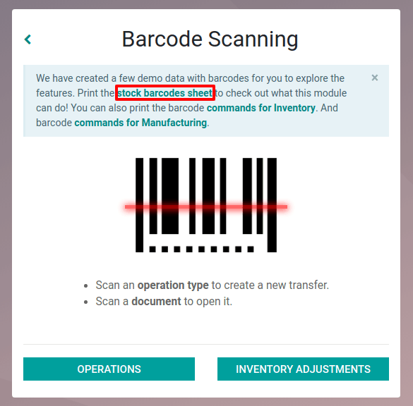
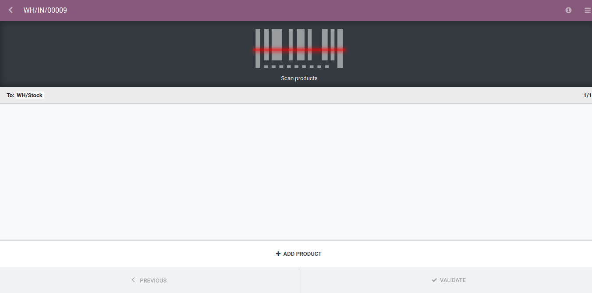

==============================
Create a Transfer from Scratch
==============================

To create a transfer from the *Barcode* application, you first need to
print the operation type barcodes. To do so, you can download the
*Stock barcode sheet* from the home page of the app.

Once done, you can scan the one for which you want to create a new
document. Then, an empty document will be created and you will be able
to scan your products to populate it.

