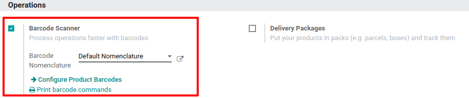
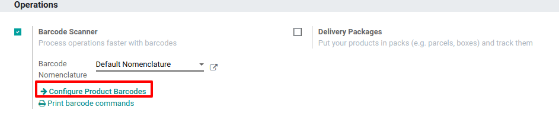
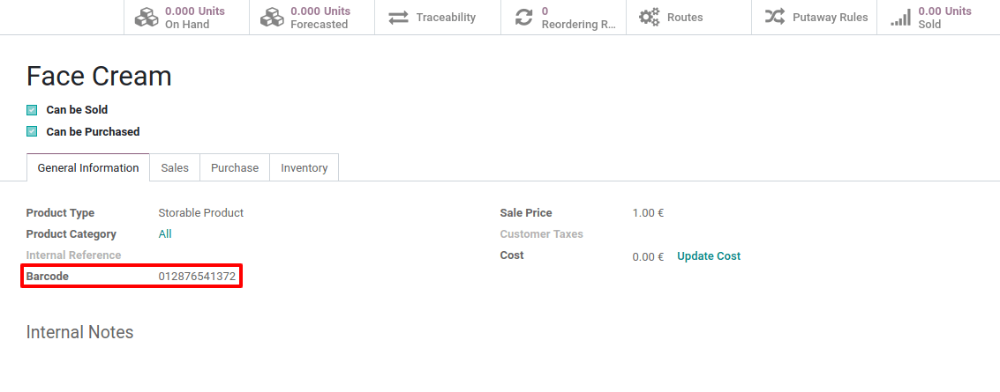
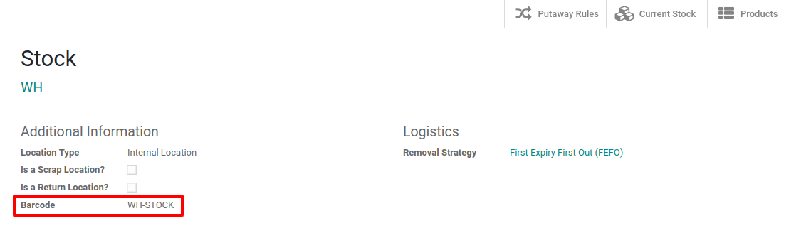
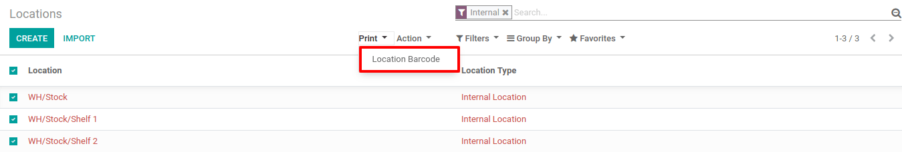

=============================
Activate the Barcodes in Odoo
=============================

The barcode scanning features can save you a lot of time usually lost
switching between the keyboard, the mouse and the scanner. Properly
attributing barcodes to products, pickings locations, etc. allows you to
work more efficiently by controlling the software almost exclusively
with the barcode scanner.

Configuration
=============

To use this feature, you first need to activate the *Barcode*
functionality via :menuselection:`Inventory --> Settings --> Barcode Scanner`. Once you
have ticked the feature, you can hit save.

Set Product Barcodes
====================

You can easily assign barcodes to your different products via the
*Inventory* app. To do so, go to :menuselection:`Settings --> Configure Products Barcodes`.

Then, you have the possibility to assign barcodes to your products
directly at creation on the product form.

.. image:: software/software_03.png
    :align: center

.. note::
         Be careful to add barcodes directly on the product variants and not on
         the template product. Otherwise, you won’t be able to differentiate
         them.

Set Locations Barcodes
======================

If you manage multiple locations, you will find useful to attribute a
barcode to each location and stick it on the location. You can configure
the locations barcodes in :menuselection:`Inventory --> Configuration --> Locations`.

.. note::
         You can easily print the barcode you allocate to the locations via the
         *Print* menu.

Barcode Formats
===============

Most retail products use EAN-13 barcodes. They cannot be made up without
proper authorization. You must pay the International Article Numbering
Association a fee in exchange for an EAN code sequence.

Still, as Odoo supports any string as a barcode, you can always define
your own barcode format for internal use.