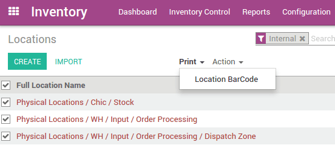

=====================================
How to activate the barcodes in Odoo?
=====================================

The barcode scanning features can save you a lot of the time usually
lost switching between the keyboard, the mouse and the scanner. Properly
attributing barcodes to products, pickings locations, etc. allows you to
work more efficiently by controlling the software almost exclusively
with the barcode scanner.

Set products barcodes
=====================

.. image:: media/software01.png
    :align: center

In order to fill a picking or to perform an inventory, you need to make
sure that your products are encoded in Odoo along with their barcodes.
If this is not already done, you can fill in the products barcodes
through a handy interface. Go to 
:menuselection:`Inventory --> Configuration --> Settings`
and click :menuselection:`Operations --> Barcode Scanner`.
Click Save, and go back into the previous screen to click Configure
Product Barcodes.  This interface can also be accessed via the planner.

.. note::
    Product variants: be careful to add barcodes directly on the
    variant, and not the template product (otherwise you won't be able to
    differentiate them).

Set locations barcodes
======================

If you manage multiple locations, you will find useful to attribute a
barcode to each location and stick it on the location. You can configure
the locations barcodes in 
:menuselection:`Inventory --> Configuration --> Warehouse Management --> Locations`. 
There is button in the **Print** menu that you
can use to print the locations names and barcodes. There are 4 barcodes
per page, arranged in a way that is convenient to print on sticker
paper.

Example of location naming: **warehouse short name** - **location short
name** - (**Corridor X** - **Shelf Y** - **Height Z**) Example: A032-025-133

.. image:: media/software03.png
    :align: center

Barcode formats
===============

Most retail products use EAN-13 barcodes. They cannot be made up without
proper authorization: you must pay the International Article Numbering
Association a fee in exchange for an EAN code sequence (that's why no
two products in a store will ever have the same EAN code).

Still, as Odoo supports any string as a barcode, so you can always
define your own barcode format for internal use.
