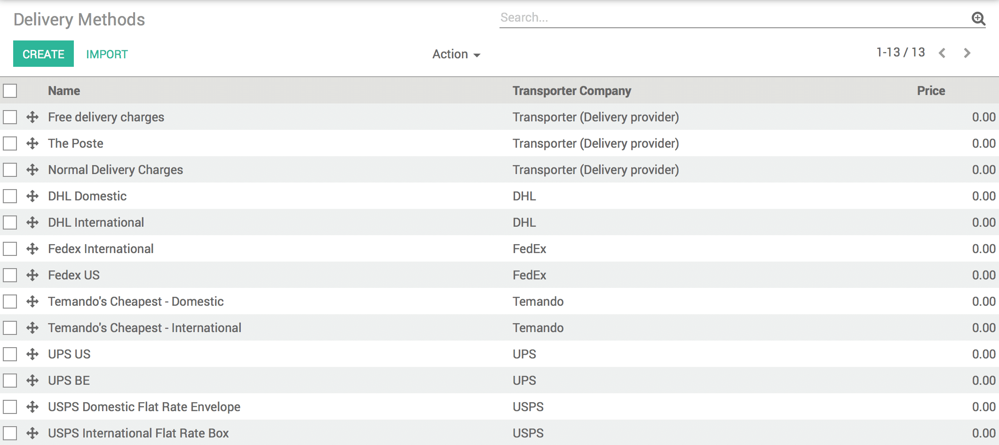
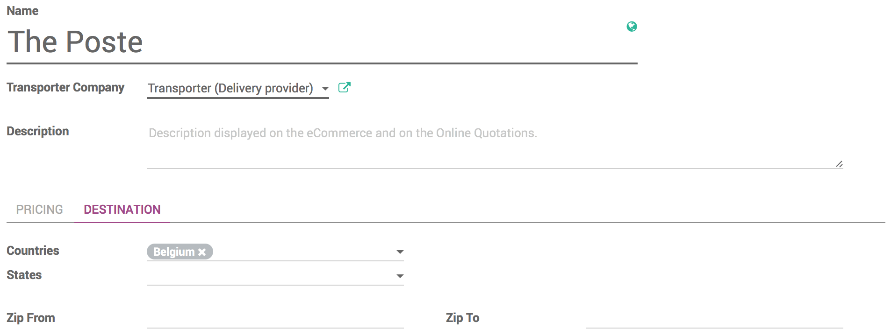
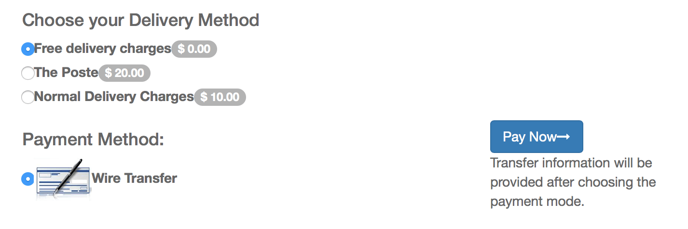

===================================================================
How can I limit a delivery method to a certain number of countries?
===================================================================

Overview
========

With Odoo, you can have different types of delivery methods, and you can
limit them to a certain number of countries.

Configuration
=============

Go to the **Inventory** module, click on **Configuration** and then on
**Delivery Methods**.

Select the delivery method that you want to change, or create a new one.

In the **Destination** tab, choose the countries to which you want to
apply this delivery method.

Now, that this is done, Let's see the result.

If you go to the website, and you try to buy something, once you've
entered your details and you proceed to the payment, the website will
propose you only the delivery methods that apply to your shipping
address.

.. note::
    This process doesn't work in backend. We assume that when you
    create a Sale Order, you know which delivery method you can use since
    you created them.