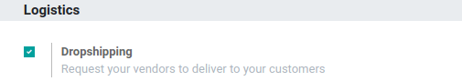

==================================================================
Send Products to Customers Directly from Suppliers (Drop-shipping)
==================================================================

What is Drop-Shipping?
======================

Drop-Shipping is a system that allows orders taken from your store to be
shipped straight from your supplier to your customer. On a usual
delivery system, products are sent from your supplier to your warehouse
to be put in stock and then shipped to your customers after ordering.

With drop-shipping, no item is stocked. When a customer places an order
in your shop, the item is delivered straight from the supplier to the
customer. Therefore, the product doesn't need to get through your
warehouse.

Points to be Considered while Implementing Drop-Shipping
========================================================

-  Use drop-shipping only for the products you can't or don't want to keep in stock.
        One reason is that you'll always make smaller
        margins on items that are drop-shipped, so you should keep it
        only for items that take up a lot of space in your warehouse.

-  Drop-shipping is best for niche products.
       Chances are that products that are in high demand are being offered by large suppliers at a
       fraction of the price you'll be able to charge, so using a more
       costly shipping method won't be financially rewarding. But if
       your product is unique, then it makes sense!

-  To protect your customers from bad experiences.
       Test drop-shipping companies for yourself beforehand and list the best ones.

-  Make sure time is not against you.
       Drop-shipping should take a reasonable amount of time and surely not more than it would have taken you to handle it all by yourself. It's also nice to be able
       to provide your customers with a tracking number.

-  Items have to be available from your supplier.
       It's good to know if
       the product you're selling is available upstream. If you don't
       have that information, inform your customers that you don't hold
       the item in stock and that it's subject to availability from a
       third party.

.. tip::
      For more information and insights about Drop-Shipping, you can read our
      blog: `*What is drop-shipping and how to use
      it* <https://www.odoo.com/blog/business-hacks-1/post/what-is-drop-shipping-and-how-to-use-it-250>`__.

Configure Drop-Shipping
=======================

Activate the functionality in the *Purchase* application by going to :menuselection:`Configuration
--> Settings`.

Then, go to the *Inventory* app, in :menuselection:`Configuration --> Settings` to
activate the *Multi-Step Routes* feature. It will allow you to make
the *Route* field appear on the sale order lines to specify you send a
product via drop-shipping.

.. image:: dropshipping/dropshipping_02.png
    :align: center

Now, in the *Sales* app, go to :menuselection:`Products --> Products`. Select the
product you would like to drop-ship and add a vendor pricelist which
contains the right supplier, via the purchase tab.

.. image:: dropshipping/dropshipping_03.png
    :align: center

Send Products from the Suppliers Directly to the Customers
==========================================================

Create a *Sales Order* and add the product on which you just set the
vendor. Add the *Route* field thanks to the widget on the right of the
sale order line. Now, you are able to specify that your products’ route
is *Drop-Shipping*.

.. image:: dropshipping/dropshipping_04.png
    :align: center

.. image:: dropshipping/dropshipping_05.png
    :align: center

Once the sale order is confirmed, Odoo automatically generates a
*Request for Quotation* for the supplier who will proceed to the
drop-shipping. You can find it in the *Purchase* app, with the sale
order as *Source Document*.

.. image:: dropshipping/dropshipping_06.png
    :align: center

Once this *Purchase Order* is confirmed, a *Receipt Order* is
created and linked to it. The source location is the vendor location and
the destination location is the customer location. Then, the product
won’t go through your own stock when you validate the dropship document.

.. image:: dropshipping/dropshipping_07.png
    :align: center

You can also easily access the dropship document directly from your
inventory dashboard.

.. image:: dropshipping/dropshipping_08.png
    :align: center
