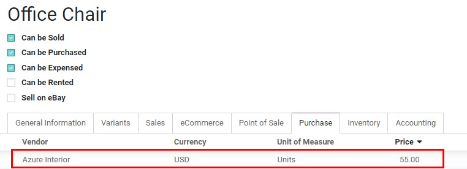
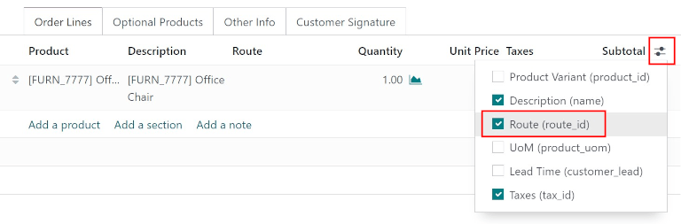
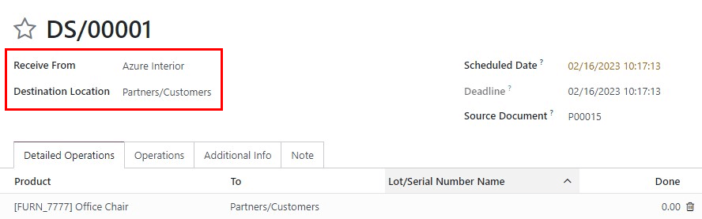

==================================================================
Send products to customers directly from suppliers (drop-shipping)
==================================================================

What is drop shipping?
======================

Drop-Shipping is a system that allows orders taken from a store to be shipped straight from a
supplier to the customer. Typically, products are sent from a supplier to the warehouse to be put in
stock, then shipped to the customer after orders are placed.

With drop-shipping, items are not stocked. When an order is placed by a customer, the item is
delivered directly from the supplier to the customer. Therefore, the product doesn't need to go
through the warehouse.

Products can be configured to be automatically drop-shipped anytime they are ordered by selecting
the Route :guilabel:`Dropship` on the product form. Products can also be configured to be
drop-shipped when creating a quote by selecting the Route :guilabel:`Dropship` for each specific
product in the :guilabel:`Order Line`.

When to use drop-shipping
=========================

Drop-shipping is typically used on products that can't or should not be kept in stock. Since there
are smaller margins on items that are drop-shipped, it should be primarily used  on items that take
up a lot of space in the warehouse. Another common use is for unique items that are infrequently
ordered. Products that are in high demand make sense to keep in stock, whereas the more unique and
infrequently sold products are best to drop-ship.

Things to consider when implementing drop-shipping
==================================================

- | **Ensure customer satisfaction.**
  | Test drop-shipping from the suppliers before offering it to customers.

- | **Make sure drop-shipping is efficient.**
  | Shipping time should not take longer than if the product was stored and shipped from the
    warehouse. Be sure customers can be provided with a tracking number for drop-shipments.

- | **Ensure items are readily available from the supplier.**
  | It is best practice to check with the supplier on stock for items that are drop-shipped. If the
    product's availability is not known, customers should be informed  that the items are not kept
    in stock and availability is dependent on a third party.

Configuration
=============

Enable the :guilabel:`Dropshipping` option in :menuselection:`Purchase --> Configuration -->
Settings --> Logistics`.

.. image:: dropshipping/dropshipping_01.png
   :align: center
   :alt: Dropshipping settings option enabled Odoo Inventory configuration settings.

Then, in the :guilabel:`Inventory` app, enable the :guilabel:`Multi-Step Routes` option in
:menuselection:`Inventory --> Configuration --> Settings --> Warehouse`. Note that activating
:guilabel:`Multi-Step Routes` will also activate :guilabel:`Storage Locations`.

These two configurations enable the :guilabel:`Route` field on the sale order, allowing products to
be drop-shipped.

.. image:: dropshipping/warehouse-settings.png
   :align: center
   :alt: Storage Locations and Multi-Step Routes enabled in Warehouse settings.

Next, drop-shipping needs to be configured on the product form.  In the :guilabel:`Sales` app, go to
:menuselection:`Products --> Products`. Select the product to drop-ship, and in the
:guilabel:`Purchase` tab, add the vendor information.

.. note::
   If a product should always be drop-shipped anytime a customer places an order, select the route
   :guilabel:`Dropship` in the :guilabel:`Inventory` tab. If selected, dropship will not need to be
   specified on the sales order, instead the product will always be drop-shipped when ordered.

Send products from the suppliers directly to the customers
==========================================================

In the :guilabel:`Sales` application, create a quotation with the product that a vendor was just
assigned to. Assign the route :guilabel:`Dropship` to the product. If the :guilabel:`Route` column
is not visible, enable it by clicking on the :guilabel:`Additional Options Menu` next to
:guilabel:`Subtotal`, then click on :guilabel:`Route`.

Once the sale order is confirmed, Odoo automatically generates a :guilabel:`Request for Quotation`
for the supplier to drop-ship the product. The quote can be found in the source document.

Once the :guilabel:`Purchase Order` is confirmed, a :guilabel:`Receipt Order` is created and linked
to it. The :guilabel:`Receive From` field defines the vendor location and the :guilabel:`Destination
Location` defines the partner/customer location. Once the dropship is validated, the product won't
go through the warehouse, rather it will go directly from the supplier to the customer.

.. tip::
   Dropship documents ready for processing  can also be found from the :guilabel:`Inventory`
   dashboard.
