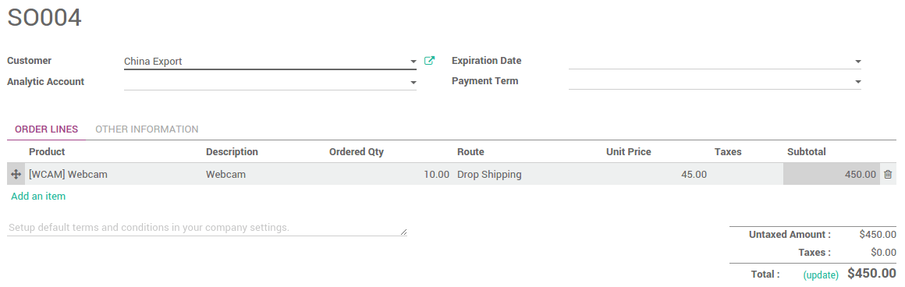

==========================================================================
How to send products to customers directly from suppliers (drop-shipping)?
==========================================================================

What is drop-shipping?
----------------------

Drop-Shipping is a system that allows orders taken from your store to be
shipped straight from your supplier to your customer. On a usual
delivery system, products are sent from your supplier to your warehouse
to be put in stock, and then shipped to your customers after ordering.
With drop-shipping, no item is stocked. When a customer places an order
in your shop, the item is delivered straight from the supplier to the
customer. Therefore, the product doesn't need to get through your
warehouse.

Points to be considered while implementing drop-shipping
--------------------------------------------------------

-  Use drop-shipping only for the products you can't or don't want to
   keep in stock. One reason is that you'll always make smaller
   margins on items that are drop-shipped, so you should keep it
   only for items that take up a lot of space in your warehouse.

-  Drop-shipping is best for niche products. Chances are that products
   that are in high demand are being offered by large suppliers at a
   fraction of the price you'll be able to charge, so using a more
   costly shipping method won't be financially rewarding. But if
   your product is unique, then it makes sense!

-  To protect your customers from bad experiences, test drop-shipping
   companies for yourself beforehand and list the best ones.

-  Make sure time is not against you. Drop-shipping should take a
   reasonable amount of time and surely not more than it would have
   taken you to handle it all by yourself. It's also nice to be able
   to provide your customers with a tracking number.

-  Items have to be available from your supplier. It's good to know if
   the product you're selling is available upstream. If you don't
   have that information, inform your customers that you don't hold
   the item in stock and that it's subject to availability from a
   third party.

.. tip::
    For more information and insights on Drop-shipping, read our blog on 
    `What is drop-shipping and how to use it <https://www.odoo.com/blog/business-hacks-1/post/what-is-drop-shipping-and-how-to-use-it-250>`__.

Configuring drop-shipping
-------------------------

-   Open the menu :menuselection:`Inventory --> Configuration --> Settings`. 
    Go to **Location & Warehouse**, locate the **Dropshipping**
    option and tick the box **Allow suppliers to deliver directly to
    your customers**. Then, click on **Apply**.

.. image:: media/dropshipping06.png
   :align: center

-  Then go to the menu :menuselection:`Sales --> Configuration --> Settings`.
   Locate **Order Routing** and tick the box **Choose specific
   routes on sales order lines (advanced)**. Click on **Apply**.

.. image:: media/dropshipping05.png
   :align: center

-  Now, open the menu :menuselection:`Sales --> Sales --> Products`. 
   Add a supplier to the products you want to dropship.

.. image:: media/dropshipping03.png
   :align: center

How to send products from the suppliers directly to the customers
=================================================================

-  Create a **Sales Order** and specify on a sales order line for your
   products that the route is **Dropshipping**.

-  Open the menu :menuselection:`Purchases --> Purchases --> Requests for Quotation`.
   The draft purchase order is automatically created from the
   procurement with the drop-shipping route. Once the order is
   confirmed, you will see that one shipment has been created.

.. image:: media/dropshipping04.png
   :align: center

-  To confirm the sending from the vendor to the customer, go back to
   **Inventory** app. On the dashboard, click on **# TO RECEIVE** on
   the dropship card.

.. image:: media/dropshipping02.png
   :align: center

-  It will open the list of drop-shipping transfers. Validate the
   transfer once it has been done. The items will be directly
   delivered from the partner to the customer without transiting to
   your warehouse.

.. seealso::
    * :doc:`inventory_flow`

.. todo::
    Add link to this section when available
    * How to analyse the performance of my vendors?
