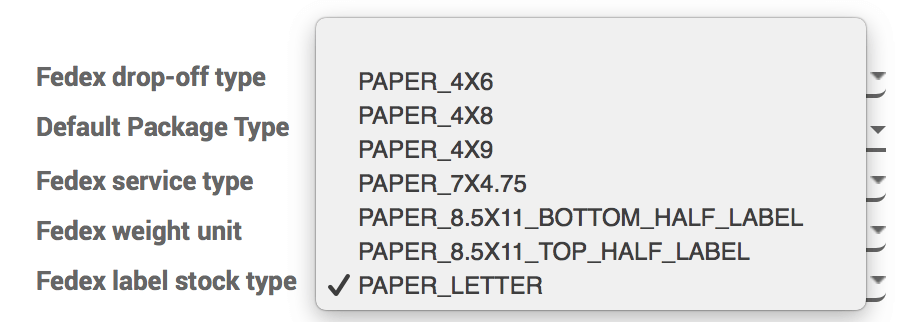
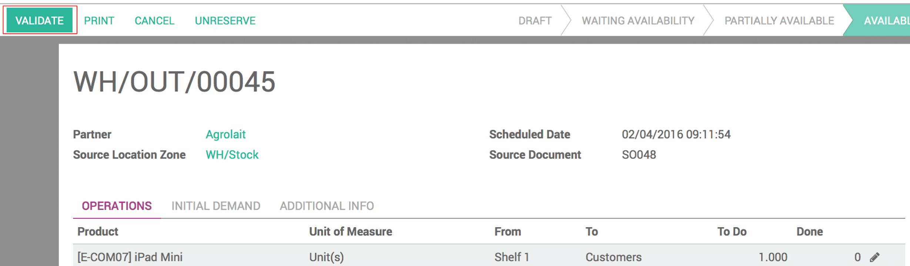
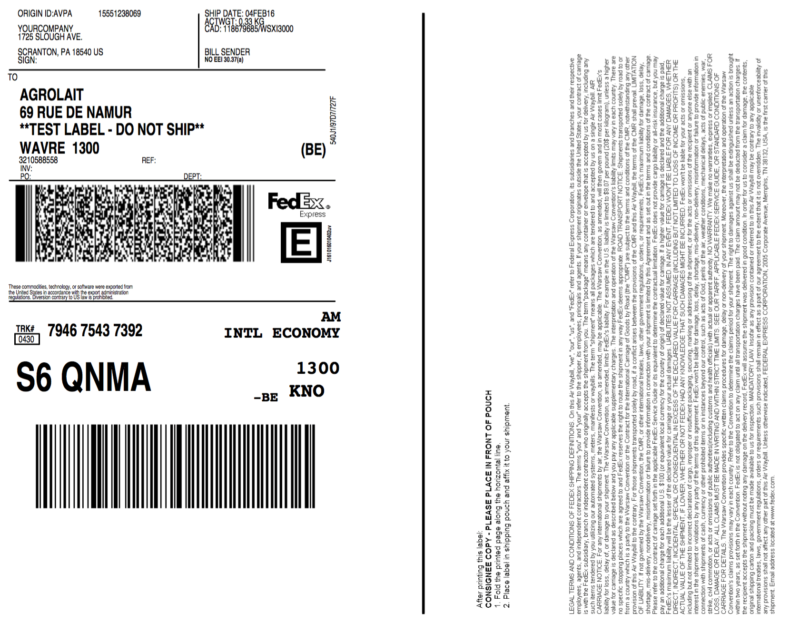

================================
How can I change the label type?
================================

Overview
========

With Odoo, you can choose among different types of labels for your
delivery orders. Follow the steps below and give an appropriate label
type to your delivery.

Configuration
=============

In the **Inventory** module, Go to **Configuration** and click on
**Delivery methods**.

Choose a delivery method and then click on **Edit**.

.. image:: media/label_type01.png
    :align: center

In the **Pricing** tab, under **Fedex label stock type**, you can choose
one of the label types available. The availability will vary depending
on the carrier.

Once this is done, you can see the result if you go to the Sales module
and you create a new sale order.

As you confirm the sale and validate the delivery with the carrier for
which you have modified the label type, The label will appear in your
history.

.. image:: media/label_type03.png
    :align: center

.. image:: media/label_type05.png
    :align: center

The default label type is paper letter, and if you choose the label type
bottom half for example, here is the difference :

.. image:: media/label_type06.png
    :align: center

