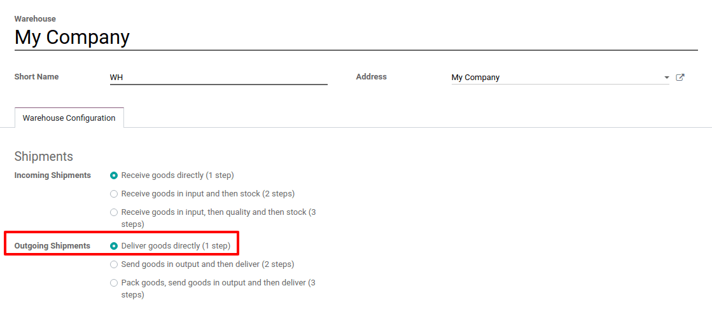
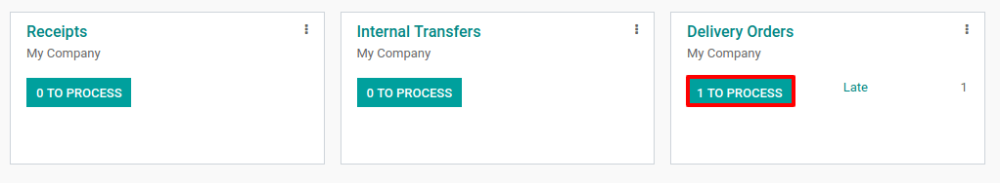
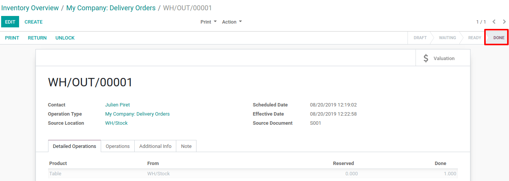

==============================================
Process Delivery Orders in one Step (Shipping)
==============================================

There is no configuration needed to deliver in one step. The default
outgoing shipments are configured to be directly delivered from the
stock to the customers.

However, if advanced routes have been activated and you set another
shipping configuration on your warehouse, you can set it back to the
one-step delivery configuration. Go to :menuselection:`Inventory --> Configuration --> Warehouses`
and edit the warehouse in question.

Then, choose *Deliver goods directly* as your *Outgoing Shipments*
strategy.

Create a Sales Order
====================

In the *Sales* application, create a quotation with some storable
products to deliver and confirm it.

Notice that we now see 1 delivery associated with this *sales order*
in the stat button above the sales order. If you click on the 1 Delivery
stat button, you should now see your delivery order.

.. image:: one_step/one_step_02.png
    :align: center

Process a Delivery
==================

You can also find the *delivery order* directly from the *Inventory*
application. In the dashboard, you can click the *1 TO PROCESS* button
under the Delivery Orders Kanban card.

Enter the picking that you want to process. You will be able to click on
*Validate* to complete the move if you have products in stock.

.. image:: one_step/one_step_04.png
    :align: center

Once you *Validate* the delivery order, the products leave your
*WH/Stock location* and are moved to the *Customer location*. You
can easily see that the delivery took place thanks to the status of the
document which is now *Done*.

