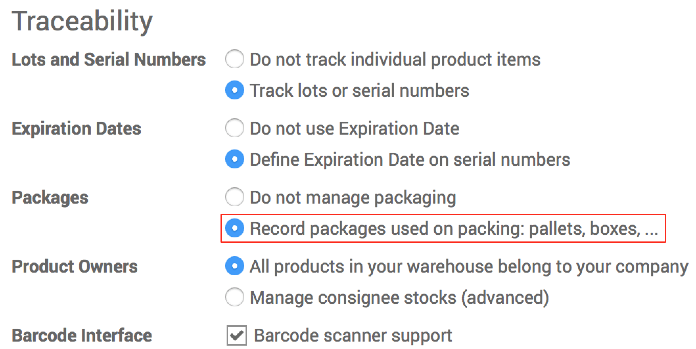
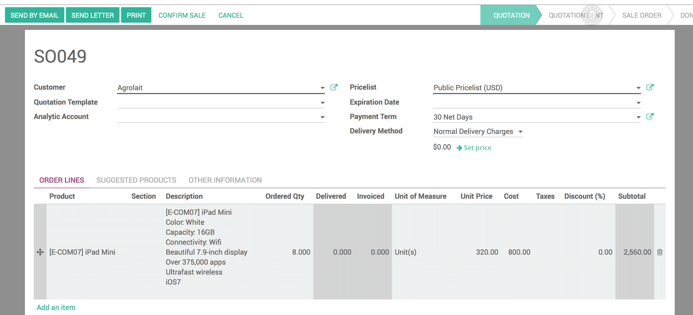
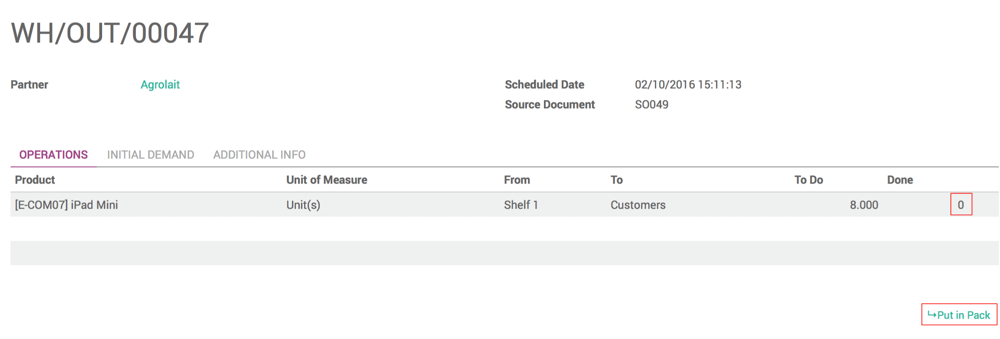
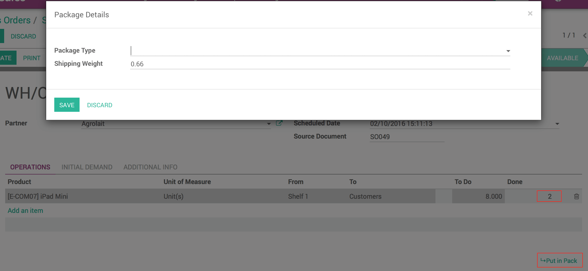

==========================================================
How can you change the packaging type for your sale order?
==========================================================

Overview
========

Odoo gives you the possibility to change the default packaging type and
adapt the packaging the way you want it, depending on the weight of the
order.

Configuration
=============

In the **Inventory** module, Go to **Configuration** and then click on
**Settings**.

In :menuselection:`Traceability --> Packages`, flag **Record packages used on
packing : pallets, boxes,...**

*Sale process*

In the **Sales** module, go to **Sales** and click on **Sale Order**.

Create your new Sale Order, and **Confirm the Sale**.

Once you've confirmed the Sale, you need to click on **Delivery**, to be
redirected to the Delivery order.

Click on **Edit**, and you can now change the packaging.

In the **Operations** tab, in the last column, change the **0** and put
the number of products that you want to pack together. Then click on
**Put in Pack**.

Choose the type of packaging that you want. You can also see that the
weight has been adapted to your package, and you can change it manually
if you want it to be more precise. Then click on **Save**.

Repeat the operation until all the products are put in pack.

Finally, click on **Validate** to confirm the delivery.
