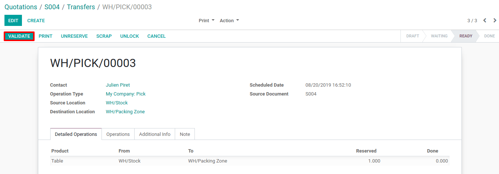
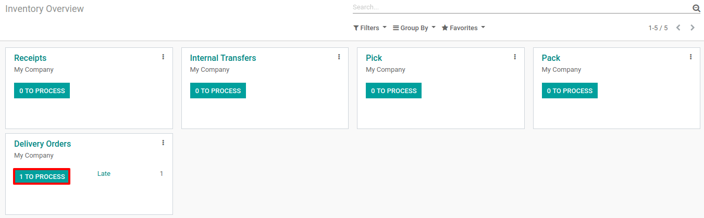

===========================================================
Process Delivery Orders in three Steps (Pick + Pack + Ship)
===========================================================

When an order goes to the shipping department for final delivery, Odoo
is set up by default to utilize a one-step operation: once all goods are
available, they are able to be shipped in a single delivery order.
However, that process may not reflect reality and your company could
require more steps before shipping.

With the delivery in 3 steps (Pick + Pack + Ship), the items will be
picked to be transferred to a packing area. Then, they will be moved to
an output location before being effectively shipped to the customers.

Activate Multi-Step Routes
==========================

The first step is to allow using *multi-step routes*. Indeed, routes
provide a mechanism to chain different actions together. In this case,
we will chain the picking step to the shipping step.

To allow *multi-step routes*, go to :menuselection:`Inventory --> Configuration --> Settings` and
activate the option. Note that activating *Multi-Step
Routes* will also activate *Storage Locations*.

.. image:: three_steps/three_steps_01.png
    :align: center

Configure Warehouse for Delivery in 3 Steps
===========================================

Once *Multi-Step Routes* has been activated, you can go to
:menuselection:`Inventory --> Configuration --> Warehouse` and enter the warehouse which will use
delivery in 3 steps. You can then select the option *Pack goods, send
goods in output and then deliver (3 steps)* for *Outgoing Shipments*.

.. image:: three_steps/three_steps_02.png
    :align: center

Activating this option will lead to the creation of two new locations,
*Output* and *Packing Zone*. If you want to rename it go to :menuselection:`Inventory --> 
Configuration --> Locations`, *Select* the one you want to rename and update its name.

Create a Sales Order
====================

In the *Sales* application, you can create a quotation with some
storable products to deliver. Once you confirm the quotation, three
pickings will be created and automatically linked to your sale order.

.. image:: three_steps/three_steps_03.png
    :align: center

If you click the button, you should now see three different pickings:

1. The first one with a reference PICK to designate the picking process,

2. The second one with the reference PACK that is the packing process,

3. The last one with a reference OUT to designate the shipping process.

.. image:: three_steps/three_steps_04.png
    :align: center

Process the Picking, Packing, and Delivery
==========================================

The picking operation is the first one to be processed and has a
*Ready* status while the other ones are *Waiting Another Operation*.
The Packing operation will become *Ready* as soon as the picking one
is marked as done.

You can enter the picking operation from here, or access it through the
inventory dashboard.

.. image:: three_steps/three_steps_05.png
    :align: center

In case you have the product in stock, it has automatically been
reserved and you can simply validate the picking document.

Once the picking has been validated, the packing order is ready to be
processed. Thanks to the fact that the documents are chained, the
products which have been previously picked are automatically reserved on
the packing order which can be directly validated.

.. image:: three_steps/three_steps_07.png
    :align: center

.. image:: three_steps/three_steps_08.png
    :align: center

Once the packing has been validated, the delivery order is ready to be
processed. Here again, it is directly ready to be validated in order to
transfer the products to the customer location.

.. image:: three_steps/three_steps_10.png
    :align: center