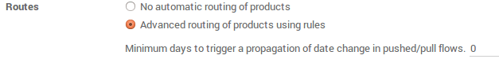

==========================================================
How to process delivery orders in two steps (pick + ship)?
==========================================================

Overview
========

When an order goes to the shipping department for final delivery, Odoo
is set up by default to utilize a **one-step** operation: once all goods are
available, they are able to be shipped in a single delivery order.
However, your company's business process may have one or more steps that
happen before shipping. In the **two steps** process, the items in a delivery
order are **picked** in the warehouse and brought to an **output location** for
**shipping**. The goods are then shipped.

In order to accomplish a **Pick + Ship** delivery in Odoo, there are a few 
necessary configuration steps. These steps create an additional
location, which by default is called **Output**. So, if your warehouse's
code is ``WH``, this configuration will create a location called
``WH/Output``. Goods will move from ``WH/Stock`` to ``WH/Output`` in the first
step (picking). Then, they move from ``WH/Output`` to ``WH/Customers`` (in the
case of sales orders) in the second step (shipping).

.. note::
    Check out :doc:`inventory_flow` to determine if this inventory flow is the
    correct method for your needs.

Configuration
=============

Allow management of routes
--------------------------

Odoo configures movement of delivery orders via the **routes**. Routes
provide a mechanism to chain different actions together. In this case,
we will chain the picking step to the shipping step.

To allow management of routes, go to :menuselection:`Configuration --> Settings`.

Ensure that the radio button **Advanced routing of products using
rules** is checked.

Click on **Apply** at the top of the page to save changes (if you needed to
check the radio button above).

.. note::
    If you checked option **Advanced routing of products using rules**
    you may need to activate **Manage several locations per warehouse** if it
    wasn't activated beforehand.

Configure warehouse for Pick + Ship
------------------------------------

To configure a **Pick + Ship** move, go to 
:menuselection:`Configuration --> Warehouses` and edit
the warehouse that will be used.

For outgoing shippings, set the option to **Bring goods to output
location before shipping (Pick + Ship)**

.. image:: media/two_steps03.png
   :align: center

Create a Sales Order
====================

Install the **Sale** if it is not the case, and 
create a sales order with some products to deliver.

Notice that we now see ``2`` transfers associated with this sales order
in the **Delivery** stat button above the sales order.

.. image:: media/two_steps01.png
   :align: center

If you click on the **2 Transfers** stat button, you should now see two
different pickings, one with a reference **PICK** to designate the
picking process and another with a reference **OUT** to designate the
shipping process.

.. image:: media/two_steps04.png
   :align: center

Process a Delivery
==================

How to Process the Picking Step?
--------------------------------

Ensure that you have enough product in stock, and go to 
**Inventory** and click on the **Waiting** link under the **Pick** kanban card.

.. image:: media/two_steps06.png
   :align: center

Click on the picking that you want to process.

Click on **Reserve** to reserve the products if they are available.

Click on **Validate** to complete the move from **WH/Stock** to **WH/Output**.

This has completed the picking step and the **WH/PICK** move should now show
**Done** in the status column at the top of the page. The product has
been moved from **WH/Stock** to **WH/Output** location, which makes the product
**available for the next step** (Shipping).

How to Process the Shipping Step?
---------------------------------

Go to **Inventory** and click on the **# TO DO** link under the
**Delivery Orders** kanban card.

.. image:: media/two_steps02.png
   :align: center

Click on the picking that you want to process.

Click on **Validate** to complete the move from **WH/Output** to the
customer (Click **Apply** to assign the quantities based on the
quantities listed in the **To Do** column)

This has completed the shipping step and the **WH/OUT** move should now show
**Done** in the status column at the top of the page. The product has
been shipped to the customer.

.. todo::
    link to these sections when they will be available
    -  Process Overview: From sales orders to delivery orders

    -  Process Overview: From purchase orders to receptions
