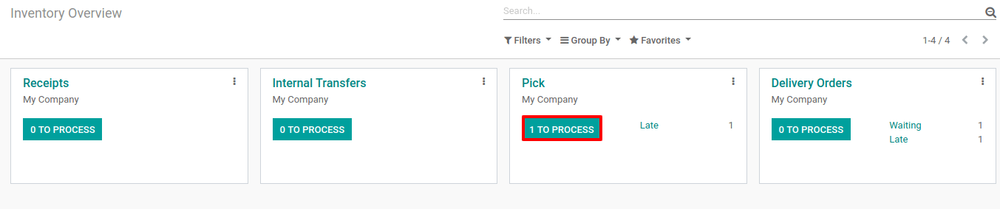
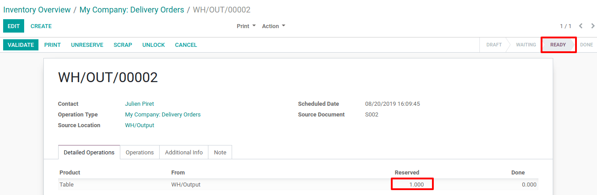

==================================================
Process Delivery Orders in two Steps (Pick + Ship)
==================================================

When an order goes to the shipping department for final delivery, Odoo
is set up by default to utilize a one-step operation: once all goods are
available, they are able to be shipped in a single delivery order.

However, your company's business process may have one or more steps that
happen before shipping. In the two steps process, the products which are
part of the delivery order are picked in the warehouse and brought to an
output location before being effectively shipped.

Activate Multi-Step Routes
==========================

The first step is to allow using *multi-step routes*. Indeed, routes
provide a mechanism to chain different actions together. In this case,
we will chain the picking step to the shipping step.

To allow *multi-step routes*, go to :menuselection:`Inventory --> Configuration --> Settings` and
activate the option. Note that activating *Multi-Step Routes* will also
activate *Storage Locations*.

.. image:: two_steps/two_steps_01.png
    :align: center

Warehouse configuration
=======================

Once *Multi-Step Routes* has been activated, you can go to :menuselection:`Inventory -->
Configuration --> Warehouse` and enter the warehouse which will use
delivery in 2 steps. You can then select the option *Send goods in
output and then deliver (2 steps)* for Outgoing Shipments.

.. image:: two_steps/two_steps_02.png
    :align: center

Activating this option will lead to the creation of a new *Output*
location. If you want to rename it go to :menuselection:`Inventory --> Configuration -->
Locations`, Select Output and update its name.

.. image:: two_steps/two_steps_03.png
    :align: center

Create a Sales Order
====================

In the *Sales* application, you can create a quotation with some
storable products to deliver. Once you confirm the quotation, two
pickings will be created and automatically linked to your sale order.

.. image:: two_steps/two_steps_04.png
    :align: center

If you click on the *2 Delivery* button, you should now see two
different pickings, one with a reference *PICK* to designate the
picking process and another one with a reference *OUT* to designate
the shipping process.

.. image:: two_steps/two_steps_05.png
    :align: center

Process the Picking and the Delivery
====================================

The picking operation is the first one to be processed and has a
*Ready* status while the delivery operation will only become *Ready*
once the picking operation has been marked as done.

You can enter the picking operation from here, or access it through the
inventory dashboard.

In case you have the product in stock, it has automatically been
reserved and you can simply validate the picking document.

.. image:: two_steps/two_steps_07.png
    :align: center

Once the picking has been validated, the delivery order is ready to be
processed. Thanks to the fact that the documents are chained, the
products which have been previously picked are automatically reserved on
the delivery order.

.. image:: two_steps/two_steps_08.png
    :align: center

