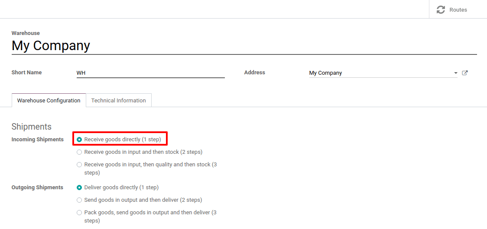
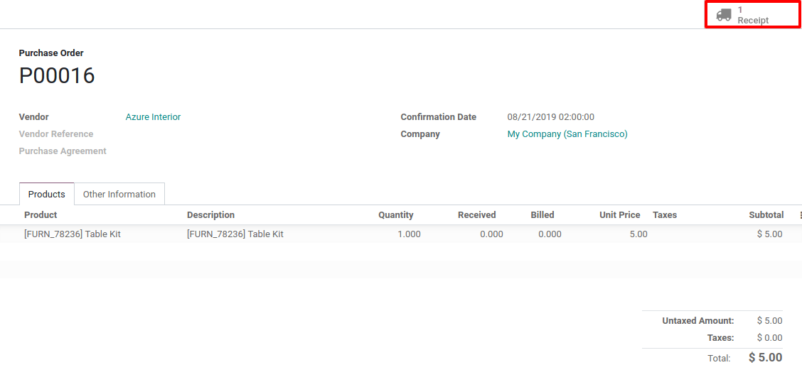
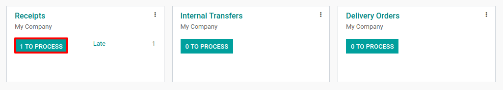

=======================================
Process a Receipt in one step (Receipt)
=======================================

There is no configuration needed to receive in one step. The default
incoming shipments are configured to be directly received from the
vendors to the stock.

However, if advanced routes have been activated and you set another
incoming configuration on your warehouse, you can set it back to the
one-step receipt configuration. To do so, go to :menuselection:`Configuration -->
Warehouses` and edit the warehouse in question.

Set the *Incoming Shipments* option to *Receive goods directly (1
step)*.

Create a Purchase Order
=======================

To create a *Request for Quotation*, go to the *Purchase*
application and click on *Create*. Then, add some storable products to
receive and confirm the *RfQ*.

Notice that, now, we see 1 receipt associated with the purchase order
you just created. If you click on the button, you will see your receipt
order.

Process a Receipt
=================

You can also fin the receipt directly from the *Inventory* app. When
on the dashboard, you can click the *1 TO PROCESS* button under the
*Receipts* Kanban card. Then, you will see your receipt.

Now, enter the picking that you want to process. You will be able to
click on *Validate* to complete the move directly as products coming
from suppliers are considered as being always available. 

.. note::
   If you have :guilabel:`Storage Locations` activated, you can click the hamburger menu next to 
   the :guilabel:`Done quantity` to specify the location(s) where you are storing the received
   product(s).

.. image:: one_step/one_step_04.png
   :align: center

Once you *Validate* the receipt, the products leave the *Supplier
Location* to enter your *WH/Stock Location*. You can easily see that
the receipt took place thanks to the status of the document, which is
now *Done*.

.. image:: one_step/one_step_05.png
   :align: center
