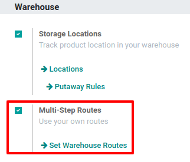
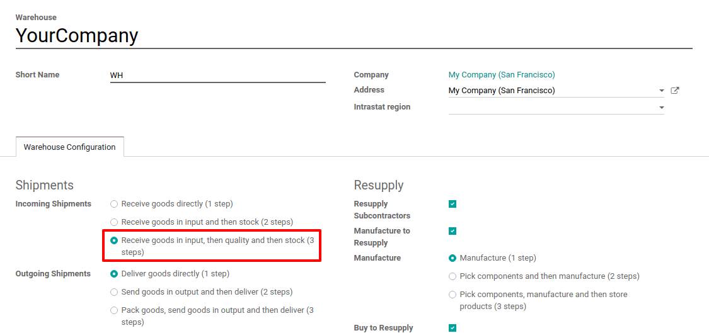
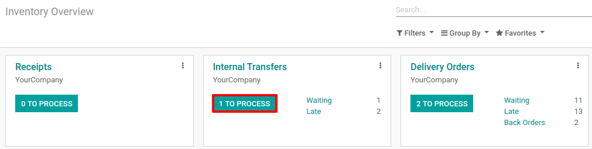

==========================================================
Process a Receipt in three steps (Input + Quality + Stock)
==========================================================

Quality is essential for most companies. To make sure we maintain quality throughout the supply
chain, it only makes sense that we assess the quality of the products received from suppliers.
To do so, we will add a quality control step.

Odoo uses routes to define how to handle the different receipt steps.
Configuration of those routes is done at the warehouse level. By default, the reception is a 
one-step process, but it can also be configured to have two-steps or three-steps processes.

The three-steps flow works as follows: you receive the goods in your receiving area, then transfer 
them into a quality area for quality control (QC). When the quality check is completed, the goods 
that match the QC requirements are moved to stock

Activate Multi-Step Routes
==========================

The first step is to allow the use of *Multi-Step Routes*. Routes provide a mechanism to chain different 
actions together. In this case, we will chain the picking step to the shipping step.

To enable *Multi-Step Routes*, go to :menuselection:`Inventory --> Configuration --> Settings` and 
activate the option.

.. note::
         By default, activating *Multi-Step Routes* also activates *Storage
         Locations*.

Configure warehouse for receipt in 3-steps
==========================================

Once *Multi-Step Routes* has been activated, go to :menuselection:`Inventory --> Configuration --> 
Warehouse` and enter the warehouse which should work with the 3-steps reception. Then, select 
*Receive goods in input, then quality and then stock (3 steps)* for *Incoming Shipments*.

Activating this option leads to the creation of two new locations: *Input* and *Quality Control*. 
To rename them, go to :menuselection:`Inventory --> Configuration --> Locations` and select
the one you want to rename.

Create a Purchase Order
=======================

To start the 3-steps reception process, create a *Request for Quotation* from the *Purchase* app, 
add some storable products to it and confirm. Then, three pickings are created with your *Purchase
Order* as the source document:

1. The first one with a reference *IN* to designate the receipt
   process;

2. The second one with a reference *INT*, which is the move to the
   quality control zone;

3. The last one with a reference *INT* to designate the move to stock.

.. image:: three_steps/three_steps_03.png
   :align: center
   :alt: View of the three moves created by the purchase of products in three steps strategy

Process the receipt, quality control and entry in stock
=======================================================

As the receipt operation is the first one to be processed, it has a *Ready* status while the others 
are *Waiting Another Operation*.

To access the receipt operation, click on the button from the *Purchase Order* or go back to the 
*Inventory* app dashboard and click on *Receipts*.

.. image:: three_steps/three_steps_04.png
   :align: center
   :alt: View of the button to click to see the receipts that need to be processed

In the receipt order, products are always considered available because they come from the supplier. 
Then, the receipt can be validated.

.. image:: three_steps/three_steps_05.png
   :align: center
   :alt: View of the move (internal transfer) from the reception area to the warehouse input area

Once the receipt has been validated, the transfer to quality becomes *Ready*. And, because the documents 
are chained to each other, products previously received are automatically reserved on the 
transfer. Then, the transfer can be directly validated.

.. image:: three_steps/three_steps_07.png
   :align: center
   :alt: View of the move (internal transfer) from the input area to the quality control area

Now, the transfer that enters the products to stock is *Ready*. Here, it is again ready to be 
validated in order to transfer the products to your stock location.

.. image:: three_steps/three_steps_08.png
   :align: center
   :alt: View of the button to click to see the internal transfers that need to be processed

.. image:: three_steps/three_steps_09.png
   :align: center
   :alt: View of the move (internal transfer) from the quality control area to the stock