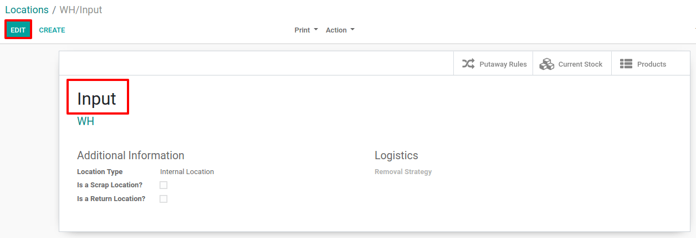
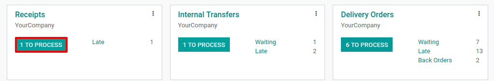
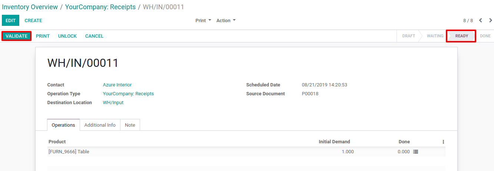
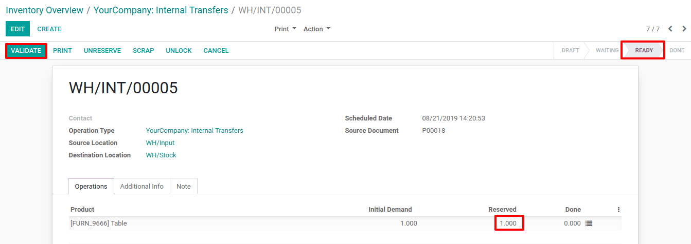

==============================================
Process a Receipt in two steps (Input + Stock)
==============================================

Configuration
=============

Odoo uses routes to define exactly how you will handle the different
receipt steps. The configuration is done at the *Warehouse* level. By
default, the reception is a one-step process, but changing the
configuration can allow you to have 2 steps.

The 2 steps flow is like this: you receive the goods in an input area,
then transfer them to your stock. As long as the goods are not
transferred in your stock, they will not be available for further
processing.

Activate Multi-Step Routes
==========================

The first step is to allow using *multi-step routes*. Indeed, routes
provide a mechanism to chain different actions together. In this case,
we will chain the unload step in the input area to the step entering the
products in stock.

To allow *multi-step routes*, go to :menuselection:`Configuration --> Settings` and
activate the feature. By default, activating *multi-step routes* will
also activate *Storage Locations*.

.. image:: two_steps/two_steps_01.png
   :align: center

Configure warehouse for receipt in 2 steps
==========================================

Once *multi-step routes* is activated, you can go to :menuselection:`Configuration -->
Warehouse` and enter the warehouse which will use receipt in 2 steps.
Then, you can select the option *Receive goods in input and then stock
(2 steps)* for *Incoming Shipments*.

.. image:: two_steps/two_steps_02.png
   :align: center

Activating this option will lead to the creation of a new *Input*
location. If you want to rename it, you can go to :menuselection:`Configuration -->
Locations --> Select Input` and update its name.

Create a purchase order
=======================

In the *Purchase* application, you can create a *Request for
Quotation* with some storable products to receive from a supplier. Once
the *RfQ* is confirmed, the receipt picking will be created and
automatically linked to your purchase order.

.. image:: two_steps/two_steps_04.png
   :align: center

Now, by clicking on the *1 Receipt* button, you will see the first
picking which will allow entering the product in the *input location*.
Then, another picking, an internal transfer, has been created in order
to move the products to *Stock*.

Process the receipt and the internal transfer
=============================================

The receipt is the first one to be processed and has a *Ready* status
while the internal transfer will only become *Ready* once the receipt
has been marked as *Done*.

You can enter the receipt operation from the purchase order, or access
it through the inventory dashboard.

By default, a receipt is always considered as ready to be processed.
Then, you will be able to directly click on *Validate* to mark it as
done.

Once the receipt has been validated, the internal transfer is ready to
be processed. As documents are chained, the products which have been
received are automatically reserved on the internal transfer. Once the
transfer is validated, those products enter the stock and you will be
able to use them to fulfill customer deliveries or manufacture products.

.. image:: two_steps/two_steps_07.png
   :align: center

