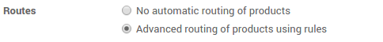
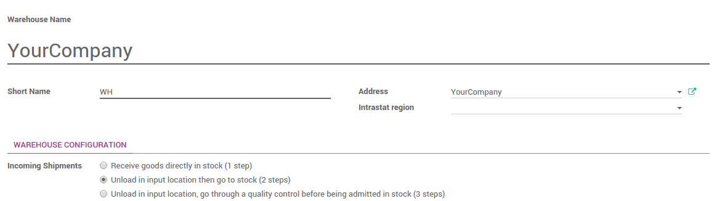
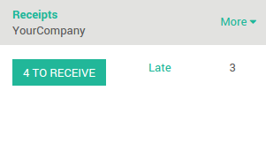

===========================================================
How to unload your shipment to an input location? (2 steps)
===========================================================

Overview
========

Odoo uses routes to define exactly how you will handle the different
receipt steps. The configuration is done at the level of the warehouse.
By default, the reception is a one step process, but changing the
configuration can allow to have 2 or even 3 steps.

The 2 steps flow is the following : You receive the goods in an input
area then transfer them from input area to your stock. As long as the
goods are not transferred in your stock, they will not be available for
further processing.

This is the case that will be explained in this document.

Configuration
=============

Use advanced routes
-------------------

To allow management of routes, go to the menu
:menuselection:`Inventory --> Configuration --> Settings`

Ensure that the routes option **Advance routing of product using
rules** is checked, then click on **Apply** to save changes.

Make sure that **"Manage several locations per warehouse"** is also
ticked.

How to configure your warehouse ?
---------------------------------

Go to the the menu :menuselection:`Inventory --> Configuration --> Warehouse`
and choose the warehouse where you want to change reception methods.

By default, warehouses are configured with one step reception (option **Receive
goods directly into stock**).

To add the control step, tick **Unload in input location then go to
stock (2 steps)**.

How to receipt a shipment in 2 steps?
=====================================

How to process the Receipt step ?
---------------------------------

-  In the purchase module, create a **Request for Quotation**, then click on
   the **Confirm order** button. You can see that there is one
   **Shipment** related to purchase order in the **stat button**
   above the purchase order form view. This is the receipt step.

.. image:: media/two_steps03.png
   :align: center

-  Go to **Inventory** and click on the **# TO RECEIVE** link on the
   **Receipts** card.

Click on the receipt that you want to process, then click on **Validate** to
complete the move from the **Vendor** to **WH/Input**.

This has completed the Receipt Step and the move refered with **WH/IN**. 
The product has been moved from the **Vendor** to the **WH/Input** location, 
which makes the product available for the next step.

How to transfer the receipt to your stock ? 
--------------------------------------------

Go back to the **Inventory** dashboard. The waiting transfer is now
ready. Click on the **# TRANSFERS** in the **Internal Transfers** to process
the quality control.

.. image:: media/two_steps04.png
   :align: center

Click on the picking you want to process. Click on **Validate** to
complete the move from **WH/Input** to **WH/Stock**.

This has completed the internal transfer step and the move refered with **WH/INT**. 
The receipt has been moved to your stock.

.. seealso::
    * :doc:`../delivery/inventory_flow`
    * :doc:`three_steps`
