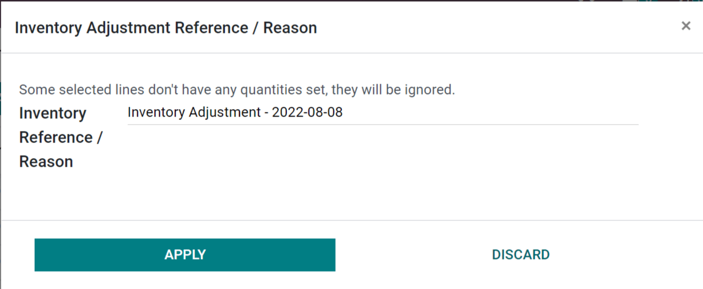
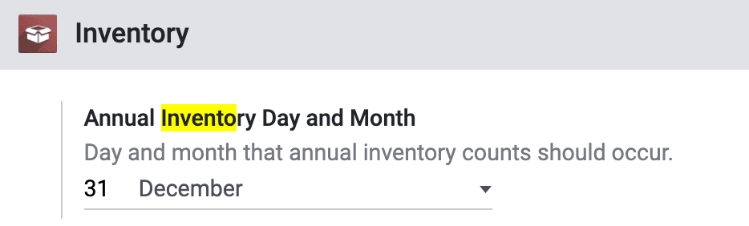

=====================
Inventory adjustments
=====================

In any warehouse management system, the recorded inventory counts in the database might not always
match the actual inventory counts in the warehouse. The discrepancy between the two counts can be
due to theft, damages, human errors, or other factors. As such, inventory adjustments must be made
to reconcile the differences, and ensure that the recorded counts in the database match the actual
counts in the warehouse.

In Odoo, inventory adjustments can be accessed through :menuselection:`Inventory --> Operations -->
Inventory Adjustments`.

The :guilabel:`Inventory Adjustments` page shows all products that are currently in stock. Each
line contains the following information:

- :guilabel:`Product`
- :guilabel:`Lot/Serial Number`
- :guilabel:`On Hand Quantity`

Add a new line
==============

To add an inventory adjustment line, click :guilabel:`Create` and fill in the :guilabel:`Product`
and :guilabel:`Counted Quantity` fields. Then click :guilabel:`Save`.

At this stage, the count is recorded but not yet *applied*. Meaning the quantity on hand is not yet
updated to match the new :guilabel:`Counted Quantity`.

To apply the new :guilabel:`Counted Quantity`, click :guilabel:`Apply` on the line or the
:guilabel:`Apply All` button on the top of the page. If :guilabel:`Apply All` is clicked, a
reference or reason can be entered before clicking :guilabel:`Apply`.

Count products
==============

Counting products is a recurring activity in a warehouse. Once a count is complete, go to
:menuselection:`Inventory --> Operations --> Inventory Adjustments` to update the
:guilabel:`Counted Quantity` column for each product line.

If a count matches the :guilabel:`On Hand Quantity` recorded in the database, click on
:guilabel:`Set`, which will copy the value in the :guilabel:`On Hand Quantity` field and paste it
in the :guilabel:`Counted Quantity` field. A move with `0.00` :guilabel:`Quantity Done` will be
recorded in the product's inventory adjustment history.

If a count does *not* match the :guilabel:`On Hand Quantity` recorded in the database, record the
count in the :guilabel:`Counted Quantity` field. When :guilabel:`Apply` is clicked, a move with the
difference between the :guilabel:`On Hand Quantity` and :guilabel:`Counted Quantity` will be
recorded in the product's inventory adjustment history.

.. image:: count_products/history-inventory-adjustments.png
   :align: center
   :alt: Inventory Adjustments History dashboard detailing a list of prior product moves.

.. note::
   Sometimes a count occurs, but can not be applied in the database right away. In the time between
   the actual count and applying the inventory adjustment, product moves can occur. In that case,
   the :guilabel:`On Hand Quantity` in the database can change and will not be consistent with the
   counted quantity. As an extra caution measure, Odoo will ask for confirmation before applying
   the inventory adjustment.

Plan counts
===========

Each inventory adjustment line contains the following information:

- :guilabel:`Scheduled Date`: the date at which a count should be made.
- :guilabel:`User`: the person in charge of the count.
- :guilabel:`Accounting Date`: the date at which the adjustments will be accounted. The column is
  hidden by default, but can be made visible by opening the column options icon.

.. important::
   In the Barcode app, users can only view counts assigned to them that are scheduled for today or
   earlier.

To plan big counts, select the desired product lines on the :guilabel:`Inventory Adjustments` page.
Then, click :guilabel:`Request a Count` and fill in the following information:

- :guilabel:`Inventory Date`: the planned date of the count.
- :guilabel:`User`: the user responsible for the count.
- :guilabel:`Accounting Date`: the date at which the inventory adjustment will be accounted.
- :guilabel:`Count`: to leave the :guilabel:`On Hand Quantity` of each product line blank, select
  :guilabel:`Leave Empty`. To prefill the :guilabel:`On Hand Quantity` of each product line with
  the current value recorded in the database, select :guilabel:`Set Current Value`.

Finally, click :guilabel:`Confirm` to request the count.

By default, after an inventory adjustment is applied, the scheduled date for the next count is the
31st of December of the current year. To modify the default scheduled date, go to
:menuselection:`Inventory --> Configuration --> Settings --> Operations` and change the date in the
:guilabel:`Annual Inventory Day and Month` setting.

