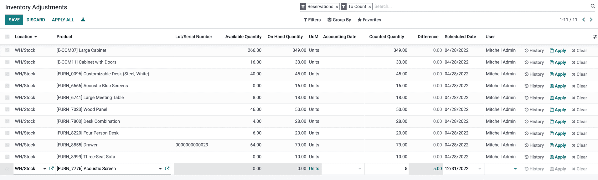
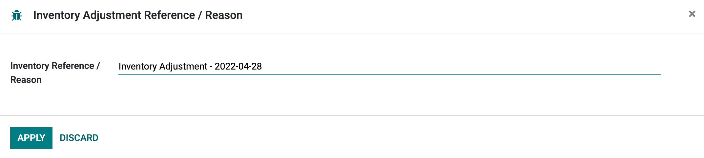
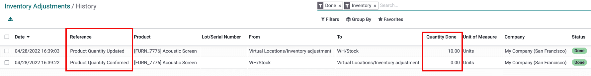
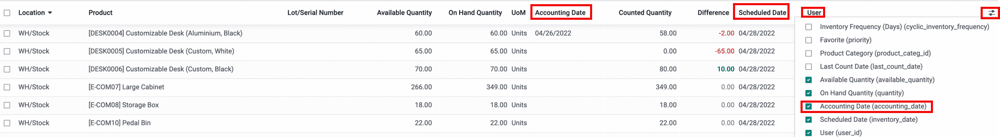
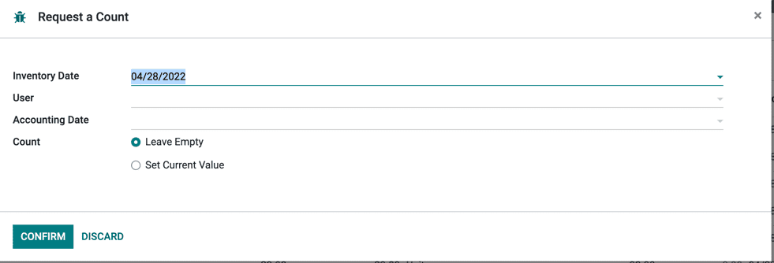

=====================
Inventory Adjustments
=====================

Inventory adjustments can be accessed through :menuselection:`Inventory --> Operations -->
Inventory Adjustments`.
The report has all products currently in the stock. Each line is a unique combination of
- Location
- Product
- Lot/Serial
- Package
- Owner

Add new product in your stock
=============================

To add a line, just hit *Create* and fill in product and counted quantity fields then press 
`tab` or click *Save*

At this stage, the count is recorded but not yet *applied*. Meaning the quantity on hand is 
not yet updated. 

Just press *Apply* on the line or button *Apply All* button on the top of the screen.

*Apply All* allows to edit the reason to use for the adjustments applied

Count products
==============

Counting products is a recurring activity in a warehouse. It often happens that theoric 
stock levels are not correct and must be amended. 

If a count is correct, press on *set*, it will copy the on hand quantity in the counted
quantity. Applying such line will record a move in the history with a 0 quantity.

If the count is different, record it in the counted quanditity field. Applying such line
will record a move with the difference in tin the history.

   
.. note::
    It happens that users count but apply only later. In the meantime, transfers of 
    a counted product can occur. In such case quanities counted and on hand are not
    consistant with the difference. When applying such line, Odoo will ask if you
    want to keep the difference and the count.
   
Plan counts
===========

On each line there is:
- *Scheduled Date*: it's the date at which a count should be made.
- *User*: it's the person in charge of the count.
- *Accounting Date*: this is the date at which the adjustments will be accounted. The
  column is hidden by default.

   
.. important::
    In the barcode app, you will only see counts to make assigned to you, scheduled
    for today or earlier.

If you want to plan big counts, the easiest way is to select some lines, then hit 
**Request A Count***. There you can select who will count and when. You can also 
prefill the quantity with the on hand quantity.

     
.. tip::
    The report offers a lot of filters that you can use to make your selection
    
By default, after an adjustment is applied, the scheduled date for the next 
count is the 31st of december of the current year. This is a setting that can
be modified in :menuselection:`Inventory --> Configuration --> Settings`.
under the setting **Annual Inventory Day and Month**

.. image:: count_products/annual-inventory.png
   :align: center
   :alt: history of moves

