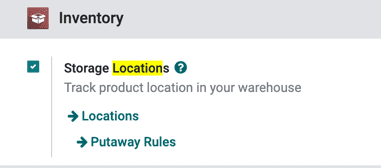
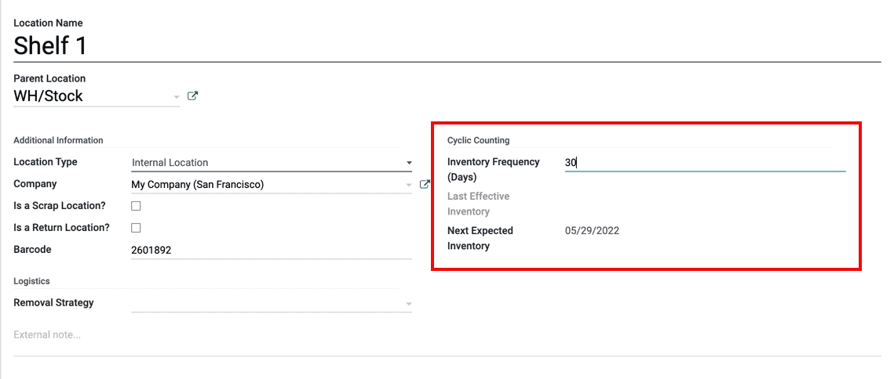

============
Cycle counts
============

In most companies, the stock is only counted once a year. That's why by default, after making an
inventory adjustment in Odoo, the scheduled date for the next count is set on the 31st of
December. However, for some businesses it's crucial to have an accurate inventory count at all
times.

The goal of cycle counts is to keep critical stock levels accurate by counting more often at key
locations.

Configuration
=============

In Odoo, cycle counts are location-based. The frequency of the counts is defined by the storage
location. To activate storage locations, go to :menuselection:`Inventory --> Configuration -->
Settings --> Warehouse` and activate the :guilabel:`Storage Locations` setting. Next, click
:guilabel:`Save` to apply the setting.

Change the inventory frequency
==============================

To change a location's inventory frequency, first, go to the locations by clicking
:menuselection:`Inventory --> Configuration --> Locations`.

Then, click on a location to open the location settings. Next, click on :guilabel:`Edit`. In the
:guilabel:`Inventory Frequency (Days)` field, set the number of days. For example, a location that
needs an inventory count every 30 days would set the :guilabel:`Inventory Frequency (Days)` value
to `30`. Once the value is entered, click :guilabel:`Save` to apply the setting to the location.
Now, once an inventory adjustment is applied to this location, the next scheduled count date will
be automatically set based on the number of days in the :guilabel:`Inventory Frequency (Days)`
setting.

