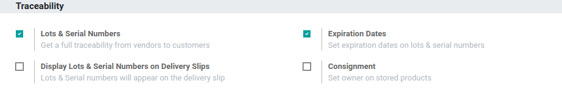
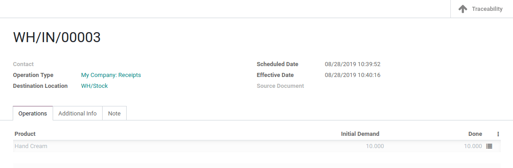

================
Expiration Dates
================

In many companies, products have expiration dates and they should be managed based on those dates.
In the food industry, for example, tracking and managing product stock based on expiration dates is
mandatory to avoid selling expired products to customers.

With Odoo, you can track and manage your products based on their expiration dates, even if they are
already tracked by lots or serial numbers.

Configuration
=============

Application configuration
-------------------------

To use expiration date tracking, open the *Inventory* application and go to
:menuselection:`Configuration --> Settings` and activate the *Lots & Serial Numbers* and *Expiration
Dates* features.

Product configuration
---------------------

Now, you can define different dates in the *inventory tab* of the product form:

- Product Use Time: the number of days before the goods start deteriorating, without being
  dangerous. This is used to calculate the Best before date on each lot/serial number received.
- Product Life Time: the number of days before the goods may become dangerous and must not be
  consumed. This is used to calculate the Expiration date on each lot/serial number received.
- Product Removal Time: shows the number of days before the goods should be removed from the stock.
  This is used to calculate the Removal date on each lot/serial number received.
- Product Alert Time: refers to the number of days before an alert should be raised on the
  lot/serial number. This is used to calculate the Alert date on each lot/serial number received.
  Once the Alert date is reached, an Activity is assigned on the relevant lot/serial number to the
  Responsible user defined on the Product.

.. image:: expiration_dates/expiration_dates_02.png
   :align: center

Expiration Date on Lots/Serial Numbers
======================================

When receiving a product into inventory, the dates will automatically be updated on the
corresponding lot/serial number. These updates will be based on the receipt date of the product and
the days set on the product form.

.. image:: expiration_dates/expiration_dates_04.png
   :align: center

Expiration Alerts
=================

You can access expiration alerts from the *inventory* app. To do so, go to :menuselection:`Master
Data --> Lots/Serial Numbers`. There, you can use the pre-existing filter to show all the
lots/serial numbers that have exceeded their respective alert dates.

.. image:: expiration_dates/expiration_dates_05.png
   :align: center
