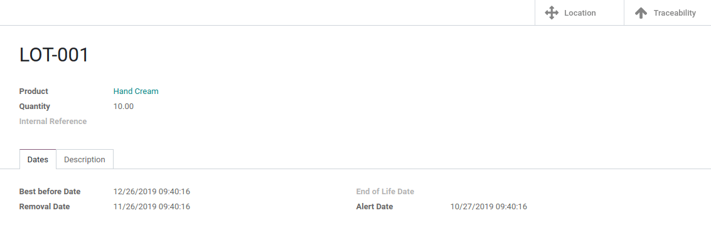
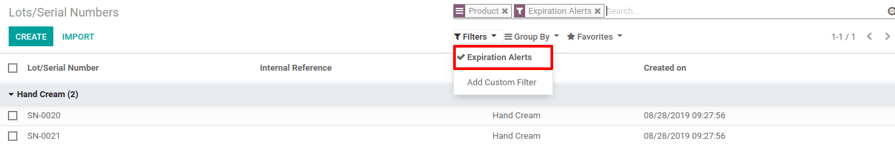

=======================
Manage expiration dates
=======================

In many companies, products have expiration dates and they should be
tracked based on those dates. In the food industry, for example,
tracking stocks based on expiration dates is mandatory to avoid selling
expired products to customers.

With Odoo, you can track your products based on their expiration dates,
even if they are already tracked by lots or serial numbers.

Configurations
==============

Application configuration
-------------------------

To use expiration dates tracking, open the *Inventory* application and
go to :menuselection:`Configuration --> Settings` and activate the *Lots & Serial
Numbers* and *Expiration Dates* features.

Product configuration
---------------------

Now, you have the possibility to define different dates in the
*inventory tab* of the product form:

-  Product Use Time: it’s the number of days before the goods start deteriorating, without being dangerous yet. It will be computed using the lot/serial number;

-  Product Life Time: refers to the number of days before the goods may become dangerous and must not be consumed. It will be computed on the lot/serial number;

-  Product Removal Time: shows the number of days before the goods should be removed from the stock. It will be computed on the lot/serial number;

-  Product Alert Time: refers to the number of days before an alert should be raised on the lot/serial number.

.. image:: media/expiration_dates_02.png
    :align: center

Expiration Date on Lots/Serial Numbers
======================================

When receiving a product in stock, the dates will automatically be
updated on the corresponding lot/serial number. This update will be
based on the reception date of the product and the times set on the
product form.

Expiration Alerts
=================

You can access all your expiration alerts from the *inventory* app. To
do so, go to :menuselection:`Master Data --> Lots/Serial Numbers`. There, you can use
the pre-existing filter that shows all the lots/serial numbers that
exceeded their alert date.

