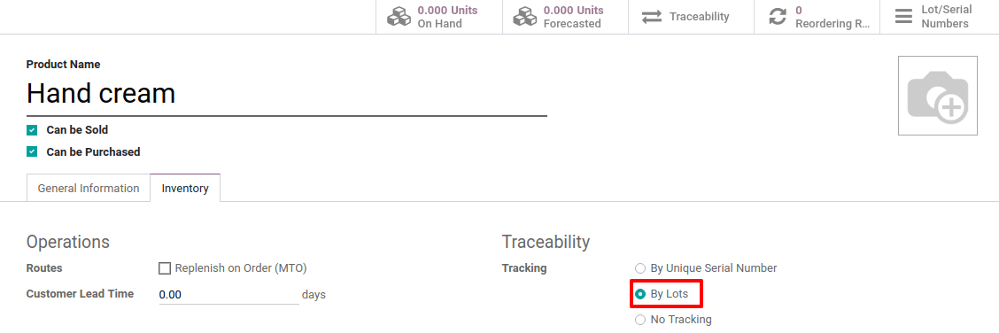
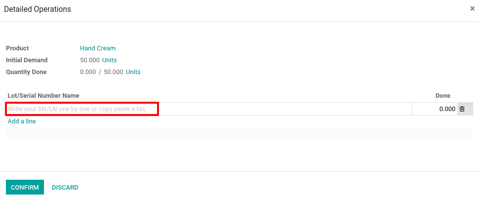
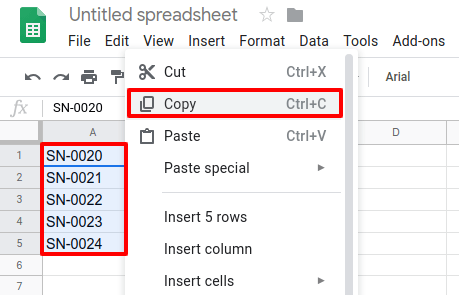

=================================
Manage lots of identical products
=================================

Lots are useful for products you receive in great quantity and for which
a lot number can help in reporting, quality controls, or any other info.
Lots will help identify a number of pieces having, for instance, a
production fault. It can be useful for a batch production of clothes or
food.

Odoo has the capacity to manage lots, ensuring compliance with the
traceability requirements imposed by the majority of industries.

The double-entry management in Odoo enables you to run very advanced
traceability.

Setting Up
==========

Application Configuration
-------------------------

First, you need to activate the tracking of lot numbers. To do so, go to
:menuselection:`Inventory --> Configuration --> Settings` and tick *Lots & Serial
Numbers*. Then, click on save.

.. image:: lots/lots_01.png
    :align: center

Product Configuration
---------------------

Now, you have to configure which products you want to track by serial
numbers.

Go to :menuselection:`Master Data --> Products` and open the product of your choice.
There, click on *Edit* and select *Tracking by Lots* in the
inventory tab.

.. image:: lots/lots_02.png
    :align: center

Manage Lots
===========

Receipts
--------

In order to receive a product tracked by lots, you have to specify its
lot numbers. You have several ways of doing so:

1. Manually assign the different lot numbers

2. Copy/paste lot numbers from an Excel file

First, you need to open the detailed operations of your picking.

.. image:: lots/lots_04.png
    :align: center

Manually assign the different lot numbers
~~~~~~~~~~~~~~~~~~~~~~~~~~~~~~~~~~~~~~~~~

When opening the detailed operations, you can click on *Add a line*.
Then, you will be able to fill the lot number in. Once done, you can
click on *Add a line* again to register a new lot number.

Copy/paste lot number from an Excel file
~~~~~~~~~~~~~~~~~~~~~~~~~~~~~~~~~~~~~~~~

Once the spreadsheet containing the lot numbers you received from your
supplier and copy the list. Then, you can paste them in the *Lot/Serial
Number Name* column for Odoo to automatically create the necessary
lines. After that, you will have to manually enter the number of
products that are contained in each one of the lots.

.. image:: lots/lots_07.png
    :align: center

Operation Types
---------------

Of course, you also have the possibility to define how you will manage
lots for each operation type. To do so, open the *Inventory* app and
go to :menuselection:`Configuration --> Operation Types`.

For each type (receipts, internal transfers, deliveries, …), you can
decide if you allow to create new lot numbers or only use existing ones.
By default, the creation of new lots is only allowed at product
reception, and using existing lot numbers isn’t allowed in this
operation. If you have inter-warehouse transfers and track products by
lots, it can be useful to allow using existing lot numbers in receipts
too.

.. image:: lots/lots_08.png
    :align: center

Lots traceability
=================

The lot number given to the products allows you to keep track of where
they were received, put in stock, to whom they were sold and where they
were shipped to.

To track an item, open the *Inventory* module and, in :menuselection:`Master Data -->
Lots/Serial Numbers`, click on the lot number corresponding to your
search.

.. image:: lots/lots_09.png
    :align: center

When you open the *Traceability* information, you see in which
documents the lot number has been used.

.. image:: lots/lots_10.png
    :align: center

Now, if you want to locate the lot number, you can do so by clicking on
the *Location* stat button.

.. image:: lots/lots_11.png
    :align: center

.. image:: lots/lots_12.png
    :align: center
