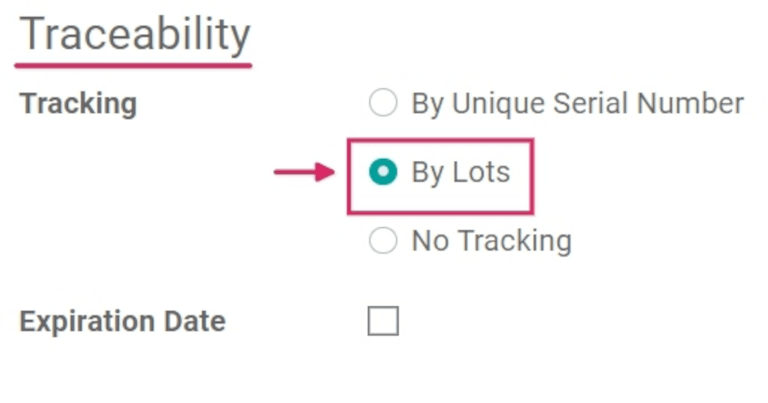
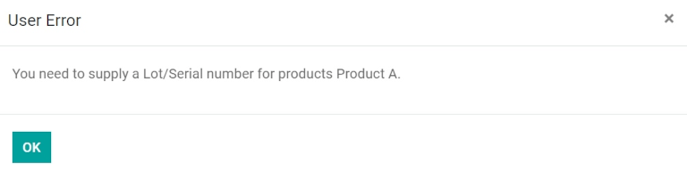

=====================================
Use lots to manage groups of products
=====================================

*Lots* are one of the two ways to identify and track products in Odoo. A lot usually indicates a
specific batch of an item that was received, is currently stored, or was shipped from a warehouse,
but can also pertain to a batch of products manufactured in-house, as well.

Manufacturers assign lot numbers to groups of products that have common properties; this can lead to
multiple goods sharing the same lot number. This helps to identify a number of products in a single
group, and allows for end-to-end traceability of these products through each step in their
lifecycles.

Lots are useful for products that are manufactured or received in large quantities (such as clothes
or food), and can be used to trace a product back to a group. This is especially useful when
managing product recalls or expiration dates.

.. seealso::
   :doc:`/applications/inventory_and_mrp/inventory/management/lots_serial_numbers/serial_numbers`

Enable lots & serial numbers
============================

To track products using lots, the *Lots & Serial Numbers* feature must be enabled. Go to
the :menuselection:`Inventory app --> Configuration --> Settings`, scroll down to the
:guilabel:`Traceability` section, and click the box next to :guilabel:`Lots & Serial Numbers`. Then,
click the :guilabel:`Save` button to save changes.

.. image:: lots/lots-enabled-lots-setting.png
   :align: center
   :alt: Enabled lots and serial numbers feature in inventory settings.

.. _inventory/management/track_products_by_lots:

Track products by lots
======================

Once the :guilabel:`Lots & Serial Numbers` setting has been activated, individual products can now
be configured to be tracked using lots. To do this, go to the :menuselection:`Inventory app -->
Products --> Products`, and choose a product.

Once on the product form, click :guilabel:`Edit` to make changes to the form. Then, click the
:guilabel:`Inventory` tab. In the :guilabel:`Traceability` section, click :guilabel:`By Lots`. Then,
click :guilabel:`Save` to save changes. Existing or new lot numbers can now be assigned to
newly-received or manufactured batches of this product.

.. important::
   If a product has stock on-hand prior to activating tracking by lots or serial numbers, an
   inventory adjustment might need to be performed to assign lot numbers to the existing stock.

Create new lots for products already in stock
---------------------------------------------

New lots can be created for products already in stock with no assigned lot number. To do this, go to
the :menuselection:`Inventory app --> Products --> Lots/Serial Numbers`, and click
:guilabel:`Create`. Doing so reveals a separate page where a new :guilabel:`Lot/Serial Number` is
generated automatically.

.. tip::
   While Odoo automatically generates a new :guilabel:`Lot/Serial Number` to follow the most recent
   number, it can be edited and changed to any desired number, by clicking the line under the
   :guilabel:`Lot/Serial Number` field, and changing the generated number.

Once the new :guilabel:`Lot/Serial Number` is generated, click the blank field next to
:guilabel:`Product` to reveal a drop-down menu. From this menu, select the product to which this new
number will be assigned.

This form also provides the option to adjust the :guilabel:`Quantity`, assign a unique
:guilabel:`Internal Reference` number (for traceability purposes), and assign this specific lot or
serial number configuration to a specific website in the :guilabel:`Website` field (if working in a
multi-website environment).

A detailed description of this specific lot or serial number can also be added in the
:guilabel:`Description` tab below.

When all desired configurations are complete, click the :guilabel:`Save` button to save all changes.

.. image:: lots/lots-new-lot-number.png
   :align: center
   :alt: New lot number creation form with assigned product.

After a new lot number has been created, saved, and assigned to the desired product, navigate back
to the product form in the :menuselection:`Inventory` app, by going to :menuselection:`Products -->
Products`, and selecting the product to which this newly-created lot number was just assigned.

On that product's detail form, click the :guilabel:`Lot/Serial Numbers` smart button to view the new
lot number. When additional quantity of this product is received or manufactured, this new lot
number can be selected and assigned to it.

Manage lots for shipping and receiving
======================================

Lot numbers can be assigned for both **incoming** and **outgoing** goods. For incoming goods, lot
numbers are assigned directly on the purchase order form. For outgoing goods, lot numbers are
assigned directly on the sales order form.

Manage lots on receipts
-----------------------

Assigning lot numbers to **incoming** goods can be done directly from the purchase order (PO).

To create a :abbr:`PO (purchase order)`, go to :menuselection:`Purchase app --> Create`. Doing so
reveals a new, blank request for quotation (RFQ) form.

On this :abbr:`RFQ (request for quotation)`, fill out the necessary information by adding a
:guilabel:`Vendor`, and adding the desired products to the :guilabel:`Product` lines, by clicking
:guilabel:`Add a product` (under the :guilabel:`Products` tab).

Choose the desired quantity of the product to order by changing the number in the
:guilabel:`Quantity` column.

Once the :abbr:`RFQ (request for quotation)` has been filled out, click :guilabel:`Confirm Order`.
When the :abbr:`RFQ (request for quotation)` is confirmed, it becomes a :guilabel:`Purchase Order`,
and a :guilabel:`Receipt` smart button appears. Click the :guilabel:`Receipt` smart button to be
taken to the warehouse receipt form.

.. note::
   Clicking :guilabel:`Validate` before assigning a lot number to the ordered product quantities
   will result in a :guilabel:`User Error` pop-up. The pop-up requires entry of a lot or serial
   number for the ordered products. The :abbr:`RFQ (request for quotation)` **cannot** be validated
   without a lot number being assigned.

From here, click the :guilabel:`Additional Options` menu, represented by a :guilabel:`hamburger
(four horizontal lines)` icon, located to the right of the :guilabel:`Unit of Measure` column in the
:guilabel:`Operations` tab). Clicking that icon reveals a :guilabel:`Detailed Operations` pop-up.

In this pop-up, configure a number of different fields, including the assignation of a lot number,
under the :guilabel:`Lot/Serial Number Name` column, located at the bottom of the pop-up.

There are two ways to assign lot numbers: **manually** and **copy/paste**.

- **Manually assign lot numbers**: Click :guilabel:`Add a line` and choose the location the products
  will be stored in under the :guilabel:`To` column. Then, type a new :guilabel:`Lot Number Name`
  and set the :guilabel:`Done` quantity.

   .. image:: lots/lots-assign-lot-number-popup.png
      :align: center
      :alt: Assign lot number detailed operations popup.

   .. note::
      If quantities should be processed in multiple locations and lots, click :guilabel:`Add a line`
      and type a new :guilabel:`Lot Number Name` for additional quantities. Repeat until the
      :guilabel:`Quantity Done` matches the :guilabel:`Demand`.

- **Copy/paste lot numbers from a spreadsheet**: Populate a spreadsheet with all of the lot numbers
  received from the supplier (or manually chosen to assign upon receipt). Then, copy and paste them
  in the :guilabel:`Lot/Serial Number Name` column. Odoo will automatically create the necessary
  number of lines based on the amount of numbers pasted in the column. From here, the :guilabel:`To`
  locations and :guilabel:`Done` quantities can be manually entered in each of the lot number lines.

   .. image:: lots/lots-excel-spreadsheet.png
      :align: center
      :alt: List of lot numbers copied on excel spreadsheet.

Once all product quantities have been assigned a lot number, click :guilabel:`Confirm` to close the
pop-up. Then, click :guilabel:`Validate`.

A :guilabel:`Traceability` smart button appears upon validating the receipt. Click the
:guilabel:`Traceability` smart button to see the updated :guilabel:`Traceability Report`, which
includes: a :guilabel:`Reference` document, the :guilabel:`Product` being traced, the
:guilabel:`Lot/Serial #` assigned, and more.

Manage lots on delivery orders
------------------------------

Assigning lot numbers to **outgoing** goods can be done directly from the sales order (SO).

To create an :abbr:`SO (sales order)`, go to the :menuselection:`Sales app --> Create`. Doing so
reveals a new, blank quotation form.

On this blank quotation form, fill out the necessary information by adding a :guilabel:`Customer`,
and adding products to the :guilabel:`Product` lines (in the :guilabel:`Order Lines` tab) by
clicking :guilabel:`Add a product`.

Then, choose the desired quantity to sell by changing the number in the :guilabel:`Quantity` column.

Once the quotation has been filled out, click the :guilabel:`Confirm` button to confirm the
quotation. When the quotation is confirmed, it becomes an :abbr:`SO (sales order)`, and a
:guilabel:`Delivery` smart button appears.

Click the :guilabel:`Delivery` smart button to view the warehouse receipt form for that specific
:abbr:`SO (sales order)`.

From here, click the :guilabel:`Additional Options` menu, represented by a `hamburger` icon (four
horizontal lines, located to the right of the :guilabel:`Unit of Measure` column in the
:guilabel:`Operations` tab). Clicking that icon reveals a :guilabel:`Detailed Operations` pop-up.

In the pop-up, a :guilabel:`Lot/Serial Number` will be chosen by default, with the full
:guilabel:`Reserved` quantity taken from that specific lot (if there is enough stock in that
particular lot).

If there is insufficient stock in that lot, or if partial quantities of the :guilabel:`Demand`
should be taken from multiple lots, change the quantity in the :guilabel:`Done` column to only
include that specific part of the total quantity.

.. note::
   The lot automatically chosen for delivery orders varies, depending on the selected removal
   strategy (:abbr:`FIFO (First In, First Out)`, :abbr:`LIFO (Last In, First Out)`, or :abbr:`FEFO
   (First Expiry, First Out)`). It will also depend on the quantity ordered, and if there is enough
   quantity in one lot to fulfill the order.

.. seealso::
   :doc:`/applications/inventory_and_mrp/inventory/routes/strategies/removal`

Then, click :guilabel:`Add a line`, select an additional (different) :guilabel:`Lot/Serial Number`,
apply the rest of the :guilabel:`Done` quantities, and click :guilabel:`Confirm` to close the
pop-up. Lastly, click the :guilabel:`Validate` button to deliver the products.

.. image:: lots/lots-detailed-operations-popup.png
   :align: center
   :alt: Detailed operations popup for source lot number on sales order.

Upon validating the delivery order, a :guilabel:`Traceability` smart button appears. Click the
:guilabel:`Traceability` smart button to see the updated :guilabel:`Traceability Report`, which
includes a :guilabel:`Reference` document, the :guilabel:`Product` being traced, the
:guilabel:`Date`, and the :guilabel:`Lot/Serial #` assigned.

The :guilabel:`Traceability Report` can also include a :guilabel:`Reference` receipt from the
previous purchase order, if the product quantities shared the same lot number.

Manage lots for different operations types
==========================================

In Odoo, the creation of new lots is only allowed upon **receiving** products from a purchase order,
by default. **Existing** lot numbers cannot be used.

For sales orders, the opposite is true: new lot numbers cannot be created on the delivery order,
only existing lot numbers can be used.

To change the ability to use new (or existing) lot numbers on any operation type, go to the
:menuselection:`Inventory app --> Configuration --> Operations Types`, and select the desired
:guilabel:`Operation Type`.

For :guilabel:`Receipts`, found on the :menuselection:`Operations Types` page, the :guilabel:`Use
Existing Lots/Serial Numbers` option can be enabled, by clicking :guilabel:`Edit`, and then clicking
the checkbox beside the :guilabel:`Use Existing Lots/Serial Numbers` option (in the
:guilabel:`Traceability` section). Lastly, click the :guilabel:`Save` button to save the changes.

For :guilabel:`Delivery Orders`, the :guilabel:`Create New Lots/Serial Numbers` option can be
enabled, by clicking :guilabel:`Edit`, and clicking the checkbox beside the :guilabel:`Create New
Lots/Serial Numbers` option. Be sure to click the :guilabel:`Save` button to save all changes.

.. image:: lots/lots-operations-type-form.png
   :align: center
   :alt: Enabled traceability setting on operations type form.

.. tip::
   For inter-warehouse transfers involving products tracked by lots, it can be useful to enable the
   :guilabel:`Use Existing Lots/Serial Numbers` option for warehouse receipts.

Lots traceability
=================

Manufacturers and companies can refer to traceability reports to see the entire lifecycle of a
product: where (and when) it came from, where it was stored, and who (and when) it went to.

To see the full traceability of a product, or group by lots, go to the :menuselection:`Inventory app
--> Products --> Lots/Serial Numbers`. Doing so reveals the :menuselection:`Lots/Serial Numbers`
dashboard.

From here, products with lot numbers assigned to them will be listed by default, and can be expanded
to show the lot numbers those products have assigned to them.

To group by lots (or serial numbers), begin by removing any filters in the search bar. Then, click
the :guilabel:`Group By` drop-down, select :guilabel:`Add Custom Group`, and select
:guilabel:`Lot/Serial Number` from the drop-down menu. Then, click :guilabel:`Apply`.

Doing so displays all existing lots and serial numbers, and can be expanded to show all quantities
of products with that assigned number.

.. image:: lots/lots-traceability-report.png
   :align: center
   :alt: Lots and serial numbers traceability report.

.. seealso::
   :doc:`/applications/inventory_and_mrp/inventory/management/lots_serial_numbers/differences`
