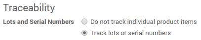
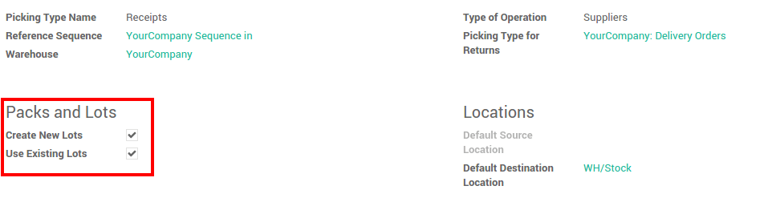
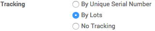
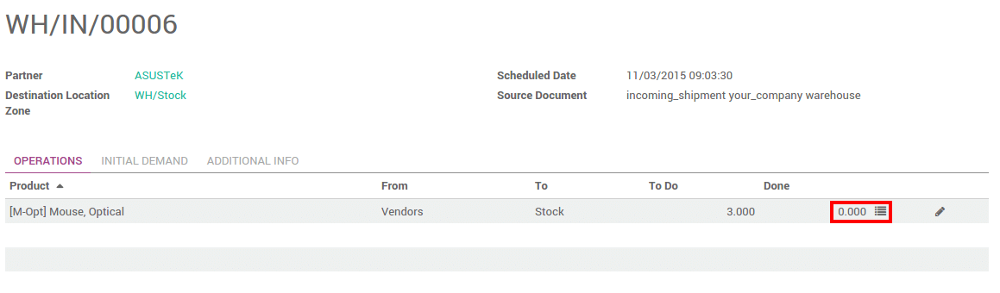
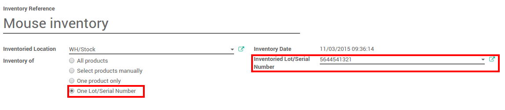

=========================================
How to manage lots of identical products?
=========================================

Overview
========

Lots are useful for products you receive in great quantity and for which
a lot number can help in reportings, quality controls, or any other
info. Lots will help identify a number of pieces having for instance a
production fault. It can be useful for a batch production of clothes or
food.

Odoo has the capacity to manage lots ensuring compliance with the
traceability requirements imposed by the majority of industries.

The double-entry management in Odoo enables you to run very advanced
traceability.

Setting up
==========

Application configuration
-------------------------

You need activate the tracking of lots in the settings. In the **Inventory**
application, go to :menuselection:`Configuration --> Settings`, 
select **Track lots or serial numbers**

In order to have an advanced management of the lots, you should also
select **Manage several locations per warehouse**.

.. image:: media/lots02.png
    :align: center

Then click on **Apply**.

Operation types configuration
-----------------------------

You also need to set up how you will manage lots for each operations.
In the **Inventory** application, go to 
:menuselection:`Configuration --> Operation Types`.

For each type (receipts, internal transfers, deliveries,...), you can
set if you can create new lot numbers or only use existing lot numbers.

Product Configuration
---------------------

Finally, you have to configure which products you want to track in lots.

Go into :menuselection:`Inventory Control --> Products`, and open the product of your
choice. Click on **Edit**, and in the **Inventory** tab, select **Tracking by
Lots**, then click on **Save**.

Manage lots
===========

Transfers
---------

In order to process a transfer of a product tracked by lot, you have to
input the lot number(s).

Click on the lot icon :

A window will pop-up. Click on **Add an item** and fill in the lot
number and the quantity.

.. image:: media/lots06.png
    :align: center

Depending on your operation type configuration, you will be able to fill
in new lot numbers, or only use existing ones.

.. note::
    In the scanner interface, you just have to scan the lot numbers.

Inventory adjustment
--------------------

Inventory of a product tracked by lot can be done in 2 ways:

-  Classic inventory by products

-  Inventory of a lot

When doing a classic inventory, there is a **Serial Number** column. If the
product has already been assigned with a number, it is already
pre-filled.

Click on **Add an item** if the product has not been inventoried yet. You
can easily create lots, just type in a new lot number in the column.

.. image:: media/lots07.png
    :align: center

You can also just do the inventory of a lot. In this case, you will have
to fill in the **Lot number**. You can also create a new lot from here. Just
type in the number, a window will pop out to link the number to a
product.

Lots traceability
=================

You can check the lot traceability from 
:menuselection:`Inventory --> Inventory Control --> Serial Numbers/Lots`

.. image:: media/lots09.png
    :align: center

You can have more details by clicking on the **Traceability** button :

.. image:: media/lots10.png
    :align: center

.. seealso::
    * :doc:`differences`
    * :doc:`serial_numbers`
