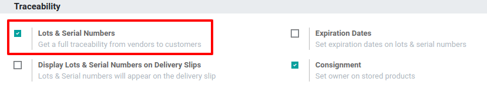
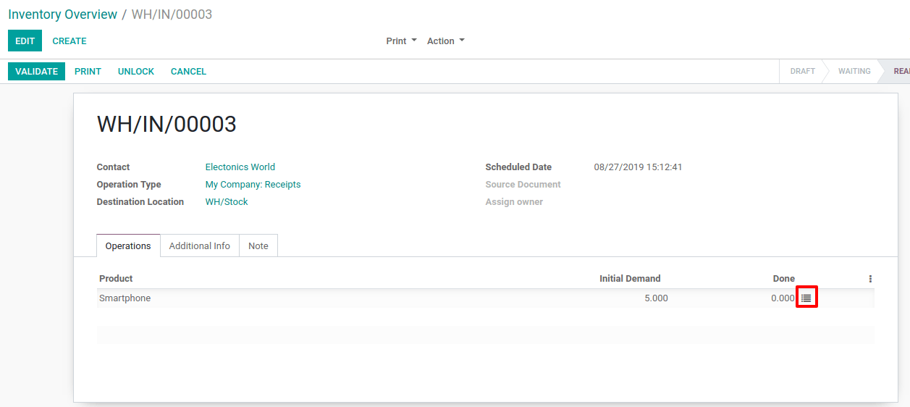
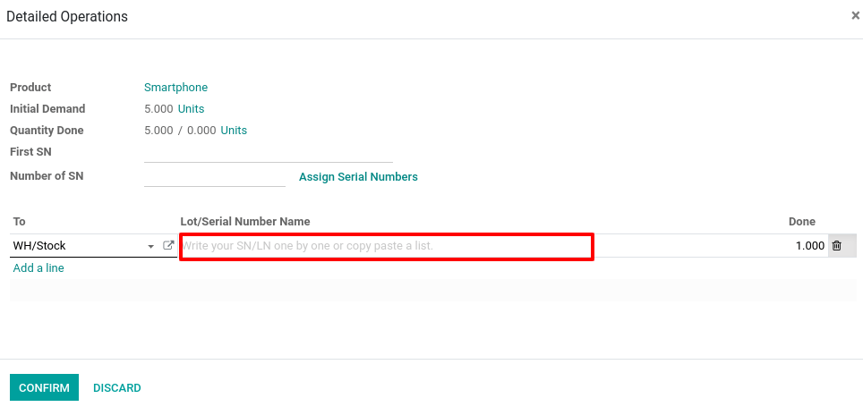

========================
Work with serial numbers
========================

To track products with serial numbers, you can use the serial number
tracking. With them, you can track the current location of the product
and, when the products are moved from one location to another, the
system will automatically identify the current location of the product,
based on its last movement.

If you want to do it or run very advanced traceability, the Odoo
double-entry management is the feature you need.

Configurations
==============

Application configuration
-------------------------

First, you need to activate the serial numbers tracking. To do so, go to
:menuselection:`Configuration --> Settings` in the *Inventory* application. Then,
enable the feature and hit save.

Product configuration
---------------------

Now, you have to configure the products you want to track by serial
numbers. To do so, go to :menuselection:`Master Data --> Products` and open the product
of your choice. Edit it and select *Tracking By Unique Serial Number*
in the *Inventory tab*. Then, click on save.

.. image:: serial_numbers/serial_numbers_02.png
    :align: center

.. image:: serial_numbers/serial_numbers_03.png
    :align: center

Manage Serial Numbers
=====================

Receipts
--------

To receive a product that is tracked by serial number, you have to
specify its serial number. Of course, you have several ways of doing so:

-  Manual assignation

-  Multi-assignation

-  Copy/pasting from an Excel file

Whatever could be your favorite way to assign serial numbers, you
firstly need to open the detailed operations of your picking.

Manual assignation of the different serial numbers
~~~~~~~~~~~~~~~~~~~~~~~~~~~~~~~~~~~~~~~~~~~~~~~~~~

When opening the detailed operations, you can click on *Add a line*.
Then, you will be able to fill in the serial number field. Once done,
you can click again on *Add a line* to register a new serial number.

Multi-assignation
~~~~~~~~~~~~~~~~~

By using the multi-assignation of serial numbers, Odoo will
automatically create the necessary lines. To do so, you have to enter
the first serial number of your set and the number of products you have
to assign a serial number to.

Once done, click on *Assign Serial Numbers* and Odoo will do the rest.

.. image:: serial_numbers/serial_numbers_06.png
    :align: center

.. image:: serial_numbers/serial_numbers_07.png
    :align: center

Copy/pasting from an Excel file
~~~~~~~~~~~~~~~~~~~~~~~~~~~~~~~

To use copy/pasting, open the spreadsheet containing the serial numbers
you received and copy the list. Then, past them in the *Lot/Serial
Number Name* column of the wizard. Doing so, Odoo will automatically
create the lines you need.

.. image:: serial_numbers/serial_numbers_08.png
    :align: center

.. image:: serial_numbers/serial_numbers_09.png
    :align: center

.. image:: serial_numbers/serial_numbers_10.png
    :align: center

Operation types
===============

You also have the possibility to define how you will manage lots for
each operation type. To define it, go to :menuselection:`Configuration --> Operation Types` in the
*Inventory* app.

For each type, you can decide if you allow the creation of new lot
numbers or want to use existing ones. By default, the creation of new
lots is only allowed at product reception.

.. image:: serial_numbers/serial_numbers_11.png
    :align: center

.. tip::
      If you have inter-warehouse transfers and track products by lots, it can
      be useful to allow using existing lot numbers in receipts too.

Serial Number traceability
==========================

Using serial numbers allows you to keep track of where the products were
received, put in stock, to whom they were sold, and where they were
shipped to.

Tracking an item is easy: open the *Inventory* app, and go to :menuselection:`Master Data -->
Lots/Serial Numbers` and click on the serial number corresponding to your search. Then, open the
*Traceability* information. There, you will see in which documents the serial number has been used.

.. image:: serial_numbers/serial_numbers_12.png
    :align: center

.. image:: serial_numbers/serial_numbers_13.png
    :align: center

And, if you want to locate a serial number, you can do so by clicking on
the *Location* button available on the serial number form.

.. image:: serial_numbers/serial_numbers_14.png
    :align: center

.. image:: serial_numbers/serial_numbers_15.png
    :align: center
