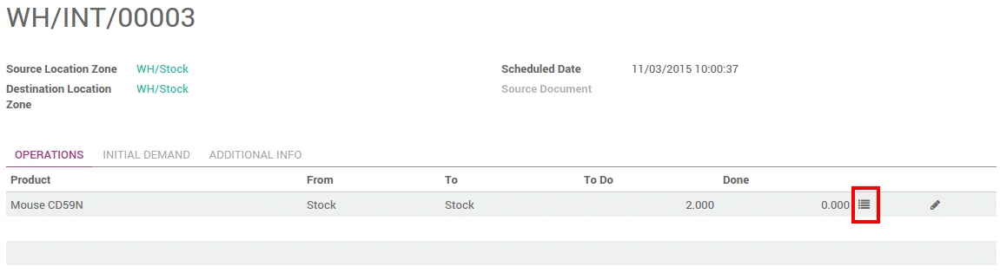
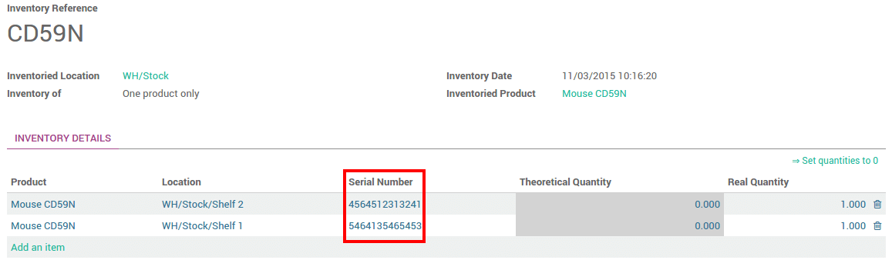

================================
How to work with serial numbers?
================================

Introduction
============

Serial Number Tracking is used to track products with serial numbers on
every transactions. You can track the current location of the product
with serial numbers. When the products are moved from one location to
another location, the system will automatically identify the current
location of the product based on last movement of the product. So you
can get the last location where the products are moved.

The double-entry management in Odoo enables you to run very advanced
traceability.

Setting up
==========

Application configuration
-------------------------

You need activate the tracking of serial numbers in the settings. In the
**Inventory** application, go to :menuselection:`Configuration --> Settings`, 
select **Track lots or serial numbers**.

.. image:: media/serial_numbers01.png
   :align: center

Then click on **Apply**.

Product Configuration
---------------------

Finally, you have to configure which products you want to track in lots.

Go into :menuselection:`Inventory Control --> Products`, and open the product 
of your choice. Click on **Edit**, and in the **Inventory** tab, select **By Unique
Serial Number**, then click on **Save**.

.. image:: media/serial_numbers02.png
   :align: center

Manage Serial Numbers
=====================

Transfers
---------

In order to process a transfer of a product tracked by serial number,
you have to input the number(s).
In order to be able to assign serial numbers to products with tracking features
enabled you will first need to mark your transfer as to do. Click on the **Mark
as TODO** button to display the Lot Split icon.

Click on the serial number icon :

A window will pop-up. Click on **Add an item** and fill in the serial
numbers.

.. image:: media/serial_numbers04.png
   :align: center

If you move products that already have serial numbers assigned, those
will appear in the list. Just click on the **+** icon to confirm that you
are moving those serial numbers.

.. image:: media/serial_numbers05.png
   :align: center

.. note::
    In the scanner interface, you just have to scan the serial numbers.

Inventory adjustment
--------------------

Inventory of a product tracked by serial numbers can be done in 2 ways:

-  Classic inventory by products

-  Inventory of a serial number

When doing a classic inventory, there is a **Serial Number** column. If the
product has already been assigned with a number, it is already
pre-filled.

Click on **Add an item** if the product has not been inventoried yet. You
can easily create serial numbers, just type in a new number in the
column.

The quantity should be 1 for each line.

You can also just do the inventory of a serial number. In this case, you
will have to fill in the serial number. You can also create a new one
from here. Just type in the number, a window will pop out to link it to
a product.

.. image:: media/serial_numbers07.png
   :align: center

Serial Number traceability
==========================

The serial number given to these items allow you to keep track of where
they were received, put in stock, to whom they were sold and where they
were shipped to.

To track an item, open the **Inventory** module, and in :menuselection:`Inventory
Control --> Serial Numbers/lots`, click on the serial number corresponding
to your search.

.. image:: media/serial_numbers08.png
   :align: center

You can have more details by clicking on the **Traceability** button :

.. seealso::
    * :doc:`differences`
    * :doc:`lots`
