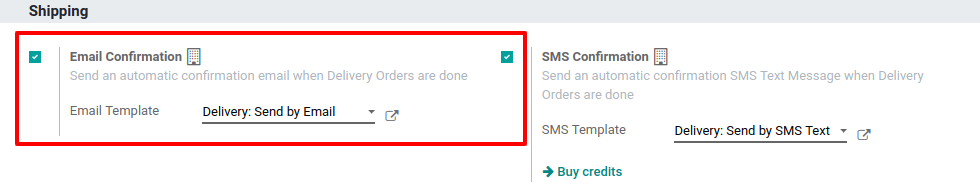
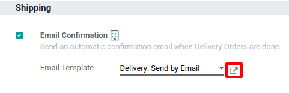
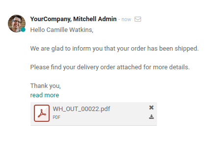
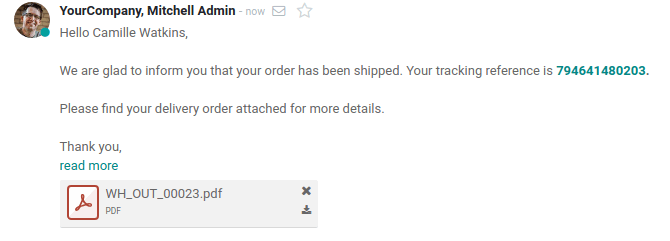

=================================
Send Automated Emails at Delivery
=================================

Configuration
=============

First, go to the *Inventory* app, then to *Settings* and activate
the *Email Confirmation* feature. If you work in multi-company, this
configuration is company-specific.

When you enable this feature, Odoo automatically creates an email
template. Of course, you can modify it if necessary by clicking on the
small arrow next to its name.

Send email at delivery validation
=================================

On the inventory dashboard, click on *Create* and fill the form for a
specific partner. Once you have added some products in it, *Validate*
it and do the same for the delivery.

.. image:: media/email_delivery_03.png
    :align: center

Doing so, an automated email will be sent and will appear in the
chatter.

If you work with a shipping method, and then have a tracking link, it
will be included in the standard email template.

