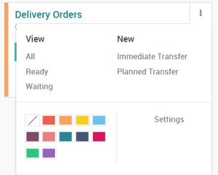

Immediate & Planned Transfers
=============================

In Odoo, you can create two types of transfers: immediate or planned
transfers.

Immediate Transfers
-------------------

When you create a transfer manually, it is by default an immediate
transfer.

In the case of an immediate transfer, you directly encode the products
and quantities you are processing, there is no reservation that applies.
This is why the column "Initial Demand" is not editable. You only fill
in the column "Done" for the quantities.

This is for example used when you are transferring goods from a location
A to a location B and that this is not planned (you are processing the
transfer right now).

Planned Transfers
-----------------

When a transfer is generated automatically (from a sales order or
purchase order for example), it is a planned transfer. This means that
there is an initial demand and that reservation applies on this initial
demand.

If you want to create a planned transfer manually, you can do it from
the inventory dashboard.

In that case, you will have to enter the initial demand first (how many
units are you supposed to proceed), then to mark your transfer as to do.
Once this is done, you will be able to reserve the products and to
process the transfer.

