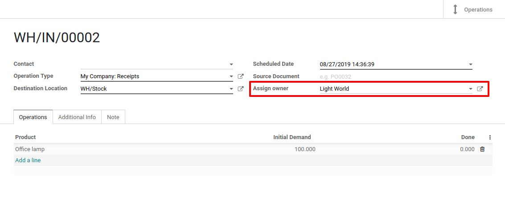
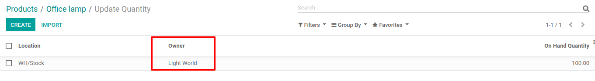

===============================
Manage Stock that you don't own
===============================

Sometimes, suppliers can offer you to store and sell products without
having to buy those items. This technique is called *consignee stock*.

Consignee stock is a great way for manufacturers and suppliers to launch
new products. As resellers may be reluctant to buy a product they are
not sure to be able to sell, consignee stock will allow them to offer an
item to check its market without having to pay for it in the first
place.

Of course, Odoo has the ability to manage those consignee stocks through
advanced settings.

Configuration
=============

To use this feature, go to :menuselection:`Inventory --> Configuration --> Settings` in
the inventory app. Then, enable the *Consignment* feature in the
*Traceability* section. Now, hit save.

.. image:: owned_stock/owned_stock_01.png
    :align: center

Reception of Consignee Stock
============================

When in the *Inventory* app, open the receipts and create a new
reception. On the right side, you will see that a new line called
*Assign Owner* has appeared. There, you can specify the partner which
owns the stock.

.. note::
   If you are the owner, you can leave the field blank.

Once the receipt is validated, the products enter your stock but still
belong to the owner. They don’t impact your inventory valuation.

