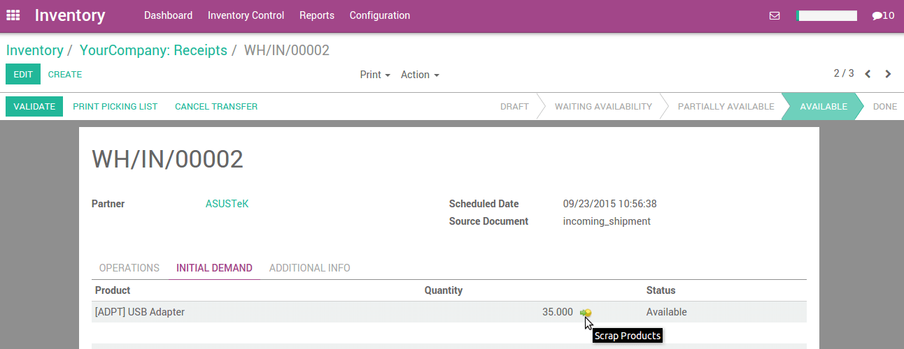
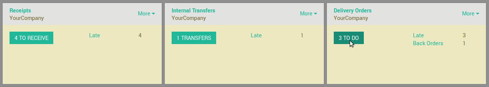
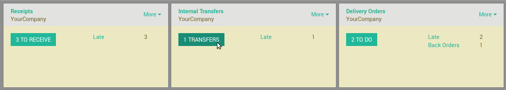
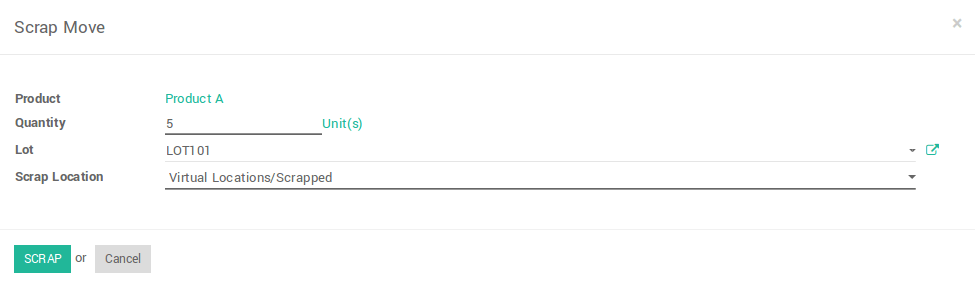

======================
How to scrap products?
======================

Overview
========

Scrap means waste that either has no economic value or only the value of
its basic material

content recoverable through recycling.

In your warehouse you sometimes find products that are damaged or that
are unusable due to expiry or for some other reason. You often notice
this during picking or physical inventory.

Since you cannot normally sell or store these products, you have to
scrap product.

When goods are scrapped they are not reflected in the system as a part
of the inventory. The scrapped material will be physically moved to
scrap area.

Configuration
=============

When you install inventory management, odoo automatically creates one
default scrap location, namely **Virtual location/Scrapped**.

To create an extra scrap location, Go to 
:menuselection:`Inventory --> Configuration --> Settings`
and check **Manage several locations per warehouse**,
then click on **Apply**.

After applying **Manage several location per warehouse**, you can create
a new scrap location in 
:menuselection:`Configuration --> Warehouse Management --> Locations.`

.. note::
    To define a scrap location, you have to check **Is a Scrap Location?** 
    on location form view.

Different ways to scrap product
===============================

Odoo provides several ways to scrap products.

1) Scrap from Receipt (Initial Demand tab).
-----------------------------------------------

To scrap product from incoming shipment, Go to 
:menuselection:`Inventory --> Dashboard --> Receipts`.

.. image:: media/scrap08.png
   :align: center

Open the incoming shipment, and in the **Initial demand** tab, click on the
scrap products button.

2) Scrap from delivery order (Initial Demand tab) .
-------------------------------------------------------

To scrap product from outgoing shipment, Go to 
:menuselection:`Inventory --> Dashboard --> Delivery Orders`

Open the outgoing shipment, and in the **Initial demand** tab, click on the
scrap products button on stock move in initial demand tab.

.. image:: media/scrap03.png
   :align: center

3) Scrap from internal transfer (Initial Demand tab).
----------------------------------------------------------

To scrap product from internal transfer, Go to 
:menuselection:`Inventory --> Dashboard --> Internal Transfers`

Open the internal transfer, and in the **Initial demand** tab, click on the
scrap products button on stock move in initial demand tab.

.. image:: media/scrap02.png
   :align: center

When you click on scrap button, a popup will open. You can enter the
quantity of products, and specify the scrap location, then click on
**Scrap**. 

.. note::
    To allow change scrap location on wizard, you have to select 
    **Manage several location per warehouse** in the settings at
    :menuselection:`Inventory --> Configuration --> Settings`
