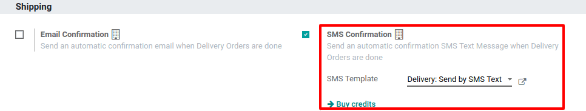
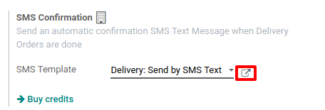
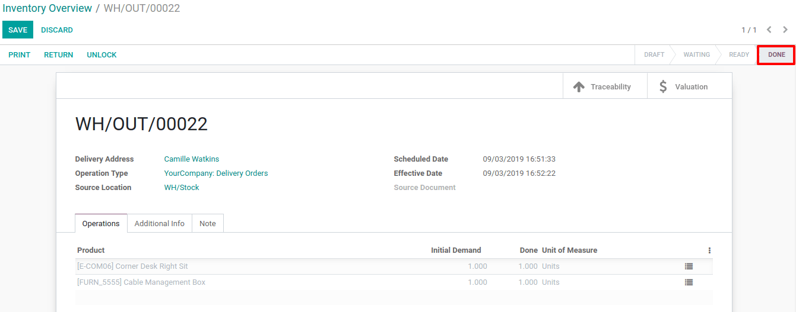

==============================
Send Automated SMS at Delivery
==============================

Configuration
=============

To send automated SMS, you need to activate the *SMS Confirmation*
feature. To do so, go to the *Inventory* app *Settings* and enable
the feature. In multi-company, this feature is company-specific.

Of course, an SMS template already exists by default in Odoo. You can
modify it by clicking on the arrow on the right.

Send SMS at delivery validation
===============================

To use this feature, try to *Create* a delivery order for a specific
partner and add some products to it. Then, *Validate* the delivery.

Now, the automated SMS that has been sent appears in the chatter.

.. note::
         The partner which is set on the transfer needs to have a phone number
         specified in its contact form for the SMS to be sent.

If you work with a shipping method, and then have a tracking link, it
will be included in the SMS template.

