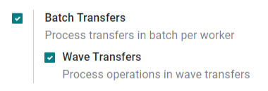
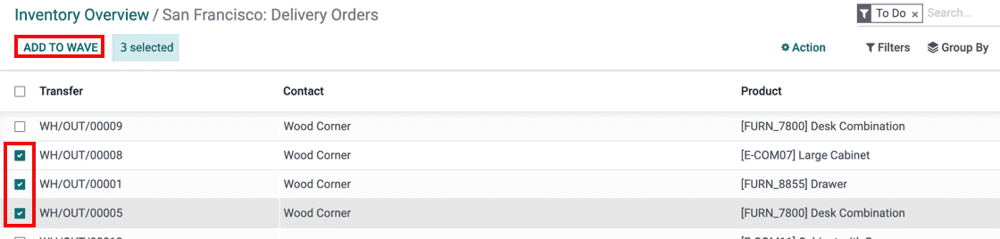
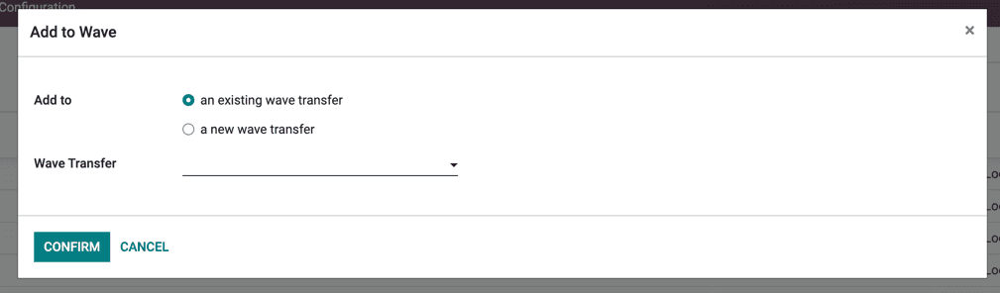

=======================
Process Wave Transfers
=======================

While a Batch Transfer is a group of several pickings, a **Wave Transfer** only contains
some parts of different pickings.
If you want to handle a orders of a specific product category, or fetch products that
are at the same location, wave pickings are the ideal feature.
.. important::
   Wave transfers are actually batch transfers with an extra step: transfers are split 
   before being grouped in a batch. 

Create a Batch Transfer
=======================

To activate the batch picking option, go to :menuselection:`Inventory
--> Configuration --> Configuration` and enable *Batch Transfers*.

Wave transfers can only contain lines from transfers of the same operation type.
To have an overview of all the lines of all transfers the best way is, from the 
Inventory home page, click on the 3 dots on the operation type of your choice
then select *Operations*

.. image:: wave_transfers/list-of-operations.png
    :align: center
    :alt: how to get the list of operations of an operation type

Now, select the lines you want to add in a new or existing wave. Hit *Add to Wave*.

    
.. tip::
   Use the filters if you want to group lines with same product, location, carrier, etc... 

Then, decide if you want to create new wave or add lines to an existing one. You can also 
select a responsible. Hit *Confirm* and you are done.

You can see the different wave transfers through the menu :menuselection:`Inventory
--> Operations --> Wave transfers

.. image:: wave_transfers/waves-list.png
    :align: center
    :alt: View of a wave transfer list. 
    
In the barcode app, wave transfers are in the same view as batch transfers 

Wave transfers are processed exactly like Batch transfers

