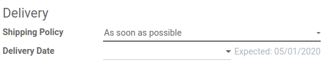
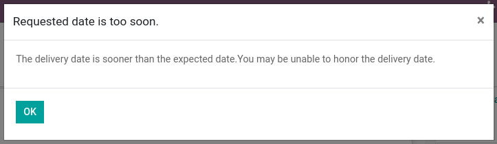
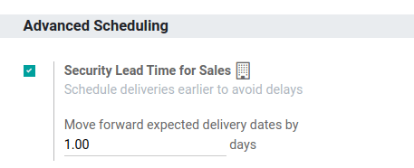
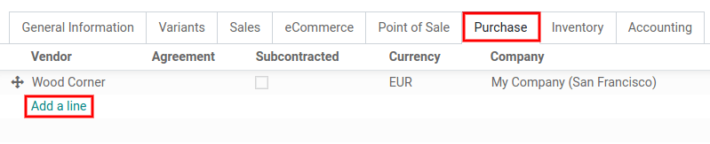
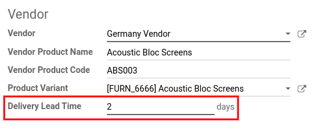

===========================================
How is the Scheduled Delivery Date Computed
===========================================

Providing the best possible service to customers is vital for business. It implies planning
every move: manufacturing orders, deliveries, receptions, and so on. To do so, you need to
configure lead time properly and coordinate scheduled dates.

By using lead times, Odoo provides end dates, the **Commitment
Date**, for each process. On a sales order, for example, this is the
date your customer will get the products he ordered.

From the customers’ side, the commitment date is important because it
gives them an estimation of when they will receive their products. The
dates take all other lead times, such as manufacturing, delivery, or
suppliers, into account.

How are Lead Times Calculated?
==============================

.. raw:: html

   <iframe src="https://docs.google.com/presentation/d/e/2PACX-1vQbjAf6_Py7n3bLLO0w8X7HA51ndQDn8fCWIEndg5Mt_AK9WtcaTuRM24FQ7AvIX-WS6FFQYyfjgiCI/embed?start=true&loop=false&delayms=30000" frameborder="0" width="100%" height="509px" allowfullscreen="true" mozallowfullscreen="true" webkitallowfullscreen="true"></iframe>

.. link to the Google Slides: https://docs.google.com/presentation/d/1nVM5PyD5OYM4jB13HqHpmBHn40NSDqbLEUUMxivsJeo

As said above, there are several types of lead times. Each is calculated
based on various indicators. Before going through the configuration,
here is a brief summary of how lead times are calculated and what they
are:

-  **Customer Lead Time**: the customer lead time is the default
   duration you set. Therefore, the expected date on the sales
   orders is today + customer lead time.

-  **Sales Security Lead Time**: the purpose is to be ready shipping
   that many days before the actual commitment taken with the
   customer. Then, the default scheduled date on the delivery order
   is **SO delivery date - Security Lead Time**.

-  **Purchase Security Lead Time**: margin of error for vendor lead times.
   When the system generates Purchase Orders for procuring products,
   they will be scheduled that many days earlier to cope with unexpected
   vendor delays.

-  **Purchase Delivery Lead Time**: this is the expected time between a
   PO being confirmed and the receipt of the ordered products. The
   **Receipt scheduled date - Vendor delivery date** is the
   default *PO Order By* date.

-  **Days to Purchase**: number of days the purchasing department takes
   to validate a PO. If another RFQ to the same vendor is already
   opened, Odoo adds the line to the RFQ instead of creating a new
   one. Then, the specific date is set on the line.

-  **Manufacturing Lead Time**: this is the expected time it takes to
   manufacture a product. This lead time is independent of the
   quantity to produce and does not take the routing time into
   account.

-  **Manufacturing Security Lead Time**: additional time to mitigate the
   risk of a manufacturing delay. In case of a *Replenish to
   Order*, the **Delivery Order scheduled date - Manufacturing
   Lead Time - Manufacturing Security Lead Time** is the default
   *Manufacturing Order* planned date.

Sales - Lead Times
==================

In the *Sales* app, there is an option called *Delivery Date*. It
allows seeing an additional field on the sales orders, *Expected
Date*. This one is automatically computed based on the different lead
times previously configured.

If the set up *Delivery Date* is earlier than the the *Expected
Date*, a warning message is displayed.

          by Odoo

But, for all of this properly working, it is still necessary to
configure all the lead times that could occur.

Customer Lead Time
------------------

The *Customer Lead Time* is the time needed for your product to go
from your warehouse to the customer place. It can be configured on any
product by going to :menuselection:`Sales --> Products --> Products`.
There, open your product form, go in the inventory tab, and add your
*Customer Lead Time*.

.. image:: scheduled_dates/scheduled_dates_04.png
    :align: center
    :alt: View of the customer lead time configuration from the product form

For example, product B is ordered on the 2nd of April but the *Customer
Lead Time* is two days. In that case, the expected delivery date is the
4th of April.

Security Lead Time
------------------

In sales, *Security Lead Time* corresponds to backup days to ensure
you are able to deliver the products in time. The purpose is to be ready
shipping earlier in order to arrive on time.

The number of security days is subtracted from the calculation to
compute a scheduled date earlier than the one promised to the customer.

To set this up, go to :menuselection:`Inventory --> Configuration -->
Settings` and enable the feature *Security Lead Time for Sales*.

For example, product B is scheduled to be delivered on the 6th of April
but the *Security Lead Time* is one day. In that case, the scheduled
date for the delivery order is the 5th of April.

Deliver several products
------------------------

In many cases, customers order several products at the same time. Those
can have different lead times but still need to be delivered, at once or
separately. Fortunately, Odoo can help you handle these cases easily.

From the *Other Info* tab of your *Sale Order*, you can choose
between *When all products are ready* and *As soon as possible*. The
first one is to deliver products at once, while the second is to deliver
them separately.

For example, products A and B are ordered at the same time. A has 8 lead
days and B has 5. With the first option, the *Expected Date* is
calculated based on the product with the most lead days, here A. If the
order is confirmed on the 2nd of April, then the *Expected Date* is on
the 10th of April.

With the second option, the *Expected Date* is calculated based on the
product with the least customer lead days. In this example, B is the
product with the least lead days. So, the *Expected Date* is on the
7th of April.

Purchase - Lead Times
=====================

Supplier Lead Time
------------------

The *Supplier Lead Time* is the time needed for a product you
purchased to be delivered. To configure it, open a product from
:menuselection:`Purchase --> Products --> Products` and add a vendor
under the *Purchase* tab.

By clicking on *Add a line*, a new window is displayed. You can
specify the *Delivery Lead Time* there. If done so, the delivery day
for every purchase of that product is now equal to *Date of the
Purchase Order + Delivery Lead Time*.

.. note::
      It is possible to add different vendors and, thus, different lead times
      depending on the vendor.

Security Lead Time
------------------

The *Security Lead Time* for purchase follows the same logic as the
one for *Sales*, except that you are the customer. Then, it is the
margin of error for your supplier to deliver your order.

To set up *Security Lead Time* for purchase, go to
:menuselection:`Inventory --> Configuration --> Settings` and enable
the feature.

.. image:: scheduled_dates/scheduled_dates_08.png
    :align: center
    :alt: View of the security lead time for purchase from the inventory settings

Doing so, every time the system generates purchase orders, those are
scheduled that many days earlier to cope with unexpected vendor delays.

Manufacturing - Lead Times
==========================

Manufacturing Lead Time
-----------------------

The *Manufacturing Lead Time* is the time needed to manufacture the
product. To specify it, open the *Inventory* tab of your product form
and add the number of days the manufacturing takes.

.. image:: scheduled_dates/scheduled_dates_09.png
    :align: center
    :alt: View of the manufacturing lead time configuration from the product form

When working with *Manufacturing Lead Times*, the *Deadline Start*
of the *MO* is **Commitment Date - Manufacturing Lead Time**. For
example, the MO’s deadline start date for an order having a commitment
date on the 10th of July is June 27th.

Security Lead Time
------------------

The *Security Lead Time* for manufacturing allows generating
manufacturing orders earlier to cope with the risk of manufacturing
delays.

To enable it, go to :menuselection:`Manufacturing --> Configuration -->
Settings` and tick *Security Lead Time*.

.. image:: scheduled_dates/scheduled_dates_10.png
    :align: center
    :alt: View of the security lead time for manufacturing from the manufacturing app settings

For example, a customer orders B with a delivery date scheduled on the
20th of June. The *Manufacturing Lead Time* is 14 days and the
*Security Lead Time* is 3 days, so the manufacturing of B needs to
start at the latest on the 3rd of June, which is the MO’s planned date.

Global Example
==============

Here is a configuration:

-  1 day of security lead time for Sales
-  2 days of security lead time for Manufacturing
-  3 days of manufacturing lead time
-  1 day of security lead time for Purchase
-  4 days of supplier lead time

Let’s say that a customer orders B on the 1st of September and the
delivery date is planned to be within 20 days (September 20th). In such
a scenario, here is when all the various steps are triggered.

-  **September 1st**: the sales order is created
-  **September 10th**: the deadline to order components from the supplier
   because of the manufacturing process (4 days of supplier lead
   time)
-  **September 13th**: the reception of the product from the supplier (1 day
   of security lead time for Purchase)
-  **September 14th**: the deadline start date for the manufacturing (19th -
   3 days of manufacturing lead time - 2 days of security lead time
   for Manufacturing)
-  **September 19th**: the expected date on the delivery order form (1 day
   of security lead time for sales)
