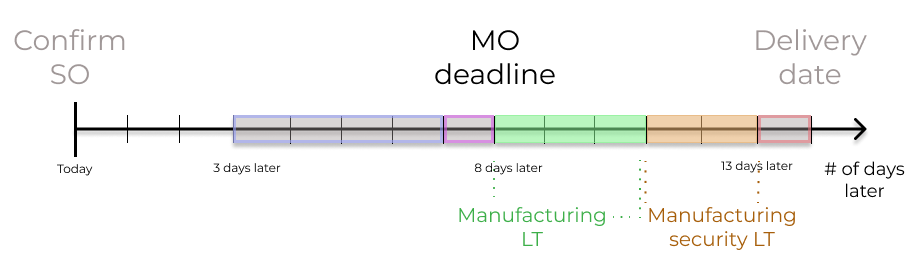
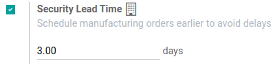
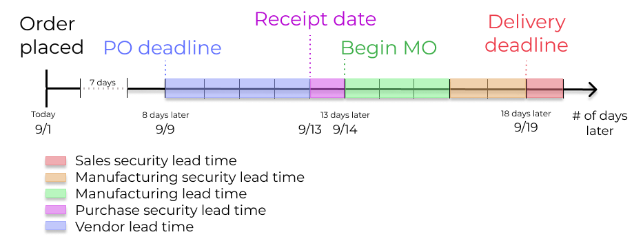

========================
Scheduled delivery dates
========================

Accurately forecasting delivery dates is vital for fulfilling customer expectations. In Odoo, the
*Inventory* app allows for comprehensive lead time configuration, allowing coordination and planning
of manufacturing orders, deliveries, and receptions.

Lead time types
===============

Different lead times for different operations can impact various stages of the order fulfillment
process. Here's a summary of the types of lead times in Odoo:

.. image:: scheduled_dates/all-lead-times.png
   :align: center
   :alt: Show graphic of all lead times working together.

- :ref:`Customer lead time <inventory/management/customer-lt>`: The default time frame for
  fulfilling customer orders. The customer lead time is the number of days from the date the sales
  order (SO) is confirmed to the date the products are shipped from the warehouse. This is also
  known as *delivery lead time*.

- :ref:`Sales security lead time <inventory/management/sales-security-lt>`: moves the *scheduled
  delivery date* forward by a specified number of days. This serves as a buffer to allow the team
  ample time to prepare the outgoing shipment earlier, considering the possibility of delays in the
  fulfillment process.

- :ref:`Purchase lead time <inventory/management/purchase-lt>`: the number of days from the
  confirmation of a purchase order (PO) to the receipt of products. It provides insight on the time
  it takes for products to arrive at the warehouse, facilitating effective scheduling and planning
  of supplier deliveries.

- :ref:`Purchase security lead time <inventory/management/purchase-security-lt>`: advances the order
  deadline on a :abbr:`PO (Purchase Order)` by a specified number of days. This proactive approach
  of placing orders earlier mitigates the risk of vendor or shipping delays. Thus, for products that
  are set to replenish to order, the need appears on the *Replenishment report* earlier, according
  to the specified number of days.

- :ref:`Manufacturing lead time <inventory/management/manuf-lt>`: the number of days needed to
  complete a manufacturing order (MO) from the date of confirmation. This lead time includes
  weekends (non-working hours in Odoo), and is used to forecast an approximate production date for a
  finished good.

- :ref:`Manufacturing security lead time <inventory/management/manuf-security-lt>`: moves the
  scheduled date of the :abbr:`MO (Manufacturing Order)` forward by a specified number of days. When
  used in conjunction with :ref:`replenish to order <inventory/management/products/strategies>`, the
  security lead time makes the need appear earlier on the replenishment report.

.. _inventory/management/customer-lt:

Sales lead times
================

Customer lead times and sales security lead times can be configured to automatically compute an
*expected delivery date* on a :abbr:`SO (Sales Order)`. The expected delivery date ensures a
realistic *delivery dates* setting for shipments from the warehouse.

Odoo issues a warning message if the set delivery date is earlier than the expected date, as it may
not be feasible to fulfill the order by that time, which would impact other warehouse operations.

.. example::
   A :abbr:`SO (Sales Order)` containing a `Coconut-scented candle` is confirmed on July 11th. The
   product has a customer lead time of 14 days, and the business uses a sales security lead time of
   1 day. Based on the lead time inputs, Odoo suggests a delivery date in 15 days, on July 26th.

   .. image:: scheduled_dates/scheduled-date.png
      :align: center
      :alt: Set *Delivery Date* in a sales order. Enables delivery lead times feature.

The following sections demonstrate how to automatically compute expected delivery dates.

Customer lead time
------------------

Set the customer lead time on each product form, by navigating to the products page. To do so, go to
:menuselection:`Sales app --> Products --> Products`. From there, select the desired product, and
switch to the :guilabel:`Inventory` tab. Then, under the :guilabel:`Customer Lead Time` field, fill
in the number of calendar days required to fulfill the delivery order from start to finish.

.. example::
   Set a 14-day customer lead time for the `Coconut-scented candle` by navigating to its product
   form. Then, in the :guilabel:`Inventory` tab, type `14.00` days into the :guilabel:`Customer Lead
   Time` field.

   .. image:: scheduled_dates/customer.png
      :align: center
      :alt: Set *Customer Lead Time* on the product form.

.. _inventory/management/sales-security-lt:

Sales security lead time
------------------------

*Sales security lead time* is set globally for the business in :menuselection:`Inventory app -->
Configuration --> Settings`.

On the configuration page, under the :guilabel:`Advanced Scheduling` heading, locate the box for
:guilabel:`Security Lead Time for Sales`, and click the checkbox to enable the feature.

Next, enter the desired number of calendar days. This security lead time is a buffer notifying the
team to prepare for outgoing shipments earlier than the scheduled date.

.. example::
   Setting the :guilabel:`Security Lead Time for Sales` to `1.00` day, pushes the
   :guilabel:`Scheduled Date` of a delivery order (DO) forward by one day. In that case, if a
   product is initially scheduled for delivery on April 6th, but with a one-day security lead time,
   the new scheduled date for the delivery order would be April 5th.

   .. image:: scheduled_dates/sales-security.png
      :align: center
      :alt: View of the security lead time for sales configuration from the sales settings.

Deliver several products
------------------------

For orders that include multiple products with different lead times, the lead times can be
configured directly from the quotation itself. On a quotation, click the :guilabel:`Other Info` tab,
and set the :guilabel:`Shipping Policy` to:

#. :guilabel:`As soon as possible` to deliver products as soon as they are ready. The
   :guilabel:`Scheduled Date` of the :abbr:`DO (Delivery Order)` is determined by adding today's
   date to the shortest lead time among the products in the order.

#. :guilabel:`When all products are ready` to wait to fulfill the entire order at once. The
   :guilabel:`Scheduled Date` of the :abbr:`DO (Delivery Order)` is determined by adding today's
   date to the longest lead time among the products in the order.

.. image:: scheduled_dates/shipping-policy.png
   :align: center
   :alt: Show *Shipping Policy* field in the *Other Info* tab of a quotation.

.. example::
   In a quotation containing 2 products, `Yoga mat` and `Resistance band,` the products have a lead
   time of 8 days and 5 days, respectively. Today's date is April 2nd.

   When the :guilabel:`Shipping Policy` is set to :guilabel:`As soon as possible`, the scheduled
   delivery date is 5 days from today: April 7th. On the other hand, selecting :guilabel:`When all
   products are ready` configures the scheduled date to be 8 days from today: April 10th.

.. _inventory/management/purchase-lt:

Purchase lead times
===================

Automatically determining the dates on which to place orders from suppliers can help simplify the
procurement process.

Odoo calculates the supplier shipment *receipt date*, and :abbr:`PO (Purchase Order)` deadline,
based on the required date the product is needed in the warehouse. By working backwards from the
receipt date, vendor lead times and purchase security lead times are taken into account, in order to
determine the :abbr:`PO (Purchase Order)` deadline.

This deadline is the date by which the order should be confirmed, in order to ensure timely arrival
by the expected receipt date.

.. image:: scheduled_dates/vendor-lead-times.png
   :align: center
   :alt: Visualization of PO deadline and receipt date used with vendor lead times.

.. seealso::
   :ref:`PO scheduling with reordering rules <inventory/management/reordering_rules>`

Vendor lead time
----------------

To set a vendor lead time for orders arriving in the warehouse from a vendor location, begin by
navigating to a product form through :menuselection:`Purchase app --> Products --> Products`.

Next, select the desired product, and switch to the :guilabel:`Purchase` tab. In the editable vendor
pricelist, click the :guilabel:`Add a line` button to add vendor details, such as the
:guilabel:`Vendor` name, :guilabel:`Price` offered for the product, and lastly, the
:guilabel:`Delivery Lead Time`.

.. note::
   Multiple vendors and lead times can be added to the vendor pricelist. The default vendor and lead
   time selected will be the entry at the top of the list.

.. example::
   On the vendor pricelist of the product form, the :guilabel:`Delivery Lead Time` for the selected
   vendor is set to `10 days.`

   .. image:: scheduled_dates/set-vendor.png
      :align: center
      :alt: Add delivery lead times to vendor pricelist on a product.

By setting the vendor lead time, the expected arrival date of the item is automatically determined
as the date of the :abbr:`PO (Purchase Order)` confirmation, plus the vendor lead time. This ensures
that warehouse employees are notified, if the products do **not** arrive within the expected
timeframe.

.. example::
   On a :abbr:`PO (Purchase Order)` confirmed on July 11th, for a product configured with a 10-day
   vendor lead time, Odoo automatically sets the :guilabel:`Receipt Date` to July 21st. The receipt
   date also appears as the :guilabel:`Scheduled Date` on the warehouse receipt form, accessible
   from the :guilabel:`Receipt` smart button, located on the :guilabel:`PO (Purchase Order)`.

   .. image:: scheduled_dates/receipt-date.png
      :align: center
      :alt: Show expected *Receipt Date* of the product from the vendor.

   .. image:: scheduled_dates/scheduled-date-receipt.png
      :align: center
      :alt: Show expected *Scheduled Date* of arrival of the product from the vendor.

.. _inventory/management/purchase-security-lt:

Purchase security lead time
---------------------------

*Purchase security lead time* is set globally for the business in :menuselection:`Inventory app -->
Configuration --> Settings`.

On the configuration page, under the :guilabel:`Advanced Scheduling` heading, locate the box for
:guilabel:`Security Lead Time for Purchase`, and click the checkbox to enable the feature.

Next, enter the desired number of calendar days. By configuring the security lead time, a buffer is
set to account for potential delays in supplier deliveries.

.. example::
   Setting the :guilabel:`Security Lead Time for Purchase` to `2.00` days, pushes the
   :guilabel:`Scheduled Date` of receipt back by one day. In that case, if a product is initially
   scheduled to arrive on April 6th, with a two-day security lead time, the new scheduled date for
   the receipt would be April 8th.

   .. image:: scheduled_dates/vendor-security.png
      :align: center
      :alt: Set security lead time for purchase from the Inventory > Configuration > Settings.

.. _inventory/management/manuf-lt:

Manufacturing lead times
========================

Lead times can help simplify the procurement process for consumable materials and components used in
manufactured products with bills of materials.

The :abbr:`MO (Manufacturing Order)` deadline, which is the deadline to begin the manufacturing
process to complete the product by the scheduled delivery date, can be determined by configuring the
manufacturing lead times and manufacturing security lead times.

Manufacturing lead time
-----------------------

Configure the manufacturing lead time directly on the product form, by navigating to
:menuselection:`Manufacturing app --> Products --> Products`, and select the desired product.

In the :guilabel:`Inventory` tab of the product, specify the calendar days needed to the manufacture
the product in the :guilabel:`Manufacturing Lead Time` field.

.. example::
   Specify a 14-day :guilabel:`Manufacturing Lead Time` for a product directly in the
   :guilabel:`Inventory` tab of the product.

   .. image:: scheduled_dates/set-manufacturing.png
      :align: center
      :alt: View of the manufacturing lead time configuration from the product form.

Establish a :abbr:`MO (Manufacturing Order)` deadline, based on the *expected delivery date*,
indicated in the :guilabel:`Scheduled Date` field of the :abbr:`DO (Delivery Order)`.

The :abbr:`MO (Manufacturing Order)` deadline, which is the :guilabel:`Scheduled Date` field on the
:abbr:`MO (Manufacturing Order)`, is calculated as the *expected delivery date* subtracted by the
manufacturing lead time.

This ensures the manufacturing process begins on time, in order to meet the delivery date.

However, it's important to note that lead times are based on calendar days. Lead times do **not**
consider weekends, holidays, or *work center capacity* (:dfn:`the number of operations that can be
performed at the work center simultaneously`).

.. seealso::
   - :ref:`Manufacturing planning <manufacturing/management/use_mps>`
   - :ref:`Configure automatic MO scheduling with reordering rules
     <inventory/management/reordering_rules>`

.. example::
   A product's scheduled shipment date on the :abbr:`DO (Delivery Order)` is August 15th. The
   product requires 14 days to manufacture. So, the latest date to start the :abbr:`MO
   (Manufacturing Order)` to meet the commitment date is August 1st.

.. _inventory/management/manuf-security-lt:

Manufacturing security lead time
--------------------------------

*Manufacturing security lead time* is set globally for the business in :menuselection:`Manufacturing
app --> Configuration --> Settings`. Under the :guilabel:`Planning` heading, locate the box for
:guilabel:`Security Lead Time`, and click the checkbox to enable the feature.

Next, enter the desired number of calendar days. By configuring the security lead time, a buffer is
set to account for potential delays in the manufacturing process.

.. example::
   A product has a scheduled shipment date on the :abbr:`DO (Delivery Order)` set for August 15th.
   The manufacturing lead time is 7 days, and manufacturing security lead time is 3 days. So, the
   :guilabel:`Scheduled Date` on the :abbr:`MO (Manufacturing Order)` reflects the latest date to
   begin the manufacturing order. In this example, the planned date on the :abbr:`MO (Manufacturing
   Order)` is August 5th.

Global example
==============

See the following example to understand how all the lead times work together to ensure timely order
fulfillment:

- **Sales security lead time**: 1 day
- **Manufacturing security lead time**: 2 days
- **Manufacturing lead time**: 3 days
- **Purchase security lead time**: 1 day
- **Vendor lead time**: 4 days

The customer places an order for a manufactured product on September 1st, and the scheduled delivery
date from the warehouse is on September 20th. Odoo uses lead times and automated reordering rules to
schedule the necessary operations, based on the outgoing shipment delivery date, September 20th:

- **September 1st**: Sales order created, confirmed by salesperson.

- **September 9th**: Deadline to order components to ensure they arrive in time when manufacturing
  begins (4-day supplier lead time).

- **September 13th**: Scheduled date of receipt for components. Initially, it was set to 9/14, but
  the 1-day purchase security lead time pushed the date earlier by 1 day.

- **September 14th**: Deadline to begin manufacturing. Calculated by subtracting the manufacturing
  lead time of 3 days, and the manufacturing security lead time of 2 days, from the expected
  delivery date of September 19th.

- **September 19th**: :guilabel:`Scheduled Date` on the delivery order form indicates the updated
  expected delivery date, which was originally set as September 20th. But the sales security lead
  time pushed the date forward by a day.

Odoo's replenishment planning maps a business' order fulfillment process, setting pre-determined
deadlines and raw material order dates, including buffer days for potential delays. This ensures
products are delivered on time.
