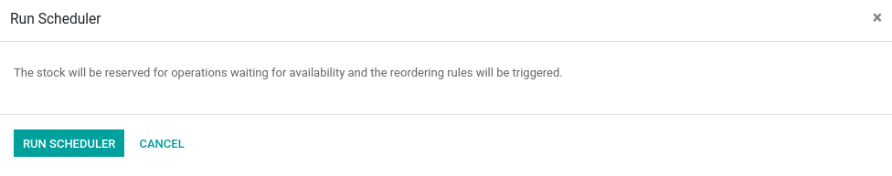
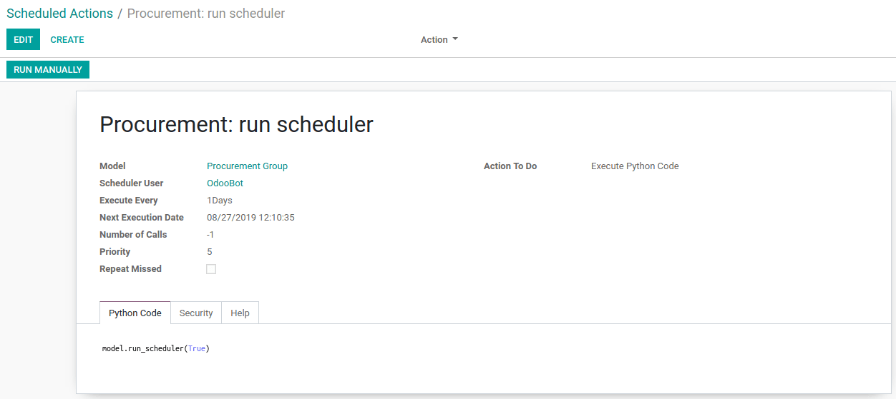

============================
Configure and Run Schedulers
============================

What is a scheduler?
====================

The scheduler is the calculation engine that plans and prioritizes
production and purchasing. It does it automatically, according to the
rules defined on products. By default, the scheduler is set to run once
a day.

Calculating Requirements / Scheduling
=====================================

Scheduling only validates procurements that are confirmed but not yet
started. These procurement reservations will start production, tasks or
purchases themselves, depending on the configuration of the requested
product.

As a human would do, the scheduler takes the priority of operations into
account when starting reservations and procurements. Urgent requests
will be started first.

.. note::
   In case there are not enough products in stock to satisfy all the
   requests, you can be sure that the most urgent ones will be produced
   first.

Configure and run the scheduler
===============================

Run the scheduler manually
--------------------------

To start the scheduler manually, go to :menuselection:`Inventory --> Operations --> Run
Schedulers`. The scheduler uses all the relevant parameters defined for
products, suppliers and the company to prioritize the different
production orders, deliveries and supplier purchases.

Configure and run the scheduler (for advanced users)
----------------------------------------------------

To use this feature, you have to activate the :ref:`developer mode <developer-mode>`.

Then, go to :menuselection:`Settings --> Technical --> Automation --> Scheduled Actions`
and modify the *Run MRP Scheduler Configuration*. There, you can set
the starting time of the scheduler.

