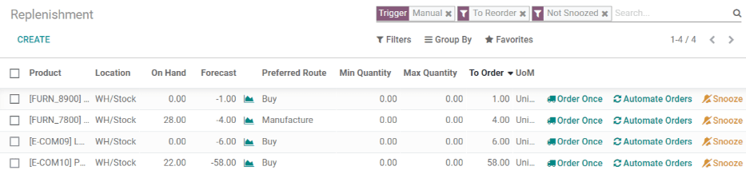
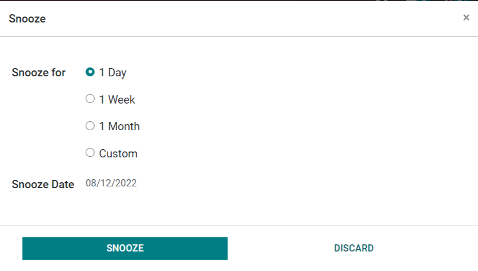
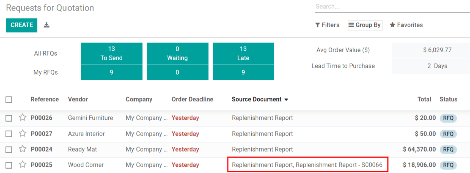
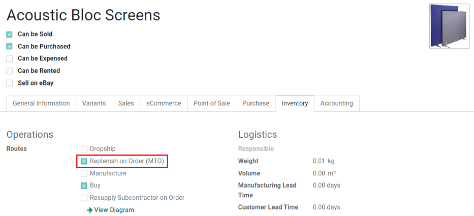

==================================
Selecting a replenishment strategy
==================================

.. |MTO| replace:: :abbr:`MTO (Make to Oder)`
.. |PO| replace:: :abbr:`PO (Purchase Order)`
.. |MO| replace:: :abbr:`MO (Manufacturing Order)`
.. |SO| replace:: :abbr:`SO (Sales Order)`

In Odoo, there are two strategies for automatically replenishing inventory: *reordering rules* and
the *make to order (MTO)* route. Although these strategies differ slightly, they both have similar
consequences: triggering the automatic creation of a |PO| or |MO|. The choice of which strategy to
use depends on the business's manufacturing and delivery processes.

Terminology
===========

Replenishment report and reordering rules
-----------------------------------------

The replenishment report is a list of all products that have a negative forecast quantity.

*Reordering rules* are used to ensure there's always a minimum amount of a product in-stock, in
order to manufacture products and/or fulfill sales orders. When the stock level of a product reaches
its minimum, Odoo automatically generates a purchase order with the quantity needed to reach the
maximum stock level.

Reordering rules can be created and managed in the replenishment report, or from the product form.

.. _inventory/management/products/strategies:

Make to order
-------------

*Make to order (MTO)* is a procurement route that creates a draft purchase order (or manufacturing
order) each time a sales order is confirmed, **regardless of the current stock level**.

Unlike products replenished using reordering rules, Odoo automatically links the sales order to the
|PO| or |MO| generated by the |MTO| route.

Another difference between reordering rules and |MTO| is, with |MTO|, Odoo generates a draft |PO| or
|MO| immediately after the |SO| is confirmed. With reordering rules, Odoo generates a draft |PO| or
|MO| when the product's forecasted stock falls below the set minimum quantity.

In addition, Odoo automatically adds quantities to the |PO| or |MO| as the forecast changes, so long
as the |PO| or |MO| is not confirmed.

The |MTO| route is the best replenishment strategy for products that are customized, and/or for
products that have no stock kept on-hand.

Configuration
=============

Replenishment report and reordering rules
-----------------------------------------

To access the replenishment report, go to :menuselection:`Inventory app --> Operations -->
Replenishment.`

By default, the replenishment report dashboard shows every product that needs to be manually
reordered. If there is no specific rule for a product, Odoo assumes the :guilabel:`Min Quantity` and
:guilabel:`Max Quantity` stock are both `0.00`

.. note::
   For products that don't have a set reordering rule, Odoo calculates the forecast based on
   confirmed sales orders, deliveries, and receipts. For products that have a set reordering rule,
   Odoo calculates the forecast normally, but also takes into account the purchase/manufacturing
   lead time and security lead time.

.. important::
   Before creating a new reordering rule, make sure the product has a *vendor* or a *bill of
   materials* configured on the product form. To check this, go to :menuselection:`Inventory app
   --> Products --> Products`, and select the product to open its product form. The vendor, if
   configured, is listed in the :guilabel:`Purchase` tab, and the bill on materials, if configured,
   is found in the :guilabel:`Bill of Materials` smart button at the top of the form.

   The :guilabel:`Product Type`, located in the :guilabel:`General Information` tab on the product
   form, **must** be set to :guilabel:`Storable Product`. By definition, a consumable product does
   not have its inventory levels tracked, so Odoo cannot account for a consumable product in the
   replenishment report.

To create a new reordering rule from the replenishment report, go to :menuselection:`Inventory app
--> Operations --> Replenishment`, click :guilabel:`Create`, and select the desired product from the
drop-down menu in the :guilabel:`Product` column. If necessary, a :guilabel:`Min Quantity` and a
:guilabel:`Max Quantity` can be configured in the corresponding columns on the
:guilabel:`Replenishment` report page, as well.

To create a new reordering rule from the product form, go to :menuselection:`Inventory app -->
Products --> Products`, and select a product to open its product form. Click the
:guilabel:`Reordering Rules` smart button, click :guilabel:`Create`, and fill out the fields.

Replenishment report fields
~~~~~~~~~~~~~~~~~~~~~~~~~~~

The following fields are on the :guilabel:`Replenishment` report. If any of these fields are not
visible, click the :guilabel:`⋮ (additional options)` icon on the far right side of the report, then
click the checkbox next to a field to make it visible.

- :guilabel:`Product`: the product that requires a replenishment.
- :guilabel:`Location`: the specific location where the product is stored.
- :guilabel:`Warehouse`: the warehouse where the product is stored.
- :guilabel:`On Hand`: the amount of product currently available.
- :guilabel:`Forecast`: the amount of product available after all current orders (sales,
  manufacturing, purchase, etc.) are taken into account.
- :guilabel:`Preferred Route`: how the product is procured, either :guilabel:`Buy`,
  :guilabel:`Manufactured`, :guilabel:`Dropship`, etc.
- :guilabel:`Vendor`: the company from which the product is acquired.
- :guilabel:`Bill of Materials`: the bill of materials for the product (if one is configured).
- :guilabel:`Trigger`: how the replenishment is created, either :guilabel:`Auto` (automatically,
  once the :guilabel:`On Hand` quantity goes below the :guilabel:`Min Quantity`) or
  :guilabel:`Manual` (only when the replenishment is requested).
- :guilabel:`Procurement Group`: the reference number for how the product is being acquired, such as
  a sales order, purchase order, or manufacturing order.
- :guilabel:`Min Quantity`: the minimum amount of product that should be available. When inventory
  levels goes below this number, the replenishment is triggered.
- :guilabel:`Max Quantity`: the amount of product that should be available after replenishing the
  product.
- :guilabel:`Multiple Quantity`: if the product should be ordered in specific quantities, enter the
  number that should be ordered. For example, if the :guilabel:`Multiple Quantity` is set to `5`,
  and only 3 are needed, 5 products are replenished.
- :guilabel:`To Order`: the amount of product that is currently needed, and will be ordered, if the
  :guilabel:`Order Once` or :guilabel:`Automate Orders` button is clicked.
- :guilabel:`UoM`: the unit of measure used to acquire the product.
- :guilabel:`Company`: the company for which the product is acquired.

By default, the quantity in the :guilabel:`To Order` field is the quantity required to reach the set
:guilabel:`Max Quantity`. However, the :guilabel:`To Order` quantity can be adjusted by clicking on
the field and, changing the value, and clicking :guilabel:`Save`. To replenish a product manually,
click :guilabel:`Order Once`.

To automate a replenishment from the :guilabel:`Replenishment` page, click :guilabel:`Automate
Orders` on the right-side of the line, represented by a :guilabel:`🔄 (circular arrow)` icon.

When this button is clicked, Odoo will automatically generate a draft |PO|/|MO| every time the
forecasted stock level falls below the set :guilabel:`Min Quantity` of the reordering rule.

On the :guilabel:`Replenishment` page, a reordering rule or manual replenishment can be temporarily
deactivated for a given period, by clicking the :guilabel:`🔕 (snooze)` icon on the far-right of the
line.

A |PO| or |MO| created by a manual replenishment has a :guilabel:`Replenishment Report` as the
source document. A |PO| or |MO| created by an automated reordering rule has the |SO| reference
number(s) that triggered the rule as the source document.

Make to order (MTO) route
=========================

Since the |MTO| route is recommended for customized products, the route is hidden by default.

To activate the |MTO| route in Odoo:
 #. Go to :menuselection:`Inventory app --> Configuration  --> Settings`.
 #. Activate the :guilabel:`Multi-Step Routes` setting, located under the :guilabel:`Warehouse`
    section, and click :guilabel:`Save`.
 #. Then, go to :menuselection:`Inventory app --> Configuration  --> Routes`.
 #. Click on :menuselection:`Filters --> Archived` to show archived routes.
 #. Select the checkbox next to :guilabel:`Replenish on Order (MTO)`, and click on
    :menuselection:`Action --> Unarchive`.

.. note::
   Activating the :guilabel:`Multi-Step Routes` setting also activates :guilabel:`Storage
   Locations`. If these features aren't applicable to the warehouse, disable these settings after
   unarchiving the |MTO| route.

To set a product's procurement route to |MTO|, go to :menuselection:`Inventory app --> Products -->
Products`, click on the desired product to open its product form, and click :guilabel:`Edit`.

Then, click the :guilabel:`Inventory` tab, and in the :guilabel:`Routes` section of options, select
:guilabel:`Replenish on Order (MTO)`.

For products purchased directly from a vendor, make sure the :guilabel:`Buy` route is selected, in
addition to the :guilabel:`Replenish on Order (MTO)` route. Also, make sure a vendor is configured
in the :guilabel:`Purchase` tab of the product form.

For products manufactured in-house, make sure the :guilabel:`Manufacture` route is selected, in
addition to the :guilabel:`Replenish on Order (MTO)` route. Also, make sure a bill of materials is
configured for the product, which is accessible via the :guilabel:`Bill of Materials` smart button
on the product form.

Finally, when all configurations are complete, click :guilabel:`Save`.

.. note::
   The |MTO| route cannot be selected alone. |MTO| **only** works if the :guilabel:`Manufacture` or
   :guilabel:`Buy` route is also selected.

