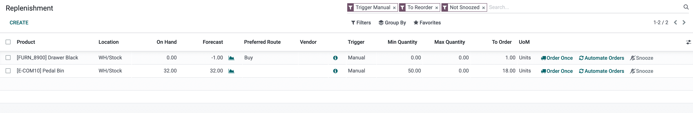
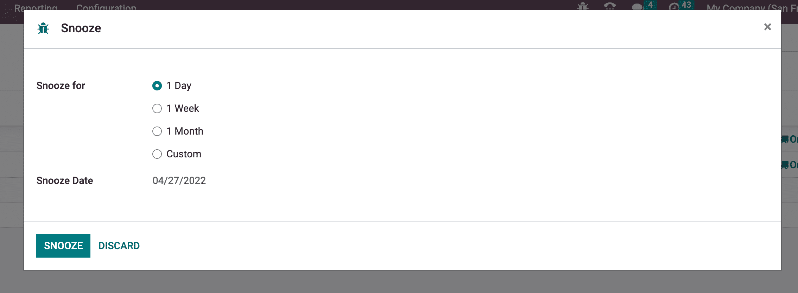
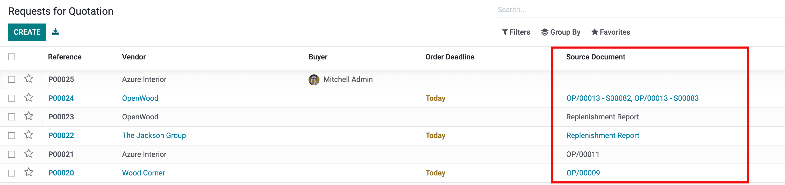
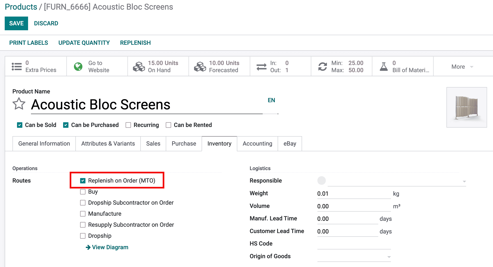

==============================================
How to select the right replenishment strategy
==============================================

Reordering Rules and Make to Order have similar consequences: creating a
Purchase or Manufacturing order automatically.
But those methods work differently. They should be used depending on your 
manufacturing and delivery strategies.

Terminology
===========

Replenishment Report and Reordering Rules
-----------------------------------------
The replenishment report is a list of all your products that have a negative forecast
quantity. 
Reordering rules are used to ensure that you always have the minimum
amount of a product in stock in order to manufacture your products
and/or answer to your customer needs. When the stock level of a product
reaches its minimum the system will automatically generate a procurement
order with the quantity needed to reach the maximum stock level.
Reordering Rules can be created and managed in the replenishment report or
from the product form.

Make to Order
-------------

The Make to Order is a route that creates a draft purchase order or manufacturing 
order each time a sales order is confirmed, **regardless of the current stock**. 
A strong link is created between the 
SO and the PO/MO. 
Another difference with Reorering Rules is that with MTO, a new PO or MO is generated
immediately at the confirmation of the SO. With Reordering rules, as long as the 
PO or MO is not confirmed, quantities will be added to it.
This is a good way to handle products that are customized and should be 
used for this purpose only.

Configuration
=============

Replenishment Report
--------------------
This Feature can be accessed through :menuselection:`Inventory --> Operations --> Replenishment`
By default, the Replenishment Report show every product that needs to be reoredered manually. 
If there is no specific rule for a product, it's assumed that the min and max stock are 0.

.. note::
    - If a product doesn't have any specific rule, the system will check the forecast in an
      infinite future.
    - If a product has a specific rule, the system will check the forecast at D + 
      purchase/manufacturing lead time + security lead time.

A Reordering Rule can be added through the replenishment report by simply adding a 
line in the report. Be sure to have necessary information like supplier or bill of material configured on
your product.

By default, the quantity to order is the quantity required to fill your max quantity in stock 
but it can be adjusted. To replenish manually, just hit **Order Once**.

Rules can create automatically a Purchase Order or a Manufacturing order when
required. For this, hit **Automate Orders**

A Reordering Rule can be temporarly deactivated for a given period by using the **Snooze** button. 

Purchase/Manufacturing orders created by the Replenishment will have *Replenishment Report* as
source document when created manually. If they are created automatically source document will be
*OP/xxxxxxx* or *OP/xxxxxxx - Sxxxxxx* with the Sales Order(s) reference that triggered the rule.

    
.. tip::
    Don't forget to select the right product type. A consumable
    can not be stocked and will thus not be accounted for in the stock valuation.

Make to Order 
--------------

As this configuration is recommended in particular cases, the Make to Order is a bit hidden in Odoo.
To activate it:
#. go to :menuselection:`Inventory --> Configuration --> Settings`
#. activate setting **Multi-Step Routes** and save.
#. go to :menuselection:`Inventory --> Configuration --> Routes`
#. Filter on archived routes.
#. Unarchive MTO route: select route and pick action *Unarchive*.

.. note::
    Activating Multi-Step Routes also activate **Storage Locations** setting. If you don't need these features, 
    don't forget to disable then after unarchiving the MTO route.
    
On the product form, in the Inventory tab, click on "Make To Order".

Choice between the two options
------------------------------

Using the Replenishment Report with rules is the most flexible way
to manage your stock levels. It can do the same as MTO except the strong 
link between SO and PO/MO is not existing.
Unless you sell/manufacture customized items, it's highly recommended to
use the Replenishment Report.

