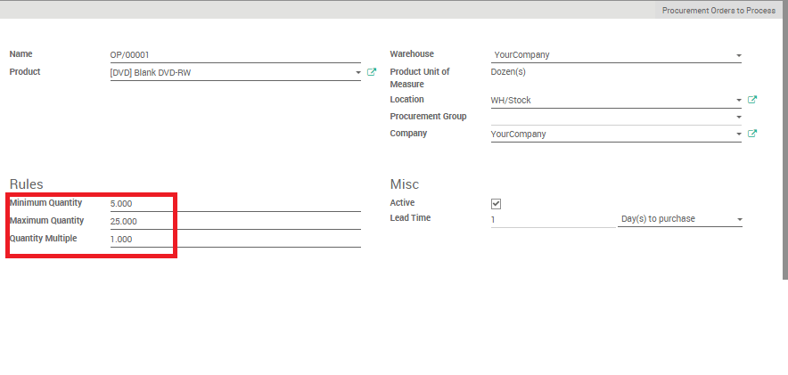
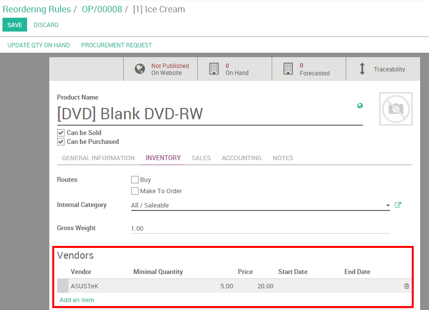

==============================================
올바른 재고보충전략을 선택하는 방법
==============================================

최소재고 규칙과 주문제작(M.T.O)은 유사한 결과를 도출하는것 같지만, 서로 규칙이 다릅니다. 자신의 제조전략 및 배송전략에 기반하여 사용되어야 합니다.

전문용어
=========

최소재고 규칙
---------------

Minimum Stock rules are used to ensure that you always have the minimum
amount of a product in stock in order to manufacture your products
and/or answer to your customer needs. When the stock level of a product
reaches its minimum the system will automatically generate a procurement
order with the quantity needed to reach the maximum stock level.
최소재고 규칙은 제품을 제조하고(하거나) 고객의 요구에 응답하기위해 항상 최소한의 재고를 유지하도록 보장하기위해 사용합니다.

주문제작(Make to Order)
-------------------------

The Make to Order function will trigger a Purchase Order of the amount
of the Sales Order related to the product. The system will **not** check
the current stock. This means that a draft purchase order will be
generated regardless of the quantity on hand of the product.
주문제작(M.T.O)기능은 고객으로부터 제품과 관련된 주문이 들어온만큼 그 제품에 대한 구매주문 초안을 자동으로 생성합니다. Odoo 시스템은 현재재고수량을 **체크하지 않습니다.** 
이것은 구매주문서 초안이 제품의 현재보유수량과 상관없이 생성됨을 의미합니다.

환경설정(Configuration)
=========================

최소주문규칙
--------------

최소주문규칙은 인벤토리 모듈을 톨해 설정가능합니다. 인벤토리 모듈 메뉴에서 "재주문규칙(Reordering Rule)"을 선택합니다. 거기에서 주어진 제품의 최소/최대 재고수량을 설정해야하므로 "생성하기(Create)"버튼을 클릭합니다.

.. note::
    Show tooltips for "minimum quantity", "maximum quantity" and "quantity multiple"
    fields

Then, click on your product to access the related product form and, on
the "Inventory submenu", do not forget to select a supplier.
그다음, "인벤토리 하위메뉴"에서 연관된 제품양식을 보기위해 제품을 클립니다. 그리고 공급업체를 선택하는걸 잊지마세요.

.. tip::
    Don't forget to select the right product type. A consumable
    can not be stocked and will thus not be accounted for in the stock valuation.
    올바른 제품타입을 선택하는걸 잊지마세요. 소모품(consumable)은 저장될 수 없고 이런 이유로 재고가치로 계산되지 않습니다.

주문제작(Make to Order)
-------------------------

주문제작(M.T.O)은 :menuselection:`인벤토리(Inventory) --> 인벤토리 제어(Inventory control) --> 제품(Products)` (또는 제품양식 화면을 볼 수 있는 어떤 다른 모듈)를 통해서 제품양식 화면내에서 설정가능합니다.

On the product form, under Inventory, click on "Make To Order".
인벤토리 > 제품양식에서, "주문제작(Make To Order)"을 클릭하세요.

.. image:: strategies/strategies03.png
    :align: center

위에서 설명한 두가지 옵션중에 선택하기
-------------------------------------

이와같이 두 옵션중에 선택하는것은 자시의 인벤토리 전략에 달려있다.
1. 만약 여유분의 재고와 항상 최소의 재고수량이 있어야 된다고 생각한다면, 최소재고 규칙을 사용해야 합니다.
2. 만약 고객으로부터 판매주문이 들어올 경우에만 그 해당재고를 재주문할 요량이라면, 주문제작(Make to Order, 약어로 M.T.O)이 더 나을것입니다.
