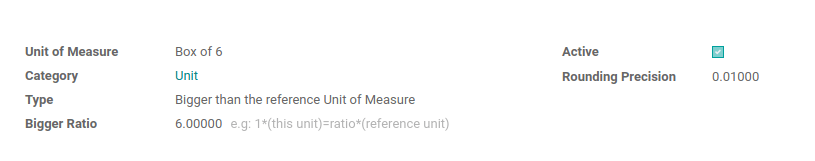
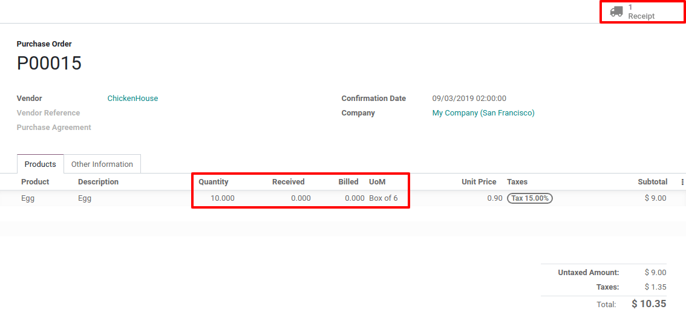

==============================
Use Different Units of Measure
==============================

In some cases, handling products in different units of measure is
necessary. For example, if you buy products in a country where the
metric system is of application and sell in a country where the imperial
system is used, you will need to convert the units. Another common use
case is buying products in bigger packs to your supplier and selling
them in units to your customers.

You can set up Odoo to work with different units of measure for one
product.

Configuration
=============

In the *Inventory* application, go to :menuselection:`Configuration --> Settings`. In
the *Products* section, activate *Units of Measure*, then *Save*.

.. image:: uom/uom_01.png
    :align: center

Create New Units of Measure
===========================

In the *Inventory* application go to :menuselection:`Configuration --> UoM`. There,
hit *Create*. As an example, we will create a Box of 6 units that we
will use for the Egg product.

The category is important for unit conversion, you will be able to
convert products from one unit to another only if those units belong to
the same category. The box of 6 is 6 times bigger than the reference
unit of measure for the category which is “Units” here.

.. image:: uom/uom_03.png
    :align: center

Specify Units of Measure on your Products
=========================================

In the :menuselection:`Inventory application --> Master Data --> Products`, open the
product which you would like to change the purchase/sale unit of
measure, and click on *Edit*.

In the *General Information* tab, you can select the *Unit of
Measure* in which the product will be sold, which is also the unit in
which internal transfers will take place. You can also select the
*Purchase Unit of Measure*, which is the unit in which you purchase
the product.

.. image:: uom/uom_04.png
    :align: center

Transfer from One Unit to Another
=================================

Buy in the Purchase UoM
-----------------------

In the *Purchase* application, *Create* a new request for quotation
in which you include the product with the different *Units of Measure*
and *Confirm* it.

On the automatically generated purchase orders, the UoM used is the Box
of 6, meaning the Purchase UoM. You have of course the possibility to
manually modify the UoM if necessary. When you enter the *Receipt*
which is linked to the purchase order, you can observe that the 10 boxes
of 6 units have been converted in 60 units. Indeed, the stock is managed
in units.

.. image:: uom/uom_06.png
    :align: center

Replenishment
-------------

When doing a replenishment via the *Replenish* button on the product
form, you have the possibility to use a different unit of measure.

.. image:: uom/uom_07.png
    :align: center

.. image:: uom/uom_08.png
    :align: center

Sell in bigger UoM
------------------

You can choose the unit of measure on the sale order document and decide
to sell the eggs by the dozen. When doing so, the price is automatically
computed from Units UoM to adapt to the selected *UoM*.

.. image:: uom/uom_09.png
    :align: center

In the delivery order, the *UoM* used in the sale order is converted
to the *UoM* used for stock management, in our use case, the Units.

.. image:: uom/uom_10.png
    :align: center
