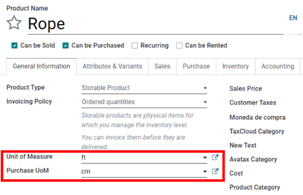
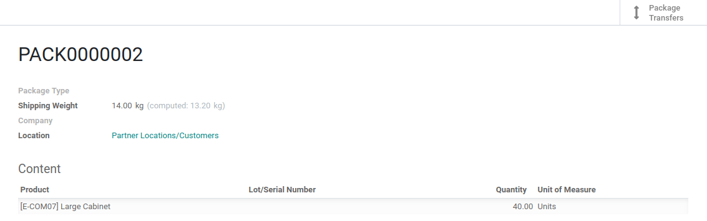

====================================================================
When Should you Use Packages, Units of Measure or Special Packaging?
====================================================================

Units of measure
================

Units of measure specify the unit used to handle a product. In Odoo, you have the possibility to
specify the unit of measure in which you manage your stock and the one which is used when
purchasing the product to your supplier.

Once a product has a :guilabel:`Unit of Measure` and a :guilabel:`Purchase UoM` set on the product
form, Odoo can automatically convert the different units in the product's purchase/sales orders and
the orders' respective delivery orders/receipts. The only condition is that all the units have to
be in the *same category* (Unit, Weight, Volume, Length, etc.).

For example, a product can have its :guilabel:`Unit of Measure` set to `feet (ft)` and its
:guilabel:`Purchase UoM` set to `centimeters (cm)`. When a purchase order (PO) is created for that
product, it will list the quantity in centimeters. Then, when the PO is confirmed, Odoo
automatically generates a receipt and converts the centimeters to feet. The receipt will list the
quantity in feet.

Packages
========

A package refers to the physical container that holds one or several products from a picking. For
example, when a product is ready for delivery, its quantities can be separated into two different
packages. In Odoo, the quantity of products in each package can be recorded in the database. Make
sure the :guilabel:`Packages` option is enabled in :menuselection:`Inventory --> Configuration -->
Settings --> Operations`.

On a delivery order, separate the products into different packages by setting the :guilabel:`Done`
quantity to the desired quantity in the first package. Then, click :guilabel:`Put in Pack` to
record the first package. Repeat for each package.

.. image:: usage/separate-delivery-into-different-packages.png
   :align: center
   :alt: Separate delivery into different packages

Packagings
==========

Packaging refers to a standard container that holds several unit of a product. For example, cans of
soda can be in a 6-pack, 15-pack, or even a pallet for the packaging.

In Odoo, packagings are used for indicative purposes on sales/purchase orders and inventory
transfers. The main difference between packagings and units of measure is that packagings are
defined at the product level while UoMs are generic.

.. image:: usage/product-packaging-examples.png
   :align: center
   :alt: Different product packaging examples.

.. image:: usage/package-field-on-po.png
   :align: center
   :alt: Package field on purchase order.

.. note::
   Packaging is also useful during product reception. When scanning the barcode of the
   packaging, Odoo automatically adds the number of units contained in the packing on the picking.

.. seealso::
   :doc:`uom`
