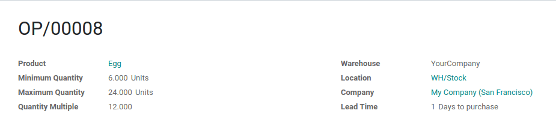

====================================================================
When Should you Use Packages, Units of Measure or Special Packaging?
====================================================================

Units of Measure
================

Units of measure specify the unit used to handle a product. In Odoo, you
have the possibility to specify the unit of measure in which you manage
your stock and the one which is used when purchasing the product to your
supplier.

.. image:: usage/usage_01.png
    :align: center

The *conversion* between the different units of measure is done
automatically. The only condition is that all the units have to be in
the *same category* (Unit, Weight, Volume, Length,...)

For example, if I have the following reordering rule for the egg and I
run the scheduler, the quantity added in the automatically generated
purchase order will be in dozens but what will enter the stock will be
units.

.. image:: usage/usage_03.png
    :align: center

.. image:: usage/usage_04.png
    :align: center

Packages
========

The package is the physical container in which you put one or several
products from a picking. For example, when you deliver a product, you
can decide to separate the quantity into two different packages. It then
allows you to have a report with the quantity of products for each
package.

To separate a delivery into different packages you will have to set the 
done quantity to the desired package quantity then click on "PUT IN 
PACK", do this for each package.

.. image:: usage/usage_05.png
    :align: center

.. image:: usage/usage_06.png
    :align: center

Packaging
=========

The packaging is the physical container that protects your product. If
you are selling computers, the packaging contains the computer with the
notice and the power plug.

In Odoo, packagings are used for indicative purposes on sale orders.
They can be specified on the product form, in the inventory tab.

.. image:: usage/usage_07.png
    :align: center

.. image:: usage/usage_08.png
    :align: center

.. note::
        Another useful use of the packaging is for product reception. By
        scanning the barcode of the packaging, Odoo adds the number of units
        contained in the packing on the picking.
