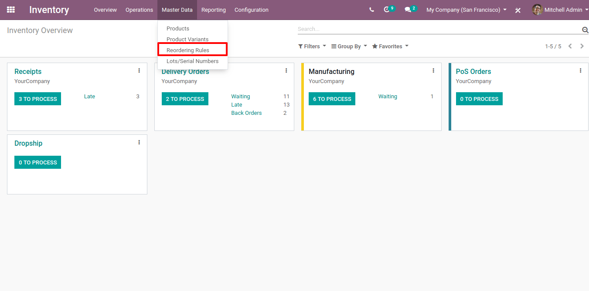
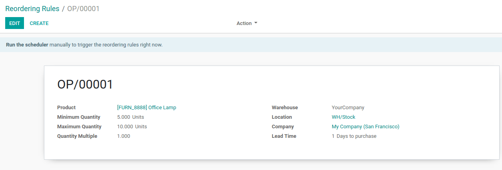
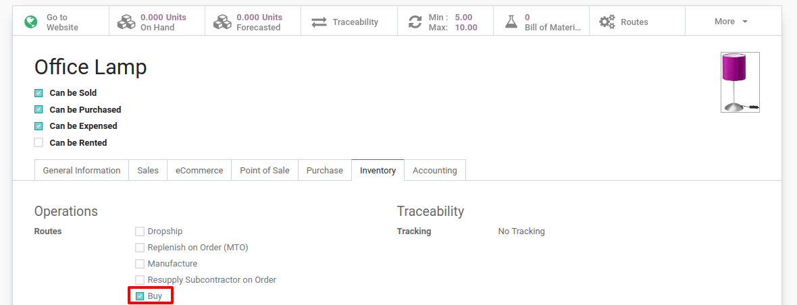
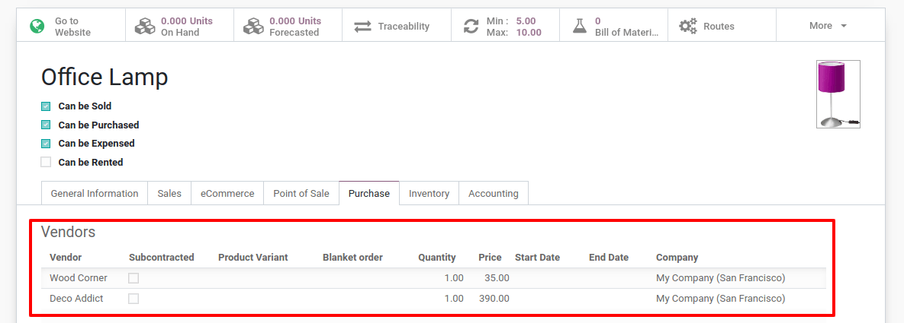
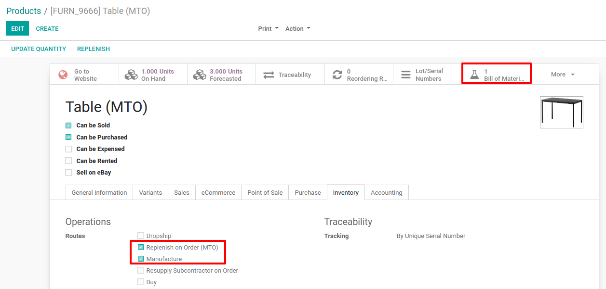

=================================================
Choose Between Reordering Rules and Make to Order
=================================================

*Reordering rules* and *make to order* do both allow to
automatically replenish products when necessary. The difference between
those tools is how they are triggered.

*Reordering rules* are used to ensure that you always have a minimum
amount of a product in stock in order to manufacture your products
and/or answer to your customer needs. When the stock level of a product
reaches its minimum the system will automatically generate a procurement
with the needed quantity to reach the maximum stock level.

The *Make to Order* route will trigger a procurement (purchase order
or manufacturing order) with the necessary quantity to fulfill a product
request (coming from a sale order or a manufacturing order). The system
will not check the quantity on hand for the corresponding product.

Configuration
=============

Reordering Rules
----------------

The *Reordering Rules* configuration is available through the menu
:menuselection:`Inventory --> Master Data --> Reordering Rules`. There, click on
*Create* to set minimum and maximum stock values for a given product.

When the forecasted stock goes below the *Minimum Quantity* specified
in this field, Odoo generates a procurement to bring the forecasted
quantity to the *Maximum Quantity*. The *Quantity Multiple* is used
to round the procurement quantity up to this multiple. If it is 0, the
exact quantity will be used.

The *Lead time* is the number of days after the order point is
triggered to receive the products or to order them to the vendor.

In case you work with multi-warehouses and/or multi-locations, you will
be able to specify different reordering rules for the same product in
each location.

.. tip::
      For the reordering rules to be triggered, on the corresponding product,
      a route should be specified. In case you manufacture your products, make
      sure to select the route *Manufacture* and create a *Bill of Material* for the product. In case you purchase your products, make
      sure to select the route *Buy* and add a *Vendor Pricelist*.

.. tip::
      Don't forget to select the product type *storable* in the product
      form. A consumable can not be stocked and won’t trigger reordering
      rules.

Make to Order
-------------

The *Make To Order* configuration is available on your product form
through your :menuselection:`Inventory module --> Master Data --> Products` (or in any
other module where products are available).

On the product form, in the *Inventory tab*, you can set a route. You
can choose *Make To Order* and another route, either *Buy* or
*Manufacture*.

Again, if the *Buy* route is selected, make sure to set a *Vendor
pricelist* in the *Purchase tab*. In case you have set a
*Manufacture* route, make sure you have a *BoM* for this product.

