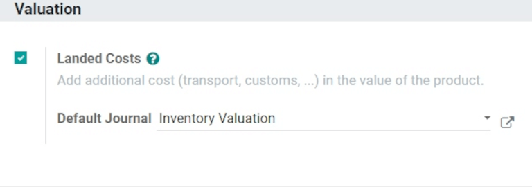
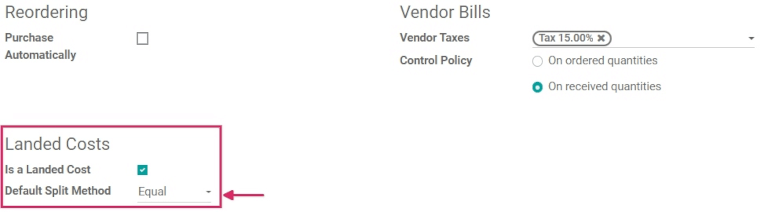
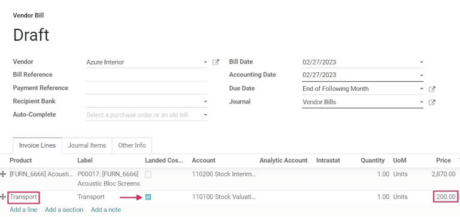
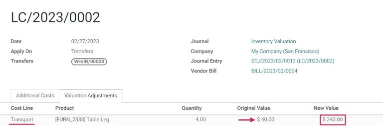

==============================================
Landed costs: add additional costs to products
==============================================

.. _inventory/reporting/landed_costs:

When companies perform profit analyses, the data being examined must be as accurate as possible. To
ensure that, **all** costs and expenses need to be accounted for, including the sum of expenses
associated with shipping a product, which is also known as *landed costs*.

In Odoo, the landed costs feature allows the user to add and include additional costs on goods
purchased. This includes the cost of freight, shipping, insurance, taxes, and more.

Enable landed costs
===================

To use landed costs, go to the :menuselection:`Inventory app --> Configuration --> Settings`, scroll
down to the :guilabel:`Valuation` header, and click the checkbox beside :guilabel:`Landed Costs` to
enable the feature.

In this same section, a default accounting journal can also be set, in which entries involving
landed costs will be recorded.

To configure a default accounting journal, click the blank field next to :guilabel:`Default Journal`
to reveal a drop-down menu, in which an existing journal can be selected. A new journal can be
created from this drop-down, as well, by typing the desired name of a new journal in the blank
field, and selecting either the :guilabel:`Create` or :guilabel:`Create and edit...` option.

Clicking :guilabel:`Create` instantly creates the journal, which can be customized later. Clicking
:guilabel:`Create and edit...` reveals a pop-up window on the :guilabel:`Settings` page, wherein the
newly-created journal's details can be configured right away. When the configurations are complete,
click :guilabel:`Save` on the pop-up window to complete the journal creation process, and return to
the :guilabel:`Settings` page.

After the setting has been enabled, and if a journal has been created or applied, click the
:guilabel:`Save` button to save all changes.

.. important::
   Landed costs can **only** be applied to products using a :abbr:`FIFO (First In First Out)` or
   :abbr:`AVCO (Average Cost)` costing method, **and** automated inventory valuation.

Create a landed cost product
============================

Landed costs can be manually entered each time a vendor bill is created. However, some products may
always have the same types of charges applied to them, and thus, the vendor bills may always list
the same landed costs. In this case, it's beneficial to create a specific landed cost product.

To create a landed cost product, first navigate to :menuselection:`Inventory app --> Products -->
Products`, and click the :guilabel:`Create` button, which reveals a blank product template page.

On the blank product template form, fill out the necessary product information, and change the
:guilabel:`Product Type` to :guilabel:`Service`.

Then, click the :guilabel:`Purchase` tab, and under the :guilabel:`Landed Costs` section, select the
checkbox beside :guilabel:`Is a Landed Cost`. Once selected, a new field appears, in which a
:guilabel:`Default Split Method` can be selected.

Clicking the blank field beside :guilabel:`Default Split Method` reveals a drop-down menu. From this
drop-down menu, select :guilabel:`Equal`, then click :guilabel:`Save`.

.. note::
   When the :guilabel:`Default Split Method` is set to :guilabel:`Equal`, the landed cost will be
   split equally between all items included on the purchase order. If a :abbr:`PO (purchase order)`
   has just one item, the full amount will be applied to this item.

.. tip::
   Depending on the landed cost of each shipment, the price of a landed cost product can change with
   each order. Therefore, a price (or cost) should **not** be set on landed cost products.

Create a request for quotation
==============================

Before adding a specific landed cost on a product, a new :abbr:`RFQ (request for quotation)` for
that product must be created. To do that, navigate to the :menuselection:`Purchase` app, and click
:guilabel:`Create`. Doing so reveals a blank :abbr:`RFQ (request for quotation)` template form.

On the blank :abbr:`RFQ (request for quotation)` template form, add a :guilabel:`Vendor`, then add
the desired product to the product lines (under the :guilabel:`Product` tab), by clicking
:guilabel:`Add a line`, and selecting the desired product.

Then, fill out the remaining information on the new :abbr:`RFQ (request for quotation)`. Lastly,
click :guilabel:`Confirm Order` to confirm the order. Once the quotation has been confirmed, it
turns into a :abbr:`PO (purchase order)`.

Next, click :guilabel:`Receive Products` to receive the ordered products, then click
:guilabel:`Validate`, which reveals a pop-up. In the pop-up, select :guilabel:`Apply` to set the
:guilabel:`Done` quantities. Then, navigate back to the initial :abbr:`PO (purchase order)` (via the
breadcrumbs).

Create a vendor bill
====================

Once goods have been received from the purchase order, a vendor bill can be created directly from
the :abbr:`PO (purchase order)`. To do so, click :guilabel:`Create Bill`. Doing so reveals a vendor
bill draft page.

On this vendor bill draft page, the information from the :abbr:`PO (purchase order)` is
automatically populated. To add a landed cost to the bill, first click :guilabel:`Edit`.

Next, click :guilabel:`Add a line` in the :guilabel:`Invoice Lines` tab to add the newly-created
landed cost product to the vendor bill. And, since this product was specifically created as a landed
cost, the checkbox under the :guilabel:`Landed Costs` column is selected by default.

.. important::
   Since no :guilabel:`Price` was set on the product template form for the landed cost product, it
   **must** be set manually on the vendor bill, in the :guilabel:`Price` column.

Create landed costs
===================

Once all the necessary information on the bill has been filled out, click :guilabel:`Create Landed
Costs` at the top of the bill.

Doing so reveals a separate page, wherein the necessary landed cost information is entered. From
this page, next to the greyed-out :guilabel:`Transfers` field, the warehouse receipt that this
landed cost is associated with must be specified. To adjust the :guilabel:`Transfers` field, click
:guilabel:`Edit` to make that field accessible.

Additionally, an expenses :guilabel:`Account` (located in the :guilabel:`Additional Costs` tab) must
be selected, as well.

To see how the landed costs affect the items on the :abbr:`PO (purchase order)`, click the
:guilabel:`Valuation Adjustments` tab. From this tab, the :guilabel:`Original Value` of the purchase
order and the :guilabel:`New Value` of the order can be seen and compared, as well as the
:guilabel:`Additional Landed Cost` that was added to change the original :abbr:`PO (purchase order
)`.

Once ready, click :guilabel:`Validate` at the top of the page, then click :guilabel:`Save` to save
all changes. Finally, click back to the vendor bill form (via the breadcrumbs).

To complete the vendor bill, click :guilabel:`Confirm` to confirm the bill. Then, click the
:guilabel:`Register Payment` button at the top of the vendor bill form. Doing so reveals a pop-up.
From this pop-up, click :guilabel:`Create Payment`. Once clicked, this reveals a green *In Payment*
banner at the top of the vendor bill form.

.. tip::
   Landed costs don't always need to be created from the vendor bill. They can also be created by
   going to :menuselection:`Inventory app --> Operations --> Landed Costs`, and clicking
   :guilabel:`Create`.
