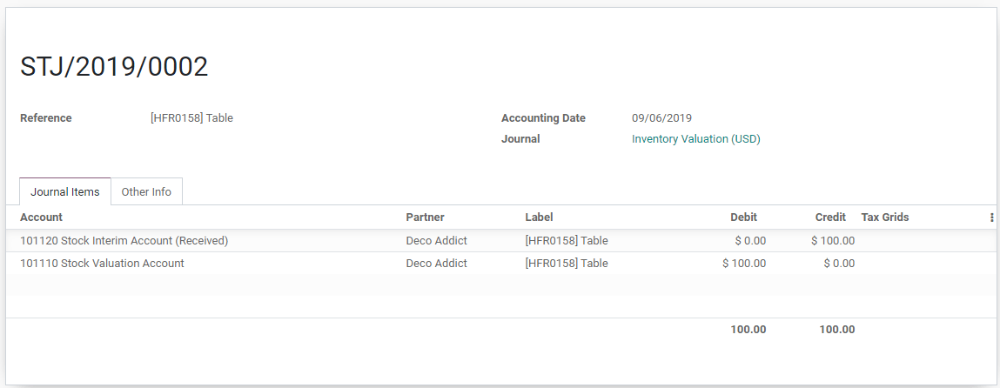

=============================
Using the inventory valuation
=============================

Inventory valuation refers to how you value your stock. It’s a very
important aspect of a business as the inventory can be the biggest asset
of a company.

In this documentation, we will explain how the inventory valuation works
in Odoo.

Inventory valuation: the basics
===============================

Receive a product
-----------------

Each time a product enters or leaves your stock, the value of your
inventory is impacted. The way it is impacted depends on the
configuration of your product (more info here).

Let’s take an example with a product - a table - configured with a
*FIFO costing method* and an automated inventory valuation.

I purchase 10 tables at a cost of $10.

.. image:: using_inventory_valuation/use_inventory_valuation_01.png
    :align: center

When I’ll confirm the receipt of the products, the value of my inventory
will be impacted. If I want to know what this impact is, I can click on
the valuation stat button.

.. tip::
         The consignment feature allows you to set owners on your stock (discover
         more about the consignment feature). When you receive products that are
         owned by another company, they are not taken into account in your
         inventory valuation.

.. image:: using_inventory_valuation/use_inventory_valuation_02.png
    :align: center

.. note::
         You need access rights on the accounting module to see that button.

In this case, I can see that the 10 tables entered the stock for a total
value of $100.

.. image:: using_inventory_valuation/use_inventory_valuation_03.png
    :align: center

I can also easily access the accounting entry that has been generated
(in case of automated inventory valuation).

Deliver a product
-----------------

In the same logic, when a table will be delivered, the stock valuation
will be impacted and you will have access to a similar information.

.. image:: using_inventory_valuation/use_inventory_valuation_05.png
    :align: center

The inventory valuation report
------------------------------

The summary of this is accessible via the inventory valuation report
(accessible from :menuselection:`Inventory --> Reporting --> Inventory Valuation`). It gives
you, product per product, the value of your stock. By clicking on the
button *Inventory At Date*, you can have the same information for a
past date.

.. image:: using_inventory_valuation/use_inventory_valuation_06.png
    :align: center
