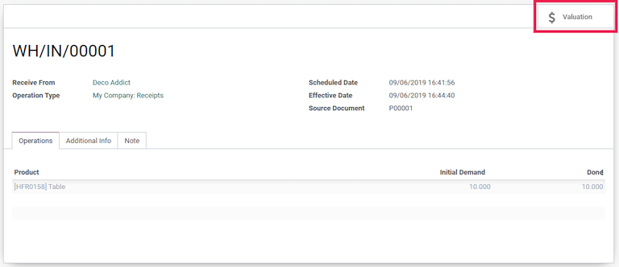
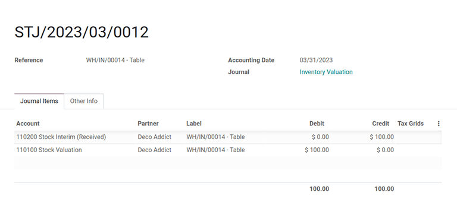
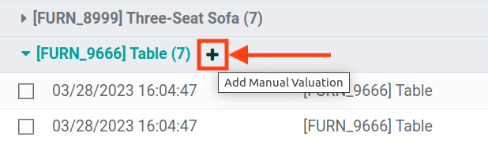

=========================
Using inventory valuation
=========================

.. _inventory/reporting/using_inventory_val:

*Inventory valuation* is a quintessential accounting procedure that calculates the value of on-hand
stock. Once determined, the inventory valuation amount is then incorporated into a company's overall
value.

In Odoo, this process can be conducted manually— by warehouse employees physically counting the
products— or automatically through the database.

.. seealso::
   :ref:`Inventory valuation configuration<inventory/inventory_valuation_config>`

Understand the basics of inventory valuation
============================================

In order to understand how moving products in and out of stock affects the company's overall value,
consider the following product and stock moves scenario below.

Receive a product
-----------------

For example, consider an physical product, a simple *table*, which is categorized as `Office
Furniture` in the product form's :guilabel:`Product Category` field.

Navigate to the the product category itself by going to :menuselection:`Inventory app -->
Configuration --> Product Categories`, and on the form, set the :guilabel:`Costing Method` as `First
In First Out (FIFO)` and the :guilabel:`Inventory Valuation` field as `Automated`.

.. tip::
   Alternatively access the :guilabel:`Product Categories` dashboard by clicking on the
   :guilabel:`internal link` arrow on the individual product's form, by hovering over the
   :guilabel:`Product Category` field.

Next, assume 10 tables are purchased at a price of $10.00, each. The :abbr:`PO (Purchase Order)` for
those tables will show the subtotal of the purchase as $100, plus any additional costs or taxes.

.. image:: using_inventory_valuation/purchase-order.png
   :align: center
   :alt: Purchase order with 10 tables products valued at $10 each.

After selecting :guilabel:`Validate` on the :abbr:`PO (Purchase Order)`, use the
:guilabel:`Valuation` smart button to view how the value of inventory was impacted.

.. important::
   :ref:`Developer mode <developer-mode>` must be turned on to see the *Valuation* smart button.

.. tip::
   The :doc:`consignment </applications/inventory_and_mrp/inventory/management/misc/owned_stock>`
   feature allows ownership to items in stock. Thus, products owned by other companies are not
   accounted for in the host company's inventory valuation.

The :guilabel:`Stock Valuation` dashboard then displays valuation of all products in the shipment,
along with their quantities and valuation. In the example of 10 tables being purchased, the
:guilabel:`Total Value` column of the dashboard would display a calculated valuation of $100.

.. image:: using_inventory_valuation/stock-valuation-product.png
   :align: center
   :alt: Stock valuation page depicting the products within a shipment.

In Odoo, automatic inventory valuation records are also recorded in the *Accounting* app. To access
these accounting entries, navigate to :menuselection:`Accounting --> Journal Entries`, and look for
inventory valuation entries with the `STJ` prefix in the :guilabel:`Journal` and :guilabel:`Number`
columns, respectively.

Deliver a product
-----------------

In the same logic, when a table is shipped to a customer and leaves the warehouse, the stock
valuation decreases. The :guilabel:`Valuation` smart button on the :abbr:`DO (Delivery Order)`,
likewise, displays the stock valuation record as it does on a :abbr:`PO (Purchase Order)`

.. image:: using_inventory_valuation/decreased-stock-valuation.png
   :align: center
   :alt: Decreased stock valuation after a product is shipped.

The inventory valuation report
------------------------------

To view the current value of all products in the warehouse, go to :menuselection:`Inventory app -->
Reporting --> Inventory Valuation`. The records in the table are organized by product, and selecting
a product's drop-down menu displays detailed records with the :guilabel:`Date`,
:guilabel:`Quantity`, and :guilabel:`Total Value` of the inventory.

.. image:: using_inventory_valuation/inventory-valuation-products.png
   :align: center
   :alt: Inventory valuation report showing multiple products.

.. note::
   The :guilabel:`Inventory At Date` button, located in the top-left corner of the :guilabel:`Stock
   Valuation` dashboard, shows the inventory valuation of products available during a prior
   specified date.

Update product unit price
~~~~~~~~~~~~~~~~~~~~~~~~~

For any company: lead times, supply chain failures, and other risk factors can contribute to
invisible costs. Although Odoo attempts to accurately represent the stock value, *manual valuation*
serves as an additional tool to update the unit price of products.

.. important::
   Manual valuation is intended for products that can be purchased and received for a cost greater
   than 0, or have product categories set with :guilabel:`Costing Method` set as either `Average
   Cost (AVCO)` or `First In First Out (FIFO)`.

Create manual valuation entries on the :guilabel:`Stock Valuation` dashboard by first navigating to
:menuselection:`Inventory app --> Reporting --> Inventory Valuation`, and then click the little gray
drop-down icon to the left of a product's name, to then reveal stock valuation line items below as
well as a teal :guilabel:`+ (plus)` button on the right.

Click the teal :guilabel:`+ (plus)` button to open up the :guilabel:`Product Revaluation` form,
where updates to the calculation of inventory valuation can be made, by increasing or decreasing the
unit price of each product.

.. image:: using_inventory_valuation/product-revaluation.png
   :align: center
   :alt: Product revaluation form adding a value of $1.00 with the reason being inflation.
